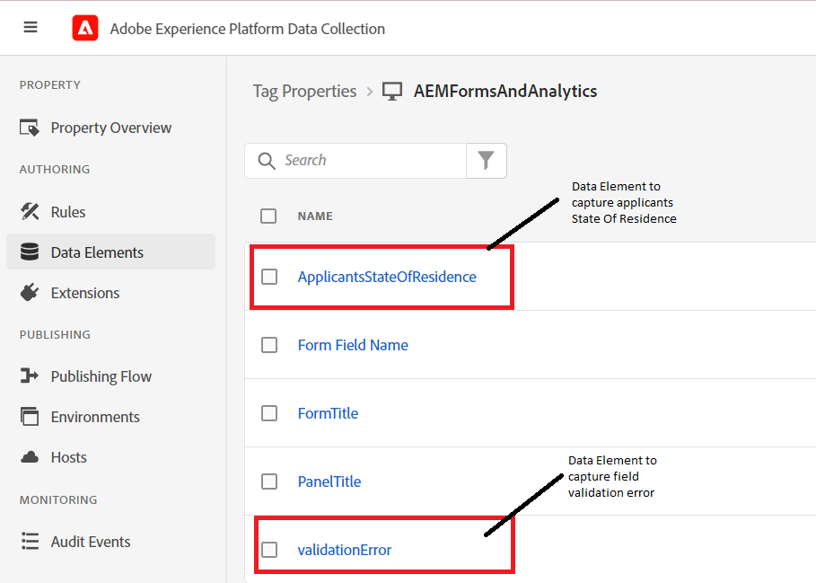
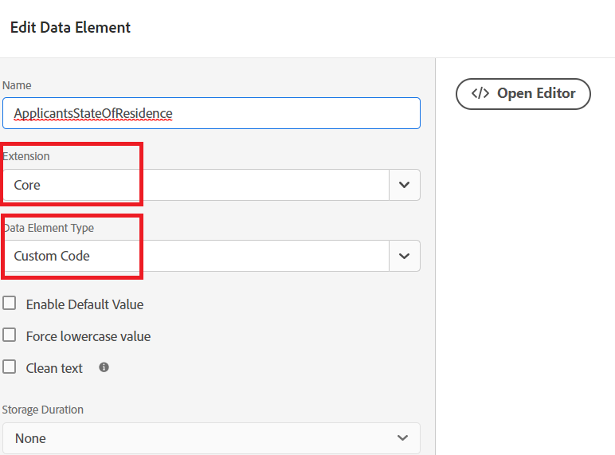
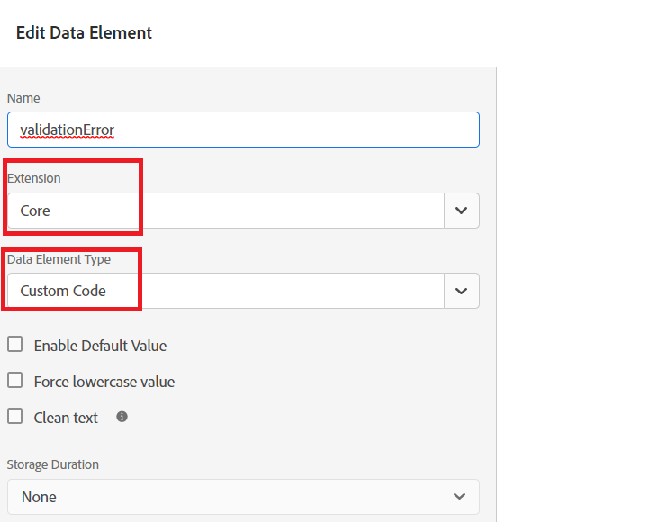

# Create data elements

In the Tags property we added two new data elements(ApplicantsStateOfResidence and validationError).



## ApplicantStateOfResidence

The **ApplicantStateOfResidence** data element was configured by selecting **Core** in the extension drop-down and **Custom Code** for the Data Element Type as shown in the screen shot below


The following custom code was used to capture the value from the **_state_** adaptive form field.

``` javascript
// use the GuideBridge API to access adaptive form elements
//The state field's SOM expression is used to access the state field
var ApplicantsStateOfResidence = guideBridge.resolveNode("guide[0].guide1[0].guideRootPanel[0].state[0]").value;
_satellite.logger.log("Returning  Applicants State Of Residence is "+ApplicantsStateOfResidence);
return ApplicantsStateOfResidence;
```

## validationError

The **ValidationError** data element was configured by selecting **Core** in the extension drop-down and **Custom Code** for the Data Element Type as shown in the screen shot below



The following custom code was written to set the `validationError` data element value.

```javascript
var validationError = "";
// Using GuideBridge API to access adaptive forms fields using the fields SOM expression
var tel = guideBridge.resolveNode("guide[0].guide1[0].guideRootPanel[0].telephone[0]");
var email = guideBridge.resolveNode("guide[0].guide1[0].guideRootPanel[0].email[0]");

_satellite.logger.log("Got tel in Tags custom script "+tel.isValid)
_satellite.logger.log("Got email in Tags custom script "+email.isValid)

if (tel.isValid == false) {  
  validationError = "error: telephone number";
  _satellite.logger.log("Validation error is "+ validationError);
}

if (email.isValid == false) {  
  validationError = "error: invalid email";
  _satellite.logger.log("Validation error is "+ validationError);
}

return validationError;
```

## Next steps

[Create Rules](./rules.md)