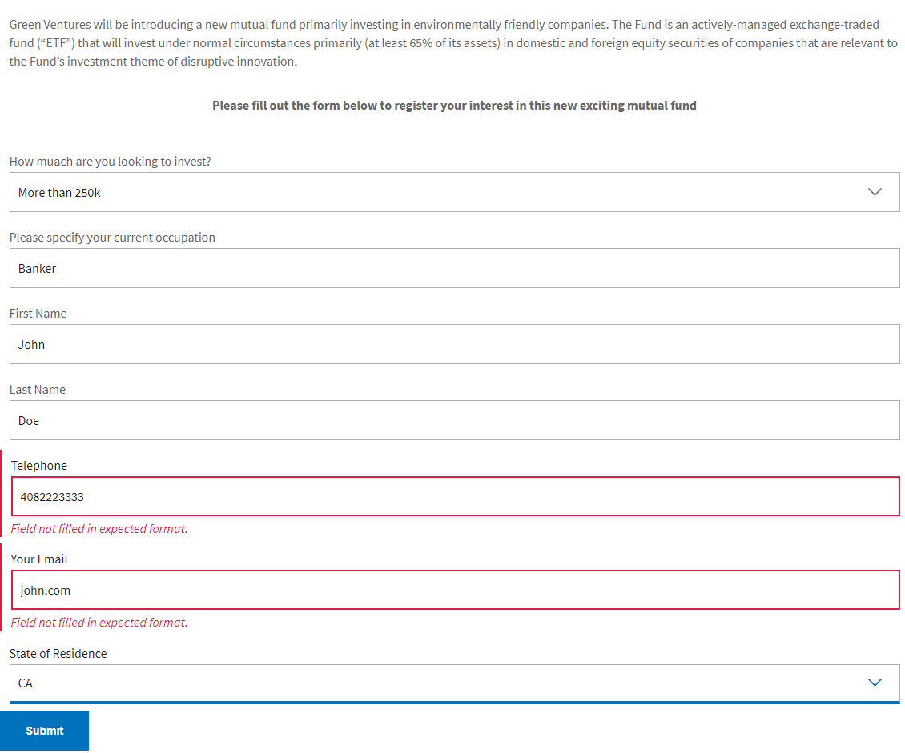

# Integrate AEM Forms with Adobe Analytics to report on form data fields

Learn how to integrate AEM Forms as a Cloud Service with Adobe Analytics on your adaptive forms using Experience Platform tags. This example will guide you through the configuration and implementation steps to produce insightful reports about how visitors interact with your forms.

## Prerequisites

 To get the most out of this tutorial, recommended you meet the following prerequisites:

 * Some experience with AEM Forms as a Cloud Service
 * Access to Experience Platform tags
 * Access to Adobe Analytics

This tutorial uses a simple adaptive form built in AEM Forms and measures form submissions for state of residence values, as well as fields that generate validation errors.

## Next steps

[Create Data Elements](./data-elements.md)