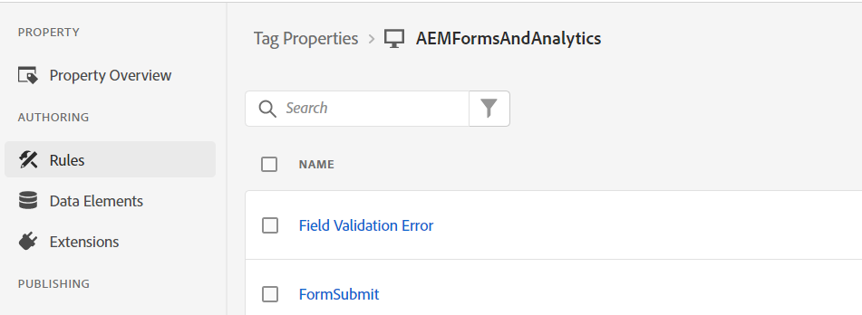
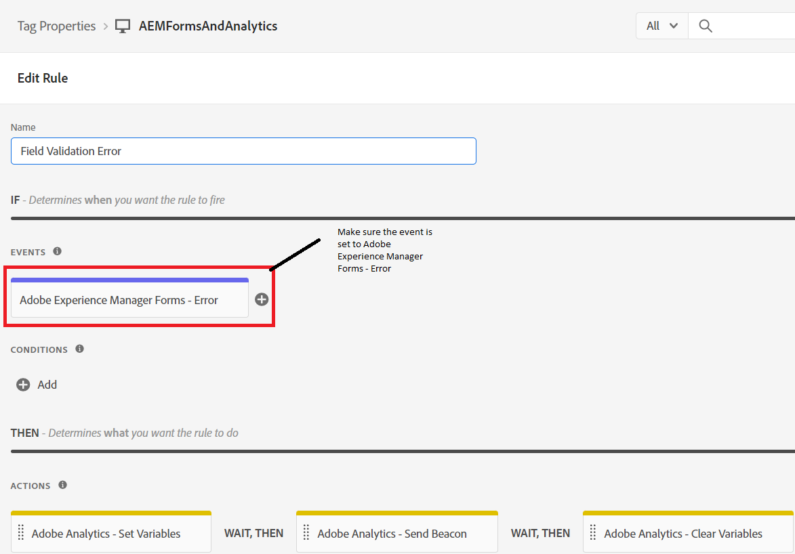
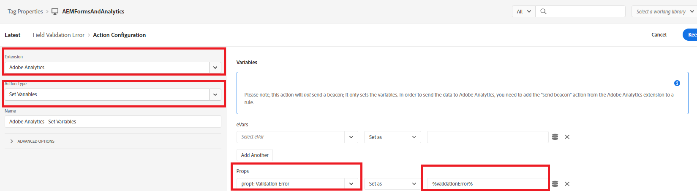
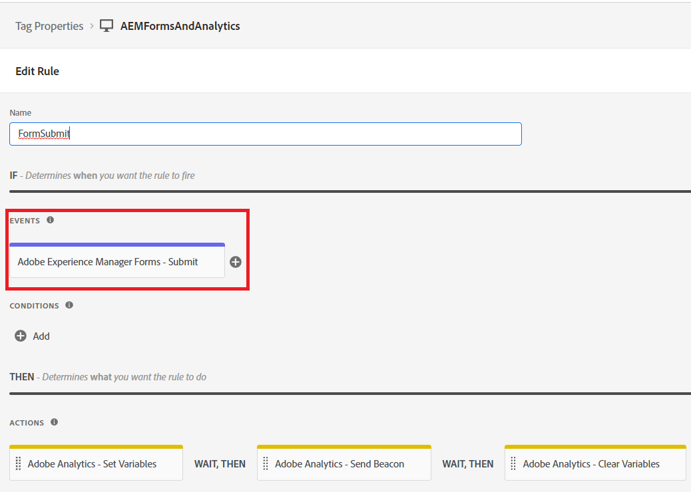
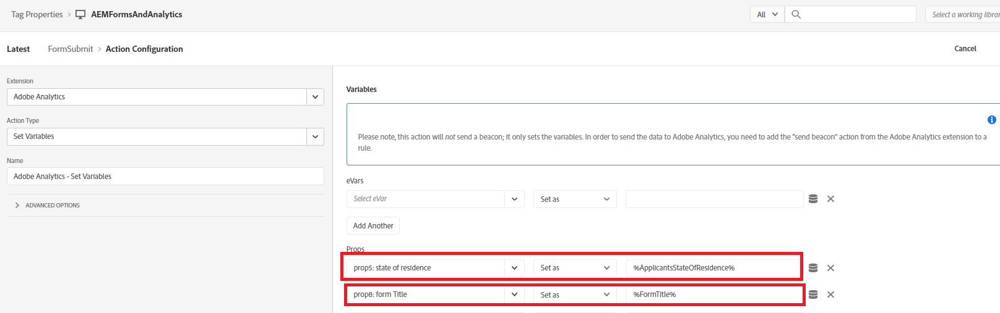

# Define the rule

In the Tags property we created 2 new [rules](https://experienceleague.adobe.com/docs/platform-learn/implement-in-websites/configure-tags/add-data-elements-rules.html) (**Field Validation Error and FormSubmit**).

## Field Validation Error

The **Field Validation Error** rule gets triggered every time there is validation error in adaptive form field. For example in our form if the telephone number or the email is not in the expected format a validation error message is displayed. 

The Field Validation Error rule is configured by setting the event to _**Adobe Experience Manager Forms-Error**_ as shown in the screen shot

The Adobe Analytics - Set Variables is configured as follows

## Form Submit Rule

The Form Submit rule is triggered every time an Adaptive Form is successfully submitted.

The Form Submit rule is configured using the _**Adobe Experience Manager Forms - Submit**_ event

In the Form Submit rule, the value of the data element _**ApplicantsStateOfResidence**_ is mapped to prop5 and the value of the data element FormTitle is mapped to prop8.

The Adobe Analytics - Set variables is configured as follows.

When you're ready to test your Tags code,[publish your changes made to the tags](https://experienceleague.adobe.com/docs/experience-platform/tags/publish/publishing-flow.html) using the publishing flow.
