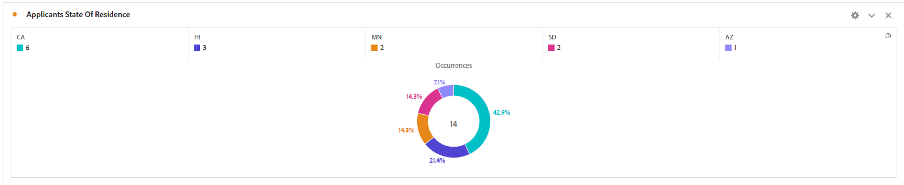
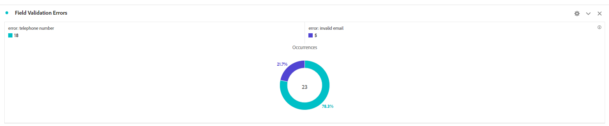
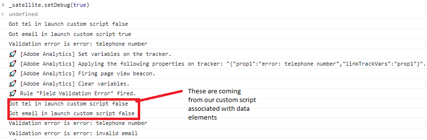
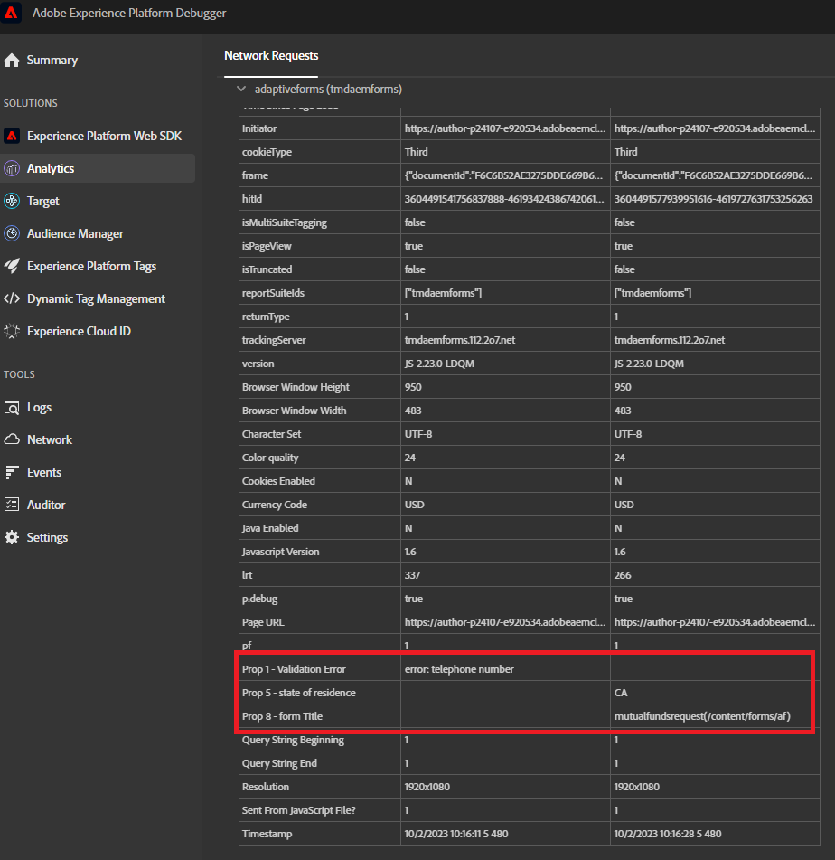

# Test your solution

Preview and submit your form using several combinations of form values. Allow several to 30 minutes to see your data in Adobe Analytics reports. Data set to props show up in reporting sooner than data set to eVars.

## Report Suite

The form data captured in Adobe Analytics is presented in donut format

**Submissions by State**



Field Validation Errors



## Debugging

Make sure the Adaptive Form is using the same configuration container which contains the Adobe Launch Configuration.

To confirm that the form is sending data to Adobe Analytics, do the following

* Open the Developer Tools in your browser.
* Enter in the following text in the Console panel.

```javascript
_satellite.setDebug(true)
```

Interact with your form while keeping the console window open. You should see something like this



## Use Adobe Experience Platform Debugger

 Add the [AEP debugger extension](https://experienceleague.adobe.com/docs/experience-platform/debugger/home.html) to your browser(you are required to sign in) to get more debugging information



## Congratulations

You have successfully integrated AEM Forms as a Cloud Service with Adobe Analytics to report on form data fields.