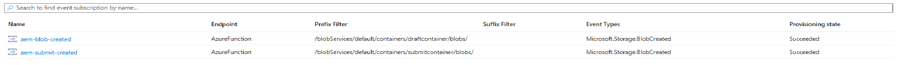

# Automate Form Completion Reminder Emails with AEM Forms Portal and Adobe Journey Optimizer

Organizations often allow customers to begin filling out online forms and complete them at a later time. While this improves the overall user experience, many forms are saved as drafts and never submitted, resulting in abandoned applications and missed business opportunities.

In this solution, users authenticate to the AEM Forms Portal before accessing the available Adaptive Forms. Authentication ensures that every saved draft is associated with a unique user identity, allowing forms to be securely saved, resumed, and tracked across multiple sessions.

The AEM Forms Portal component provides a unified interface where authenticated users can browse available forms, save forms as drafts, and resume previously saved forms. Draft and submitted form data is persisted in Azure Blob Storage using the AEM Forms Azure Storage Connector.

Whenever an authenticated user saves a form in draft mode, the save event is captured and sent to Adobe Journey Optimizer (AJO) through Adobe Experience Platform (AEP). A lookup dataset in AEP maintains the current state of each saved form, including whether it has subsequently been submitted.

An Adobe Journey Optimizer journey is triggered whenever a form is saved as a draft. The journey waits for 48 hours before checking the status of the saved form. If the form has not been submitted within the 48-hour period, Journey Optimizer automatically sends a personalized reminder email to the authenticated user, encouraging them to return to the Forms Portal and complete the application. If the form has already been submitted, the reminder email is suppressed.

This solution demonstrates how AEM Forms, Azure Blob Storage, Adobe Experience Platform, and Adobe Journey Optimizer can be integrated to deliver an automated draft reminder workflow that helps increase form completion rates while providing a secure and seamless experience for authenticated users.

## Implementation Overview

To implement this use case, the following high-level steps were completed:

1. **Configure Azure Blob Storage**
   - [Create and configure an Azure Storage account](https://experienceleague.adobe.com/en/docs/experience-manager-cloud-service/content/forms/integrate/set-submit-action/configure-submit-action-azure-blob-storage) and the required blob containers to store draft and submitted Adaptive Forms.
   - Configure the **AEM Forms Azure Storage Connector** to persist draft and submitted form data to Azure Blob Storage.
   - Make sure to publish the storage configuration

1. **Create the Adaptive Forms**
   - Create an AEM Sites page and add the **Adaptive Form Container**.
   - Author the Adaptive Forms directly within the AEM Sites page, by adding the form components into the **Form Container**. Add the functionality to save the form on button click using the rule editor. Configure the form container to submit the form to Azure Storage.  These forms will be surfaced through the AEM Forms Portal.

1. **Create the AEM Forms Portal**
   - Create an AEM Sites page and add the **Adaptive Form Container** component to the page. Add the **Search and Lister** component to the Adaptive Form Container. Configure the search and lister component to list the forms/pages created in the earlier step
   - This page serves as the Forms Portal where authenticated users can browse available Adaptive Forms, start new forms, and save forms as drafts.

1. **Create the Saved Forms Page**
   - Create another AEM Sites page and add the **Adaptive Form Container** component to the page. Add the  **Drafts and Submissions** component to the Adaptive Form Container and configure the component to list the **Draft Forms**.
   - This page displays forms that have been saved as drafts, allowing authenticated users to resume and complete previously saved forms.

1. **Capture Form Save Events**
   - 
   - Azure Event Grid subscriptions are configured on the Azure Storage account to monitor the containers used by AEM Forms for draft and submitted form data.
   - Two event subscriptions are created:
      - aem-blob-created monitors the draftcontainer.
      - aem-submit-created monitors the submitcontainer.

      Both subscriptions listen for the Microsoft.Storage.BlobCreated event and use a prefix filter to restrict notifications to the appropriate container. The endpoint for both subscriptions is the Azure Function that processes the form data and sends the corresponding event to Adobe Experience Platform. The function also updates an AEP lookup dataset with the current status of the saved form.

      The [sample azure function can be downloaded from here](assets/BlobCreatedToAEP.js)

1. **Create Custom Events in Adobe Journey Optimizer**
   - Create two custom events in Adobe Journey Optimizer:
     - **`form.save`** – triggered whenever a form is saved as a draft.
     - **`form.submit`** – triggered whenever a form is submitted.
   - These events use the Experience Events ingested into Adobe Experience Platform as the event source.

1. **Create the Adobe Journey Optimizer Journey**
   - Create an Adobe Journey Optimizer journey that is triggered when the **`form.save`** event is ingested into Adobe Experience Platform.
   - Configure the journey to:
     - Wait for **48 hours**.
     - Send a personalized reminder email only if the form is still in draft state.

This implementation integrates **AEM Forms**, **Azure Blob Storage**, **Adobe Experience Platform**, and **Adobe Journey Optimizer** to automate reminder emails for abandoned draft forms while providing authenticated users with a seamless experience to resume and complete their saved applications.