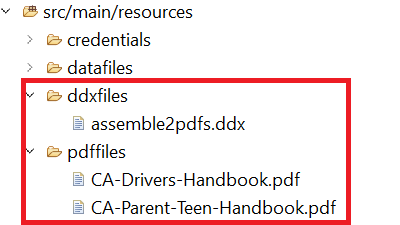

# Import Eclipse Project

* Download and unzip the [zip file](./assets/pdf-manipulation.zip)
* Launch Eclipse and import the project into Eclipse
* The project includes the following folders in the resources folder:
    * ddxFiles - This folder contains the ddx file to describe the output you want to generate
    * pdffiles - This folder contains the pdf files you want to assemble

## Test the solution

* Copy and paste your service credentials in the service_token.json resource file in the project. 
* Open the AssemblePDFFiles.java file and specify the folder in which you want to save the generated PDF files
* Open ExecuteAssemblerService.java. Set the value of the variable assembleURL to point to your instance.
* Run the ExecuteAssemblerService.java as java application

>[!NOTE]
> The very first time you run the java program you will get HTTP 403 error. To get past this make sure you give the [appropriate permissions to the technical account user in AEM](https://experienceleague.adobe.com/docs/experience-manager-learn/getting-started-with-aem-headless/authentication/service-credentials.html?lang=en#configure-access-in-aem).

**AEM Forms Users** is the role I have used for this course.
