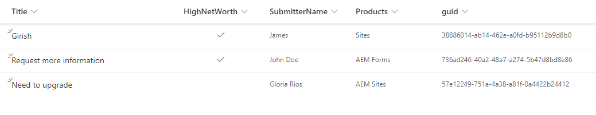
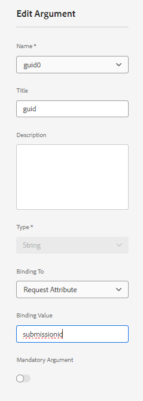
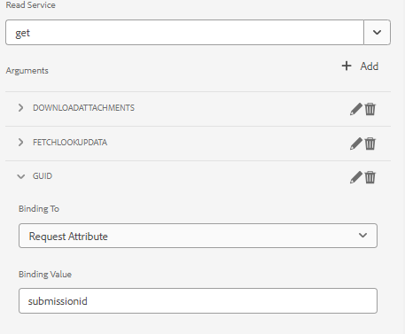

# Prefill adaptive form with share point list data

In the previous version of AEM Form(6.5), custom code had to be written to prefill form data model backed adaptive form using request attribute. In AEM Forms as cloud service, the need to write custom code is not longer required.

This article explains the steps required to prefill/pre-populate adaptive form with data fetched from sharepoint list using the form data model prefill service. 

This article assumes you have [successfully configured adaptive form to submit data to sharepoint list.](https://experienceleague.adobe.com/docs/experience-manager-cloud-service/content/forms/adaptive-forms-authoring/authoring-adaptive-forms-core-components/create-an-adaptive-form-on-forms-cs/configure-submit-actions-core-components.html?lang=en#connect-af-sharepoint-list)

The following is the data in the sharepoint list
 

To prefill an adaptive form with the data associated with a particular guid the following steps need to be performed

## Configure the get service

* Create a get service for the top level object of the form data model using the guid attribute


In this screenshot, the guid column is bound via a request attribute called `submissionid`.

The get service fully configured looks like this



## Configure the adaptive form to use form data model prefill service

* Open an adaptive form based on the share point list form data model. Associate the Form Data Model Prefill service


## Test the form

Preview the form by including the `submissionid` in the URL as shown below

```html
http://localhost:4502/content/dam/formsanddocuments/contactusform/jcr:content?wcmmode=disabled&submissionid=57e12249-751a-4a38-a81f-0a4422b24412
```


