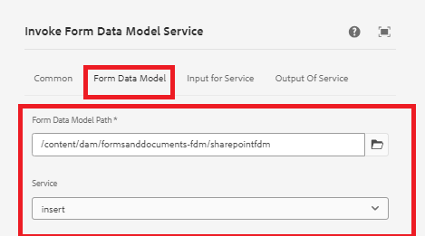
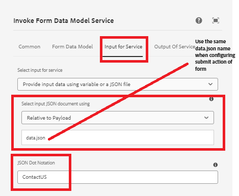
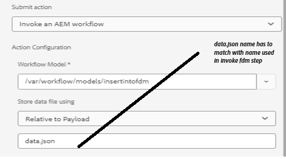

# Insert data into SharePoint list using invoke FDM workflow step


This article explains the steps required to insert data into SharePoint list using the invoke FDM step in AEM workflow.

This article assumes you have [successfully configured adaptive form to submit data to SharePoint list.](https://experienceleague.adobe.com/docs/experience-manager-cloud-service/content/forms/adaptive-forms-authoring/authoring-adaptive-forms-core-components/create-an-adaptive-form-on-forms-cs/configure-submit-actions-core-components.html?lang=en#connect-af-sharepoint-list)


## Create a form data model based on the SharePoint list data source

* Create a new form data model based on the SharePoint list data source.
* Add the appropriate model and the get service of the form data model.
* Configure the insert service to insert the top level model object.
* Test the insert service.


## Create a workflow

* Create a simple workflow with invoke FDM step.
* Configure the invoke FDM step to use the form data model created in the previous step.
* 

* 
* Notice the use of JSON dot notation. The submitted data is in the format below, and we are extracting the ContactUS object from the submitted data.

```json
{
  "ContactUS": {
    "Title": "Mr",
    "Products": "Photoshop",
    "HighNetWorth": "1",
    "SubmitterName": "John Does"
  }
}
```


## Configure Adaptive Form to trigger AEM workflow

* Create Adaptive Form using the Form Data Model created in the earlier step.
* Drag and drop some fields from the data source onto your form.
* Configure the submit action of the form as shown below
* 


## Test the form

Preview the form created in the previous step. Fill out the form and submit. The data from the form should get inserted into the SharePoint list.

