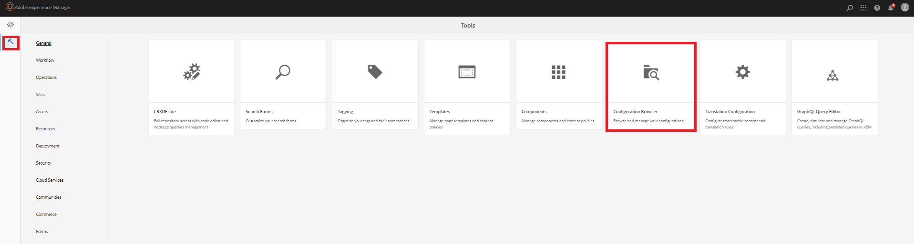

# Create Data Source

Marketo's REST APIs are authenticated with 2-legged OAuth 2.0. We can easily create a data source using the swagger file downloaded in the previous step 

## Create configuration container

* Login to AEM.
* Click on the tools menu and then **Configuration Browser** as shown below

* 

* Click on **Create** and provide a meaningful name as shown below. Make sure you select the Cloud Configurations option as shown below

* 

## Create cloud services

* Navigate to the tools menu and then click on cloud  services -> Data Sources

* 

* Select the configuration container created in the earlier step and click on **Create** to create a new data source.Provide a meaningful name and select RESTful service from the Service Type drop down list and click **Next**
* 

* Upload the swagger file and specify the Grant type, Client Id,Client Secret and Access Token url specific to your Marketo instance as shown in the screen shot below.

* Test the connection and if the connection is successful make sure you click on the blue **Create** button to finish the process of creating the data source.

* 

## Next Steps

[Create Form Data Model](./part3.md)
