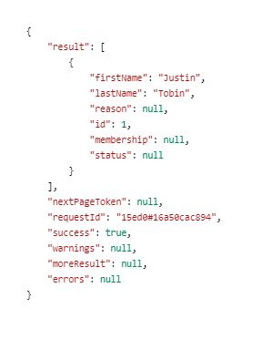

# Create Form Data Model

After configuring the data source the next step is to create a Form Data Model based on the data source configured in the earlier step. To create Form Data Model please follow the following steps:

Point your browser to the [data integrations page.](http://localhost:4502/aem/forms.html/content/dam/formsanddocuments-fdm) This lists all the data integrations created on your AEM instance. 

1. Click Create | Form Data Model
1. Provide meaningful title such as FormsAndMarketo and click Next
1. Select the data source that was configured in the earlier step and click create and edit to open the Form Data Model in the edit mode
1. Expand the "FormsAndMarketo" node. Expand the Services node
1. Select the first "Get" operation 
1. Click on Add Selected
1. Click on "Select All" in the "Add Associated Model Objects" dialog box and then click on Add
1. Save your form data model by clicking the Save button
1. Tab to the Services tab
1. Select the only service that is listed and click on Test Service
1. Provide a valid leadId and click on Test. If everything goes well you should get back the lead details as shown in the screenshot below

You can now create an Adaptive Form based on this Form Data Model to insert and fetch Marketo objects.