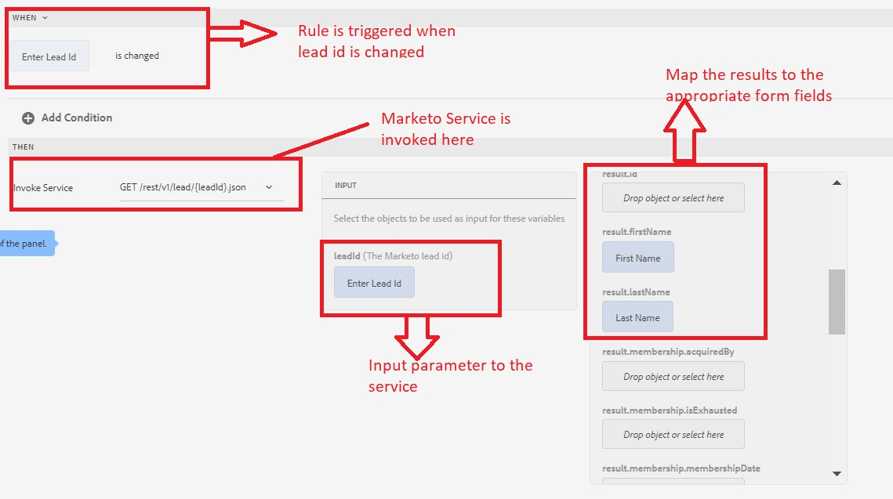

# Test the integration

We will test the integration by creating a simple form fetch and display a Lead object from Market.

>[!NOTE]
>
>This functionality was tested on form based on foundation components.

## Create Adaptive Form

1. Create an Adaptive Form and base it on "Blank Form Template", associate it with the Form Data Model created in the earlier step.
1. Open the form in edit mode.
1. Drag and drop a TextField component and a Panel component on to the Adaptive Form. Set the title of  the TextField component "Enter Lead Id" and set its name to "LeadId"
1. Drag and drop 2 TextField components on to the Panel component
1. Set the Name and Title of the 2 Textfield components as FirstName and LastName
1. Configure the Panel component to be a repeatable component by setting the Minimum to 1 and Maximum to -1. This is required as the Marketo service returns an array of Lead Objects and you need to have a repeatable component to display the results. However, in this case, we are getting only one Lead object back because we are searching on Lead objects by its ID.
1. Create a rule on the LeadId field as shown in the image below
1. Preview the form and enter a valid Lead Id in the LeadID field and tab out. The First Name and Last Name fields should get populated with the results of the service call.

The following screenshot explains the rule editor settings

## Congratulations

You have successfully integrated AEM Forms with Marketo using AEM Forms Form Data Model.