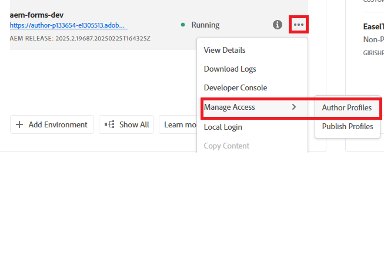
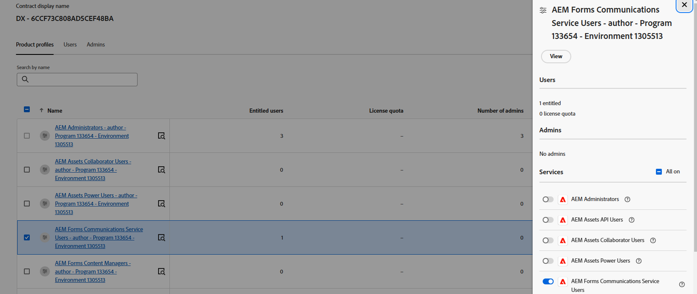
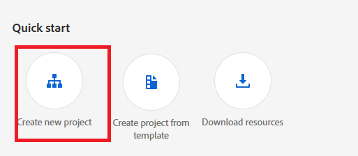
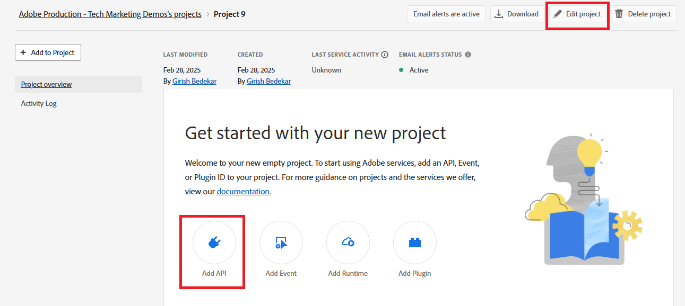
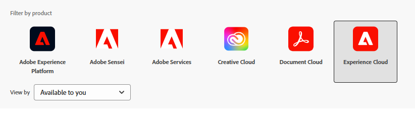
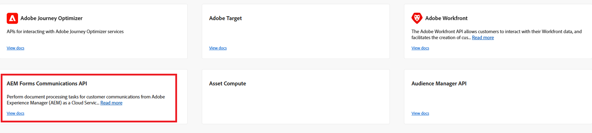
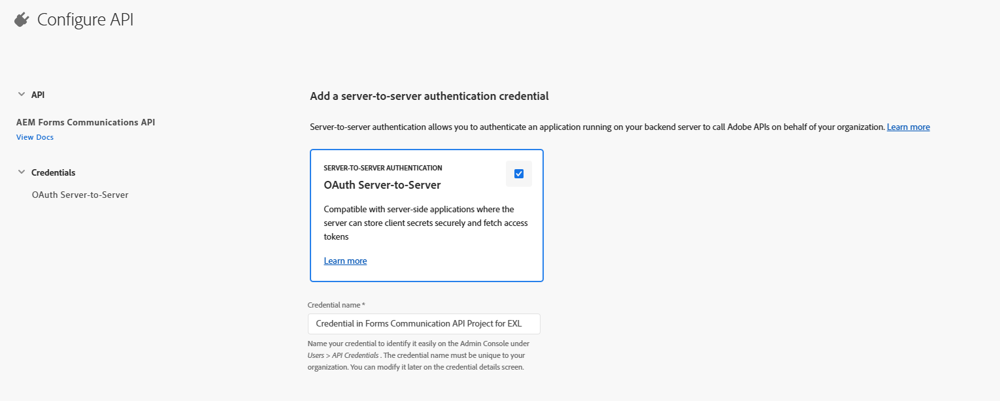
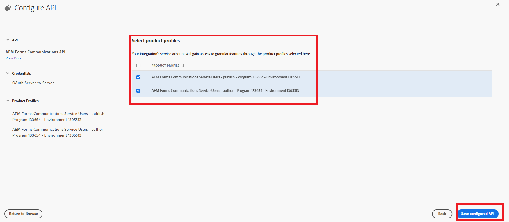
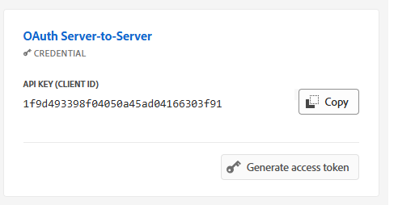
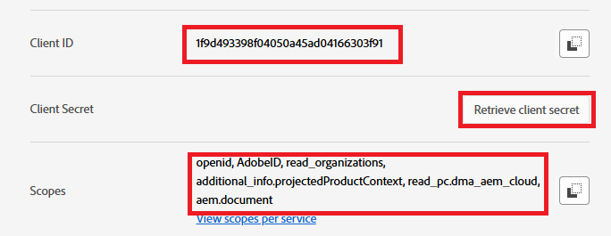

# Configure OpenAPI-based AEM Forms Communication APIs on AEM Forms as a Cloud Service

## Prerequisites

*   Latest instance of AEM Forms as a Cloud Service.
*   All the necessary [product profiles are added to the environment.](https://experienceleague.adobe.com/en/docs/experience-manager-learn/cloud-service/aem-apis/invoke-openapi-based-aem-apis)

*   Enable AEM API access to the product profile as shown below

 

## Create Adobe Developer Console Project

Login to [Adobe Developer Console](https://developer.adobe.com/console/) using your Adobe ID.
Create a new project by clicking on the appropriate icon

Give a meaningful name to the project and click on Add API icon

Select Experience Cloud

Select AEM Forms Communications API and click Next

Make sure you have selected server-to-server authentication and click next

Select the profiles and click on Save configured API button to save your settings

Click into the OAuth Server-to-Server

Copy the Client ID,Client Secret, and Scopes

## Configure AEM instance to enable ADC Project communication

If you already have an AEM Forms project, [please follow these instructions](https://experienceleague.adobe.com/en/docs/experience-manager-learn/cloud-service/aem-apis/invoke-openapi-based-aem-apis) to enable the Adobe Developer Console Project's OAuth Server-to-Server credential ClientID to communicate with the AEM instance

If you do not have an AEM Forms project, please create an [AEM Forms Project by following this documentation.](https://experienceleague.adobe.com/en/docs/experience-manager-learn/cloud-service/forms/developing-for-cloud-service/getting-started) and then enable the Adobe Developer Console Project's OAuth Server-to-Server credential ClientID to communicate with the AEM instance [using this documentation.](https://experienceleague.adobe.com/en/docs/experience-manager-learn/cloud-service/aem-apis/invoke-openapi-based-aem-apis)

## Next Steps

[Generate Access Token](./generate-access-token.md)
