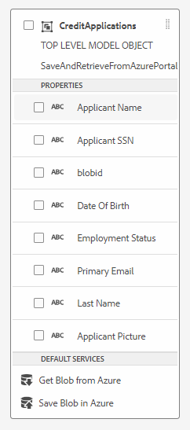

# Create the integration with Azure Storage

The next step is to create the integration between AEM Forms CS and Azure Storage using the Form Data Model.
The following video walks you through the steps required to create the integration.

>[!VIDEO](https://video.tv.adobe.com/v/335385?quality=12&learn=on)

For the purpose of this tutorial a form data model called SaveAndRetrieveFromAzurePortal was created with an entity called CreditApplications 

## Next Steps

[Create Adaptive Form](./create-af.md)
