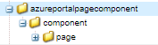
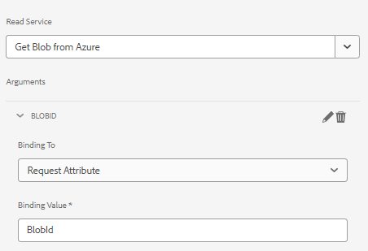

# Page Component

A page component is a regular component responsible for rendering a page. We are going a create a new page component and will be associating this page component with a new adaptive form template. This ensure our code will be excecuted only when an adaptive form is based on this particular template.

## Create Page Component

Login to your local cloud ready AEM Forms instance. Create the following structure under the apps folder


1. Right click page folder and create a node called storeandfetch of type cq:Component
1. Save the changes
1. Add the following properties to the `storeandfetch` node and save

| **Property Name**       | **Property Type** | **Property Value**                     |
|-------------------------|-------------------|----------------------------------------|
| componentGroup          | String            | hidden                                 |
| jcr:description         | String            | Adaptive Form Template Page Type       |
| jcr:title               | String            | Adaptive Form Template Page            |
| sling:resourceSuperType | String            | `fd/af/components/page2/aftemplatedpage` |

Copy the `/libs/fd/af/components/page2/aftemplatedpage/aftemplatedpage.jsp` and paste it under the `storeandfetch` node. Rename the `aftemplatedpage.jsp` to `storeandfetch.jsp`.

Open `storeandfetch.jsp` and add the following line:

``` jsp
<cq:include script="azureportal.jsp"/>
``` 

under the 

``` jsp
<cq:include script="fallbackLibrary.jsp"/>
```

The final code should look like below

``` jsp
<cq:include script="fallbackLibrary.jsp"/>
<cq:include script="azureportal.jsp"/>
```
 
Create a file called azureportal.jsp under the storeandfetch node
copy the following code in to the azureportal.jsp and save the changes

```jsp
<%@page session="false" %>
<%@include file="/libs/fd/af/components/guidesglobal.jsp" %>
<%@ page import="org.apache.commons.logging.Log" %>
<%@ page import="org.apache.commons.logging.LogFactory" %>
<%
    if(request.getParameter("guid")!=null) {
            logger.debug( "Got Guid in the request" );
            String BlobId = request.getParameter("guid");
            java.util.Map paraMap = new java.util.HashMap();
            paraMap.put("BlobId",BlobId);
            slingRequest.setAttribute("paramMap",paraMap);
    } else {
            logger.debug( "There is no Guid in the request " );
    }            
%>
```

In this code we get the value of the request parameter **guid** and store it in a variable called BlobId. This BlobId is then passed into the sling request using the paramMap attribute. For this code to work, it is assumed that you have a form based on a Azure Storage backed form data model and the read service of the form data model is bound to an request attribute called BlobId as shown in the screen shot below.



### Next Steps

[Associate the page component with the template](./associate-page-component.md)
