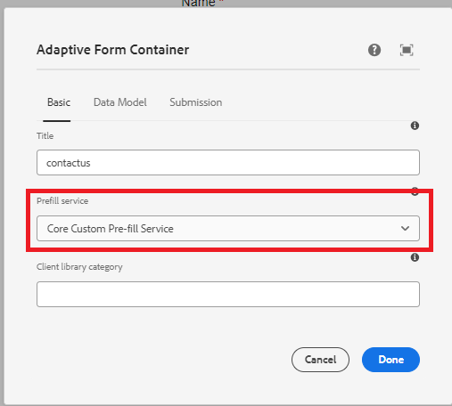

# Test the solution

After the code is deployed, create an adaptive form based on core components. Associate the adaptive form with the prefill service as shown in the screenshot below.


Every time the form is rendered, the associated prefill service will be executed and the form will be populated with the data returned by the prefill service.

For example to prefill the form with the data associated with the guid **d815a2b3-5f4c-4422-8197-d0b73479bf0e**, the following url is used. 
The code in the prefill service will extract the value of guid parameter and fetch the data associated with the guid from the data source.

``` html
http://localhost:4502/content/dam/formsanddocuments/contactus/jcr:content?wcmmode=disabled&guid=d815a2b3-5f4c-4422-8197-d0b73479bf0e
```
