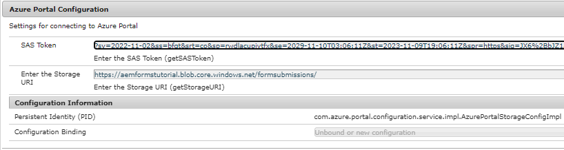

# Create OSGi configuration

A custom OSGi configuration called Azure Portal Configuration was created to specify the Azure Storage URI and the SAS Token URI. These two values are used to construct the REST API to communicate with the Azure Storage



The complete code for the configuration service is listed below

AzurePortalConfiguration

```java
package com.azure.portal.configuration;

import org.osgi.service.metatype.annotations.AttributeDefinition;
import org.osgi.service.metatype.annotations.ObjectClassDefinition;

@ObjectClassDefinition(name = "Azure Portal Configuration", description = "Settings for connecting to Azure Portal")

public @interface AzurePortalConfiguration {

    @AttributeDefinition(name = "SAS Token", description = "Enter the SAS Token")
    String getSASToken() default "";

    @AttributeDefinition(name = "Enter the Storage URI", description = "Enter the Storage URI")
    String getStorageURI() default"";

}
```

AzurePortalConfigurationService

```java
package com.azure.portal.configuration.service;

public interface AzurePortalConfigurationService {
    String getStorageURI();
    String getSASToken();

}

```

AzurePortalStorageConfigImpl

```java
package com.azure.portal.configuration.service.impl;

import org.osgi.framework.Constants;
import org.osgi.service.component.annotations.Activate;
import org.osgi.service.component.annotations.Component;
import org.osgi.service.metatype.annotations.Designate;
import com.azure.portal.configuration.service.AzurePortalConfigurationService;
import com.azure.portal.configuration.AzurePortalConfiguration;
@Component(
        service = AzurePortalConfigurationService.class,
        immediate = true,
        property = {
                Constants.SERVICE_ID+ "=Azure Portal Config Service",
                Constants.SERVICE_DESCRIPTION +"=This service reads values from Azure portal config"
        }
)
@Designate(ocd=AzurePortalConfiguration.class)
public class AzurePortalStorageConfigImpl implements AzurePortalConfigurationService {
    private AzurePortalConfiguration azurePortalConfiguration;
    @Activate
    protected void activate(AzurePortalConfiguration configuration) {
        System.out.println("##### in activate #####");
        this.azurePortalConfiguration = configuration;
    }

    @Override
    public String getStorageURI() {
        // TODO Auto-generated method stub
        return azurePortalConfiguration.getStorageURI();
    }

    @Override
    public String getSASToken() {
        // TODO Auto-generated method stub
        return azurePortalConfiguration.getSASToken();
    }

}

```

## Next Steps

[Create blob index tags](./create-blob-index-tags.md)
