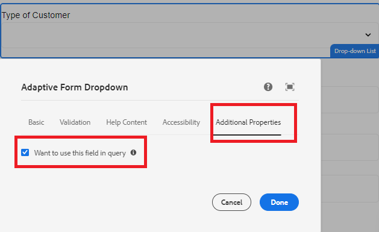
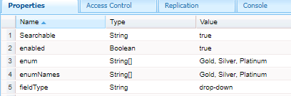
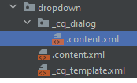

# Extend choice group components

The checkboxgroup,dropdown and radiobutton core components were extended to include an Additional Properties tab. The addtional properties tab has a checkbox to indicate if the field is to be used as an blob index tab
. When the checkbox is selected a property called Searchable is created and its value is set to true in the jcr repository as shown in the following screen shot
.

The following .content.xml was created under _cq_dialog folder.



```xml
<?xml version="1.0" encoding="UTF-8"?>
<jcr:root xmlns:sling="http://sling.apache.org/jcr/sling/1.0" xmlns:cq="http://www.day.com/jcr/cq/1.0" xmlns:jcr="http://www.jcp.org/jcr/1.0" xmlns:nt="http://www.jcp.org/jcr/nt/1.0"
          jcr:primaryType="nt:unstructured"
          jcr:title="Check box group"
          sling:resourceType="cq/gui/components/authoring/dialog">
    <content
            jcr:primaryType="nt:unstructured"
            sling:resourceType="granite/ui/components/coral/foundation/container">
        <items jcr:primaryType="nt:unstructured">
            <tabs
                    jcr:primaryType="nt:unstructured"
                    sling:resourceType="granite/ui/components/coral/foundation/tabs"
                    maximized="{Boolean}false">
                <items jcr:primaryType="nt:unstructured">

                    <properties
                            jcr:primaryType="nt:unstructured"
                            jcr:title="Additional Properties"
                            sling:resourceType="granite/ui/components/coral/foundation/container"
                            margin="{Boolean}true">
                        <items jcr:primaryType="nt:unstructured">
                            <columns
                                    jcr:primaryType="nt:unstructured"
                                    sling:resourceType="granite/ui/components/coral/foundation/fixedcolumns"
                                    margin="{Boolean}true">
                                <items jcr:primaryType="nt:unstructured">
                                    <column
                                            jcr:primaryType="nt:unstructured"
                                            sling:resourceType="granite/ui/components/coral/foundation/container">
                                        <items jcr:primaryType="nt:unstructured">
                                            <Searchable
                                                    jcr:primaryType="nt:unstructured"
                                                    sling:resourceType="granite/ui/components/coral/foundation/form/checkbox"
                                                    emptyText="Want to include in search?"
                                                    fieldDescription="Indicate if you want to use in search"
                                                    text="Want to use this field in query"
                                                    value="{Boolean}true"
                                                    uncheckedValue="{Boolean}false"

                                                    name="./Searchable"
                                                    checked="{Boolean}false"
                                                    required="{Boolean}false"/>


                                        </items>
                                    </column>
                                </items>
                            </columns>
                        </items>
                    </properties>
                </items>
            </tabs>
        </items>
    </content>
</jcr:root>

```

## Next Steps

[Create Azure Portal Configuration](./create-osgi-configuration.md)
