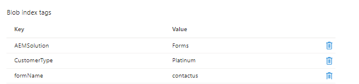

# Introduction

In this tutorial, you learn how to implement a simple use case of storing form submissions in Azure storage with blob index tags. Blob index tags provide data management and discovery capabilities by using key-value index tag attributes. You can categorize and find objects within a single container or across all containers in your storage account.

## Pre-requisites

* Experience with AEM Forms CS.
* Experience in deploying code using cloud manager.
* Access to cloud ready instance of AEM Forms CS.

To implement the above use case in AEM Forms CS, you will need the following

* [AEM Forms CS cloud ready instance](https://experienceleague.adobe.com/docs/experience-manager-learn/cloud-service/forms/developing-for-cloud-service/intellij-and-aem-sync.html?lang=en#set-up-aem-author-instance)
* [Azure portal account](https://portal.azure.com/)

### Next Steps

[extend-choice-group-components](./extend-choice-group-components.md)
