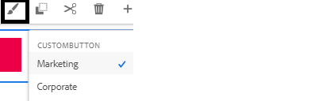
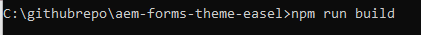
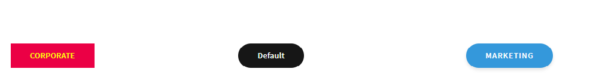

# Test the changes

Create an adaptive form based on the **"Blank with Core Components"** template. Drag and drop 3 buttons on the form and label them "Corporate","Marketing", and "Default".
Assign the appropriate style variants to the Corporate and Marketing buttons by selecting the paint brush as shown below.

The third button will have the default style applied.

## Build the theme project

The next step is to build the theme project. Navigate to the root folder of your theme project and run the command _**npm run build**_ as shown in the screenshot below.

Once the theme project is built successfully, your are ready to test the changes.

## Quick and easy way to test your css

* Open the theme.css file located under the dist folder of your theme project.Select and copy the entire file content. 
* Preview the form created in the earlier step.
* Right click on one of the buttons and select Inspect to open the developer console.
* From the developer console click on the theme.css to open the theme.css
* Select  and delete the entire content of theme.css by using CTR-A and hit the delete button.
* Copy and paste the contents of theme.css that you built in the earlier step.
* The buttons should get updated with the appropriate styles as shown below.

 

## Push the changes

If you are satisfied with the changes, you can push the changes to your cloud instance using the [front-end pipeline](https://experienceleague.adobe.com/en/docs/experience-manager-learn/getting-started-wknd-tutorial-develop/enable-frontend-pipeline-devops/create-frontend-pipeline)
