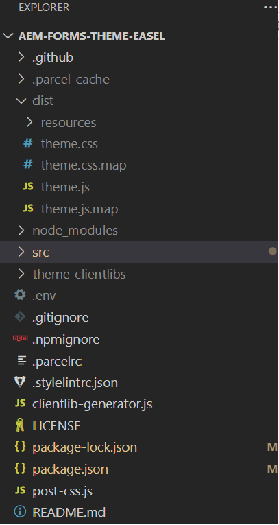
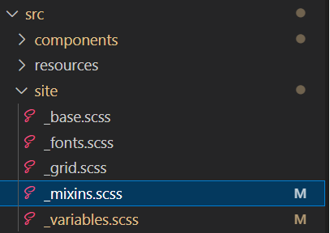

# Create variations for the button component

After the theme is cloned, open the project using visual studio code. You should see a similar view
in visual studio code


Open src->components->button->_button.scss file. We will define our custom variations in this file.

## Corporate variation

``` css
.cmp-adaptiveform-button-corporate {
  @include container;
  .cmp-adaptiveform-button {
    &__widget {
      @include primary-button;
      background: $brand-red;
      text-transform: uppercase;
      border-radius: 0px;
      color: yellow;
    }
  }
}

```

## Explanation

* **cmp-adaptiveform-button--corporate**: This is the main wrapper or container class for the "cmp-adaptiveform-button--corporate" component.
Any styles or mixins inside this block will apply to elements within this class.
* **@include container**: This uses a mixin called container, which is defined in the _mixins.scss. The mixin container typically applies layout-related styles such as setting up margins, padding, or other structural styles to ensure the container behaves consistently.
* **.cmp-adaptiveform-button**: Inside the corporate-style-button block, you're targeting the child element with the class .cmp-adaptiveform-button.
* **&__widget**: The & symbol refers to the parent selector, which in this case is .cmp-adaptiveform-button.
This means that the final class targeted will be .cmp-adaptiveform-button__widget, a BEM-style class (Block Element Modifier) that represents a sub-component (the __widget element) inside the .cmp-adaptiveform-button block.
* **@include primary-button**: This includes a primary-button mixin, which is defined in the _mixin.scss and adds styles related to the button (such as padding, colors, hover effects, etc.). The properties background,text-transform,border-radius,color defined in the mixin primary-button are overridden.

The _mixins.scss file is defined under src->site as shown in the screenshot below



## Marketing variation

``` css
.cmp-adaptiveform-button--marketing {
  
  @include container;
  .cmp-adaptiveform-button {
  &__widget {
    @include primary-button;
    background-color: #3498db;
    color: white;
    font-weight: bold;
    border: none;
    border-radius: 50px;
    box-shadow: 0 4px 6px rgba(0, 0, 0, 0.1);
    cursor: pointer;
    transition: all 0.3s ease;
    outline: none;
    text-transform: uppercase;
    letter-spacing: 0.05em;
    &:hover:not([disabled]) {
      position: relative;
      scale: 102%;
      transition: box-shadow 0.1s ease-out, transform 0.1s ease-out;
      background-color: #2980b9;
      box-shadow: 0 8px 15px rgba(0, 0, 0, 0.2);
      transform: translateY(-3px);
    }
  }
}
  
}
```

## Next Steps

[Test the variations](./build.md)


