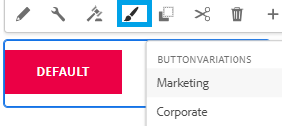

# Introduction

The Style System in Adobe Experience Manager (AEM) allows users to create multiple visual variations of a component, and then select which style to use when authoring a form. This makes components more flexible and reusable, without the need to create custom components for each style.

This article will help you create variations of the button component and test the variations in your local cloud ready environment before you push the changes to the cloud instance using cloud manager.

The screen shot shows the 2 style variations for the button component available to the form author.

## Prerequisites

* AEM Forms cloud ready instance with core components. 
* Cloning a theme: You need to be familiar in cloning a theme. For the purpose of this tutorial we have cloned the [easel theme](https://github.com/adobe/aem-forms-theme-easel). You can clone any of the available themes to suit your needs.

* Install the latest release of Apache Maven. Apache Maven is a build automation tool commonly used for Java&trade; projects. Installing the latest release ensures you have the necessary dependencies for theme customization.
* Install a plain text editor. For example, Microsoft&reg; Visual Studio Code. Using a plain text editor such as Microsoft&reg; Visual Studio Code provides a user-friendly environment for editing and modifying theme files.

## Next Steps

[Create Styling Policy](./style-policy.md)
