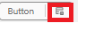
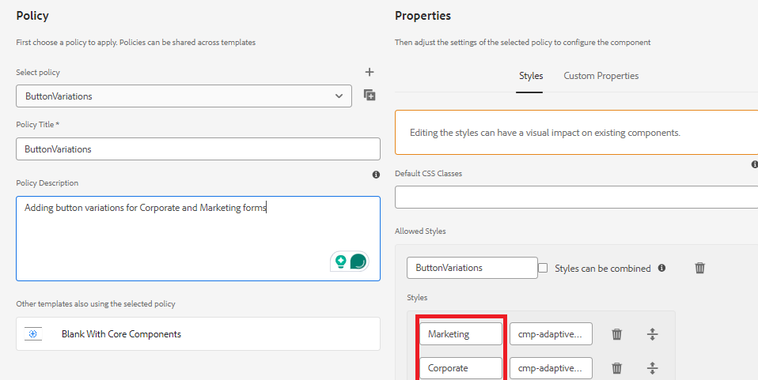

# Define the style in the policy for the component

* Login to your local cloud ready AEM instance and navigate to Tools | General | Templates | your project name.

* Select and open the  the **Blank with Core Components** template in edit mode.
* Click on the policy icon of the button component to open the policy editor.

* 

Define the policy as shown below

We have defined 2 style/variations called Marketing and Corporate.These variations are associated with corresponding CSS classes.**Please make sure there is no space before and after the CSS class names**.
Save your changes.

| Style     | CSS Class                          |
|-----------|------------------------------------|
| Marketing | cmp-adaptiveform-button--marketing |
| Corporate | cmp-adaptiveform-button--corporate |

These CSS classes will be defined in the component's scss file(_button.scss).

## Next Steps

[Define CSS Classes](./create-variations.md)
