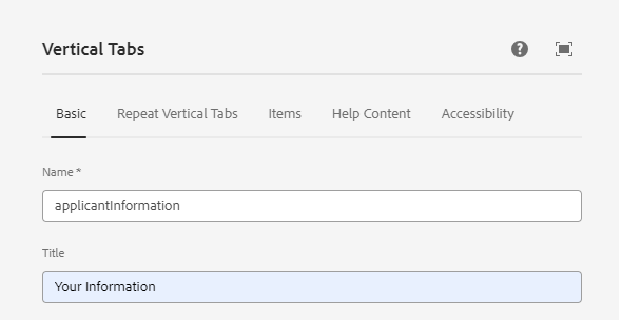
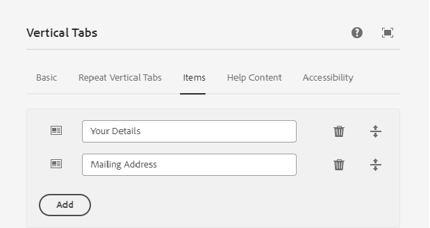
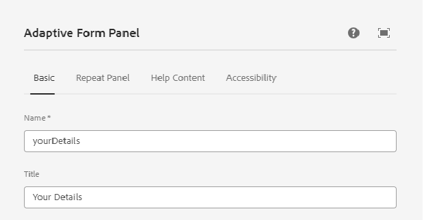
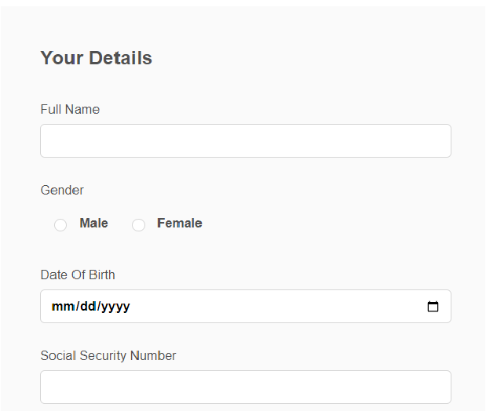
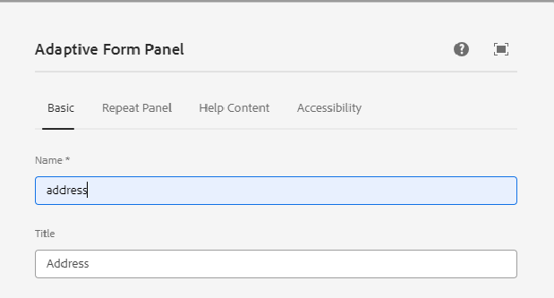
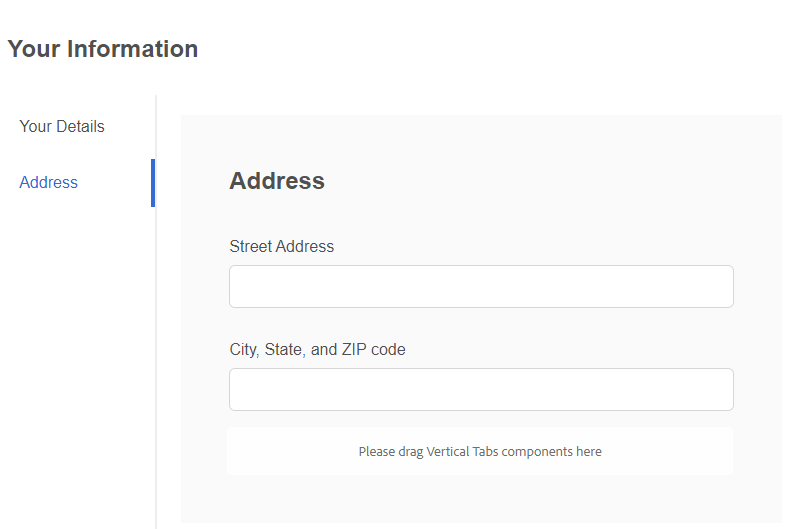

# Create Adaptive Form

Create an core component based adaptive form and insert a vertical tab component onto your form.

## Configure Vertical Component

Click on the vertical tabs component to open the configuration property sheet. Configure the following tabs

1. Basic - Provide a meaningful name and title to the vertical tab component as shown below

1. Items - The items tab allows you to add items to the vertical tab component. Generally, you will add a panel as an item and then add your form elements to the panel. The vertical tab by default has two items and you can name the items as per your requirements as seen below

## Configure individual panels

1. Your Details - Select item 1 under the **Your Information** node and open the configuration property sheet. Provide a meaningful name and title as shown below
 

Add the following fields to the Your Details panel as shown

1. Address - Select item 2 under the **Your Information** node and open the configuration property sheet. Provide a meaningful name and title as shown below

Add the following 2 text fields to the Address panel as shown below

