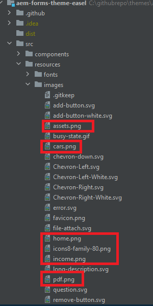
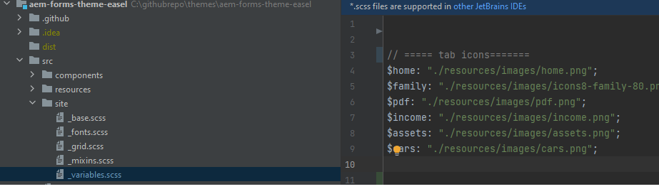
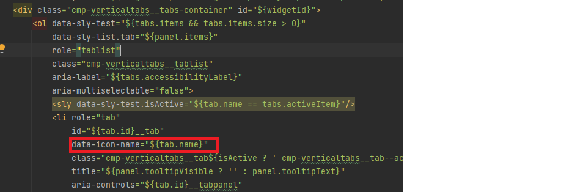
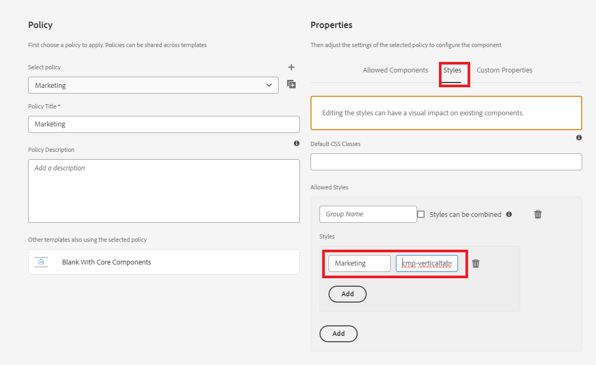

# Adding custom icons 

Adding custom icons to tabs can improve user experience and visual appeal in a few ways:

* Enhanced Usability: Icons can quickly convey the purpose of each tab, making it easier for users to find what they're looking for at a glance. Visual cues like icons help users navigate more intuitively.

* Visual Hierarchy and Focus: Icons create a more distinct separation between tabs, improving visual hierarchy. This can help important tabs stand out and guide users' attention more effectively.
By following this article, you should be able to place the icons as shown below


## Prerequisites

To follow this article, you need to be familiar with Git,creating and deploying an AEM project using cloud manager, setting up a front end pipeline in AEM cloud manager, and a little bit of CSS. If you are not familiar with the above mentioned topics, please follow [using themes to style core components](https://experienceleague.adobe.com/en/docs/experience-manager-cloud-service/content/forms/adaptive-forms-authoring/authoring-adaptive-forms-core-components/create-an-adaptive-form-on-forms-cs/using-themes-in-core-components#rename-env-file-theme-folder) article.

## Add icons to the theme

Open the theme project in visual studio code or any other editor of your choice.
Add the icons of your choice to the images folder. 
The icons marked in red are the new icons added. 


## Create icon-map to store the icons

Create the icon-map to the _variable.scss file. The SCSS map $icon-map is a collection of key-value pairs, where each key represents an icon name (like home, family, etc.), and each value is the path to the image file associated with that icon.



``` css
$icon-map: (
    home: "./resources/images/home.png",
    family: "./resources/images/icons8-family-80.png",
    pdf: "./resources/images/pdf.png",
    income: "./resources/images/income.png",
    assets: "./resources/images/assets.png",
    cars: "./resources/images/cars.png"
);


```

## Add mixin

Add the following code to the _mixin.scss

``` css

@mixin add-icon-to-vertical-tab($image-url) {
  display: inline-flex;
  align-self: center;
  &::before {
    content: "";
    display:inline-block;
    background: url($image-url) left center / cover no-repeat;
    margin-right: 8px; /* Space between icon and text */
    height:40px;
    width:40px;
    vertical-align:middle;
    
  }
  
}

```

The add-icon-to-vertical-tab mixin is designed to add a custom icon next to the text on a vertical tab. It allows you to easily include an image as an icon on tabs, positioning it beside the text and styling it to ensure consistency and alignment.

Breakdown of the Mixin
Here's what each part of the mixin does:

Parameters:

* $image-url: The URL of the icon or image you want to display beside the tab text. Passing this parameter makes the mixin versatile, as it allows different icons to be added to different tabs as needed.

* Styles Applied:

    * display: inline-flex: This makes the element a flex container, aligning any nested content (like the icon and text) horizontally.
   * align-self: center: Ensures the element is vertically centered within its container.
    * Pseudo-element (::before):
    * content: "": Initializes the ::before pseudo-element, which is used to display the icon as a background image.
    * display: inline-block: Sets the pseudo-element to inline-block, allowing it to behave like an icon placed inline with the text.
    * background: url($image-url) left center / cover no-repeat;: Adds the background image using the URL provided via $image-url. The icon is aligned to the left and centered vertically.

## Update the _verticaltabs.scss

For the purpose of the article , I created a new css class(cmp-verticaltabs--marketing) to display the tab icons. In this new class we extend the tab element by adding the icons. The complete listing of the css class is as follows

``` css
.cmp-verticaltabs--marketing
{
  .cmp-verticaltabs
    {
      &__tab 
        {
          cursor:pointer;
            @each $name, $url in $icon-map {
            &[data-icon-name="#{$name}"]
              {
                  @include add-icon-to-vertical-tab($url);
              }
            }
        }
    }
}

```

## Modify the verticaltabs component

Copy the verticaltabs.html file from ```/apps/core/fd/components/form/verticaltabs/v1/verticaltabs/verticaltabs.html``` and paste it under the verticaltabs component of your project. Add the following line ```data-icon-name="${tab.name}"``` to the copied file  under the li role as shown in the image below

we are setting a custom data attribute called data-icon-name with the value of the tab name.If the tab name matches an image name in the icon map, the corresponding image is associated with the tab.


## Test the code

Deploy the updated verticaltabs component to your cloud instance.
Deploy the updated theme using the frontend pipeline.
Create a style variation for the vertical tab components as shown below

We have created a style variation called Marketing which is associated with css class _**cmp-verticaltabs--marketing**_.
Create an adaptive form with a vertical tab component. Associate the vertical tab component with the Marketing style variation.
Add a couple of tabs to the verticaltabs and name them to match the images defined in the icon map such as home,family.


Preview the form, you should see the appropriate icons associated with the tab
