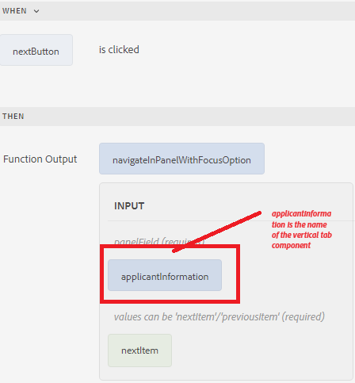
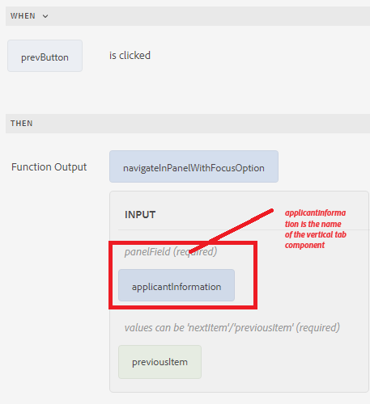

# Navigating between the tabs

You can navigate between the tab by clicking on the individual tabs or by using previous and next buttons on the form. 
To navigate using buttons, add two buttons to your form and name them Previous and Next. Associate the following custom function with the click event of the button to navigate between the tabs.

The following is the custom function to navigate between the tabs.


``` javascript
/**
 * Navigate in panel with focusOption
 * @name navigateInPanelWithFocusOption
 * @param {object} panelField
 * @param {string} focusOption - values can be 'nextItem'/'previousItem'
 * @param {scope} globals
 */
function navigateInPanelWithFocusOption(panelField, focusOption, globals)
{
    globals.functions.setFocus(panelField, focusOption);
}

```

The following is the rule editor for the Next and Previous buttons

**Next Button**



**Previous Button**



