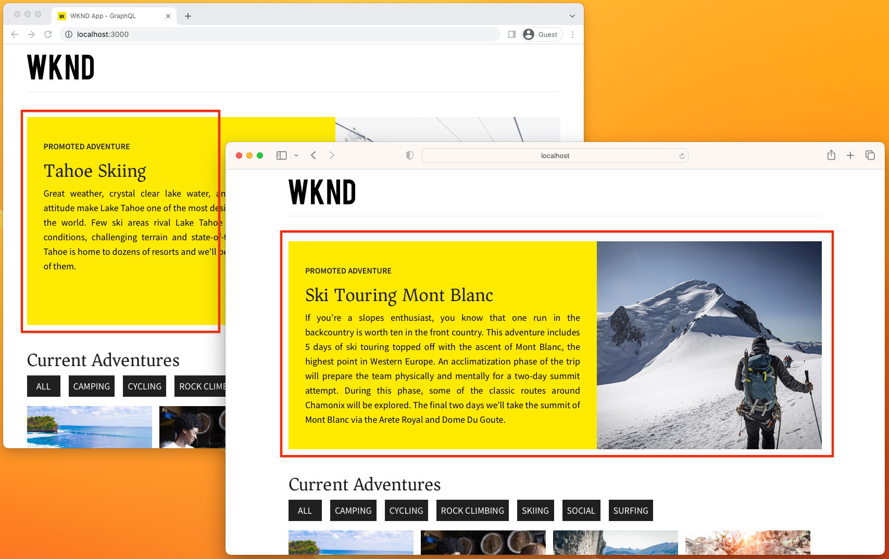

# Integrate AEM Headless and Target

Learn how to integrate AEM Headless with Adobe Target, by exporting AEM Content Fragments to Adobe Target, and use them to personalize headless experiences using the Adobe Experience Platform Web SDK's alloy.js. The [React WKND App](https://experienceleague.adobe.com/docs/experience-manager-learn/getting-started-with-aem-headless/how-to/example-apps/react-app.html) is used to explore how a personalized Target activity using Content Fragments Offers can be added to the experience, to promote a WKND adventure.

>[!VIDEO](https://video.tv.adobe.com/v/3416585/?quality=12&learn=on)

The tutorial covers the steps involved in setting up AEM and Adobe Target:

1. [Create Adobe IMS Configuration for Adobe Target](#adobe-ims-configuration) in AEM Author
2. [Create Adobe Target Cloud Service](#adobe-target-cloud-service) in AEM Author
3. [Apply Adobe Target Cloud Service to AEM Assets folders](#configure-asset-folders) in AEM Author
4. [Permission the Adobe Target Cloud Service](#permission) in Adobe Admin Console
5. [Export Content Fragments](#export-content-fragments) from AEM Author to Target
6. [Create an Activity using Content Fragment Offers](#activity) in Adobe Target
7. [Create an Experience Platform Datastream](#datastream-id) in Experience Platform
8. [Integrate personalization into a React-based AEM Headless app](#code) using the Adobe Web SDK.

## Adobe IMS Configuration{#adobe-ims-configuration}

An Adobe IMS Configuration that facilitates the authentication between AEM and Adobe Target.

Review [the documentation](https://experienceleague.adobe.com/docs/experience-manager-cloud-service/content/sites/integrations/integration-adobe-target-ims.html) for step-by-step instructions on how to create an Adobe IMS configuration.

>[!VIDEO](https://video.tv.adobe.com/v/3416495/?quality=12&learn=on)

## Adobe Target Cloud Service{#adobe-target-cloud-service}

An Adobe Target Cloud Service is created in AEM to facilitate the exporting of Content Fragments to Adobe Target.

Review [the documentation](https://experienceleague.adobe.com/docs/experience-manager-cloud-service/content/sites/integrations/integrating-adobe-target.html) for step-by-step instructions on how to create an Adobe Target Cloud Service.

>[!VIDEO](https://video.tv.adobe.com/v/3416499/?quality=12&learn=on)


## Configure asset folders{#configure-asset-folders}

The Adobe Target Cloud Service, configured in a context-aware configuration, must be applied to the AEM Assets folder hierarchy that contains the Content Fragments to export to Adobe Target.

+++Expand for step-by-step instructions

1. Log in to __AEM Author service__ as a DAM administrator
1. Navigate to __Assets > Files__, locate the asset folder that has the `/conf` applied to
1. Select the asset folder, and select __Properties__ from the top action bar
1. Select the __Cloud Services__ tab
1. Ensure that the Cloud Configuration is set to the context-aware config (`/conf`) that contains the Adobe Target Cloud Services configuration.
1. Select __Adobe Target__ from the __Cloud Service Configurations__ dropdown.
1. Select __Save & Close__ in the top right

+++

<br/>

>[!VIDEO](https://video.tv.adobe.com/v/3416504/?quality=12&learn=on)

## Permission the AEM Target integration{#permission}

The Adobe Target integration, which manifests as a developer.adobe.com project, must be granted the __Editor__ product role in Adobe Admin Console, in order to export Content Fragments to Adobe Target.

+++Expand for step-by-step instructions

1. Log in to Experience Cloud as user that can administer the Adobe Target product in Adobe Admin Console
1. Open the [Adobe Admin Console](https://adminconsole.adobe.com)
1. Select __Products__ and then open __Adobe Target__
1. On the __Product Profiles__ tab, select __*DefaultWorkspace*__ 
1. Select the __API Credentials__ tab
1. Locate your developer.adobe.com app in this list and set its __Product Role__ to __Editor__

+++

<br/>

>[!VIDEO](https://video.tv.adobe.com/v/3416505/?quality=12&learn=on)

## Export Content Fragments to Target{#export-content-fragments}

Content Fragments that exist under the [configured AEM Assets folder hierarchy](#apply-adobe-target-cloud-service-to-aem-assets-folders) can be exported to Adobe Target as Content Fragment Offers. These Content Fragment Offers, a special form of JSON offers in Target, can be used in Target activities to serve personalized experiences in headless apps.

+++Expand for step-by-step instructions

1.  Log in to __AEM Author__ as DAM user
1.  Navigate to __Assets > Files__, and locate Content Fragments to export as JSON to Target under the "Adobe Target enabled" folder
1.  Select the Content Fragments to export to Adobe Target
1.  Select __Export to Adobe Target Offers__ from the top action bar
    +   This action exports the fully hydrated JSON representation of the Content Fragment to Adobe Target as a "Content Fragment Offer"
    +   The Fully hydrated JSON representation can be reviewed in AEM
        + Select the Content Fragment
        + Expand the Side Panel
        + Select __Preview__ icon in the left Side Panel
        + The JSON representation that is exported to Adobe Target displays in the main view
1.  Log in to [Adobe Experience Cloud](https://experience.adobe.com) with a user in the Editor role for Adobe Target
1.  From the [Experience Cloud](https://experience.adobe.com), select __Target__ from the product switcher in top right to open Adobe Target.
1.  Ensure that the Default Workspace is selected in the __Workspace switcher__ in the top right.
1.  Select the __Offers__ tab in the top navigation
1.  Select the __Type__ dropdown, and selecting __Content Fragments__
1.  Verify the Content Fragment exported from AEM appears in the list
    + Hover over the offer, and select the __View__ button
    + Review the __Offer Info__ and see the __AEM deep link__ that opens the Content Fragment directly in AEM Author service

+++

<br/>

>[!VIDEO](https://video.tv.adobe.com/v/3416506/?quality=12&learn=on)

## Target Activity using Content Fragment Offers{#activity}

In Adobe Target, an Activity can be created that uses Content Fragment Offer JSON as the content, allowing personalized experiences in headless app with content created and managed in AEM.  

In this example, we use a simple A/B activity, however any Target activity can be used.

+++Expand for step-by-step instructions

1.  Select the __Activities__ tab in the top navigation
1.  Select __+ Create Activity__, and then select the type of activity to create.
    + This example creates a simple __A/B Test__ but Content Fragment Offers can power any activity type
1.  In the __Create Activity__ wizard
    + Select __Web__
    + In __Choose Experience Composer__, select __Form__
    + In __Choose Workspace__, select __Default Workspace__
    + In __Choose Property__, select the Property the Activity is available in, or select __No Property Restrictions__ to allow it to be used in all Properties.
    + Select __Next__ to create the Activity
1.  Rename the Activity by selecting __rename__ in the top left
    + Give the activity a meaningful name
1.  In the initial Experience, set __Location 1__ for the Activity to target
    + In this example, target a custom location named `wknd-adventure-promo`
1.  Under __Content__ select the Default content, and select __Change Content Fragment__
1.  Select the exported Content Fragment to serve for this experience, and select __Done__
1.  Review the Content Fragment Offer JSON in the Content text area, this is the same JSON available in AEM Author service via the Content Fragment's Preview action.
1.  In the left rail, add an Experience, and select a different Content Fragment Offer to serve
1.  Select __Next__, and configure the Targeting rules as required for the activity
    + In this example, leave the A/B testing as a manual 50/50 split.
1.  Select __Next__, and complete the activity settings
1.  Select __Save & Close__ and give it a meaningful name
1.  From the Activity in Adobe Target, select __Activate__ from the Inactive/Activate/Archive dropdown in the top right.

The Adobe Target activity that targets the `wknd-adventure-promo` location can now be integrated and exposed in an AEM Headless app.

+++

<br/>

>[!VIDEO](https://video.tv.adobe.com/v/3416507/?quality=12&learn=on)

## Experience Platform Datastream ID{#datastream-id}

An [Adobe Experience Platform Datastream](https://experienceleague.adobe.com/docs/platform-learn/implement-web-sdk/initial-configuration/configure-datastream.html) ID is required for AEM Headless apps to interact with Adobe Target using the [Adobe Web SDK](https://experienceleague.adobe.com/docs/experience-platform/edge/fundamentals/configuring-the-sdk.html). 

+++Expand for step-by-step instructions

1.  Navigate to [Adobe Experience Cloud](https://experience.adobe.com/)
1.  Open __Experience Platform__
1.  Select __Data Collection > Datastreams__ and select __New Datastream__
1.  In the New Datastream wizard, enter:
    + Name: `AEM Target integration`
    + Description: `Datastream used by the Adobe Web SDK to serve personalized Content Fragments Offers.`
    + Event Schema: `Leave blank`
1.  Select __Save__
1.  Select __Add Service__
1.  In __Service__ select __Adobe Target__
    +   Enabled: __Yes__
    +   Property Token: __Leave blank__
    +   Target Environment ID: __Leave blank__
        + The Target Environment can be set in Adobe Target at __Administration > Hosts__.
    +   Target Third-Party ID Namespace: __Leave blank__
1.  Select __Save__
1.  On the right side, copy the __Datastream ID__ for use in [Adobe Web SDK](https://experienceleague.adobe.com/docs/experience-platform/edge/fundamentals/configuring-the-sdk.html) configuration call.

+++

<br/>

>[!VIDEO](https://video.tv.adobe.com/v/3416500/?quality=12&learn=on)

## Add personalization to an AEM Headless app{#code}

This tutorial explores personalizing a simple React app using Content Fragment Offers in Adobe Target via [Adobe Experience Platform Web SDK](https://experienceleague.adobe.com/docs/experience-platform/edge/home.html). This approach can be used to personalize any JavaScript-based web experience.

Android&trade; and iOS mobile experiences can be personalized following similar patterns using the [Adobe's Mobile SDK](https://developer.adobe.com/client-sdks/documentation/).

### Prerequisites

+ Node.js 14
+ Git
+ [WKND Shared 2.1.4+](https://github.com/adobe/aem-guides-wknd-shared/releases/latest) installed on AEM as a Cloud Author and Publish services

### Set up

1.  Download the source code for sample React app from [Github.com](https://github.com/adobe/aem-guides-wknd-graphql)
    
    ```shell
    $ mkdir -p ~/Code
    $ git clone git@github.com:adobe/aem-guides-wknd-graphql.git
    ```

1.  Open code base at `~/Code/aem-guides-wknd-graphql/personalization-tutorial` in your favorite IDE
1.  Update the AEM service's host that you want the app to connect to `~/Code/aem-guides-wknd-graphql/personalization-tutorial/src/.env.development`

    ```
    ...
    REACT_APP_HOST_URI=https://publish-p1234-e5678.adobeaemcloud.com/
    ...
    ```

1.  Run the app, and ensure it connects to the configured AEM service. From the command line, execute:

    ```shell
    $ cd ~/Code/aem-guides-wknd-graphql/personalization-tutorial
    $ npm install
    $ npm run start
    ```

1.  Install the [Adobe Web SDK](https://experienceleague.adobe.com/docs/experience-platform/edge/fundamentals/installing-the-sdk.html#option-3%3A-using-the-npm-package) as an NPM package.

    ```shell
    $ cd ~/Code/aem-guides-wknd-graphql/personalization-tutorial
    $ npm install @adobe/alloy
    ```

    The Web SDK can be used in code to fetch the Content Fragment Offer JSON by activity location.

    When configuring the Web SDK, there are two IDs required:

    +   `edgeConfigId` which is the [Datastream ID](#datastream-id)
    +   `orgId` the AEM as a Cloud Service/Target Adobe Org Id that can be found at __Experience Cloud > Profile > Account info > Current Org ID__

    When invoking the Web SDK, the Adobe Target activity location (in our example, `wknd-adventure-promo`) must be set as the value in the `decisionScopes` array.

    ```javascript
    import { createInstance } from "@adobe/alloy";
    const alloy = createInstance({ name: "alloy" });
    ...
    alloy("config", { ... });
    alloy("sendEvent", { ... });
    ```

### Implementation

  1. Create a React component `AdobeTargetActivity.js` to surface Adobe Target activities.

     __src/components/AdobeTargetActivity.js__

      ```javascript
      import React, { useEffect } from 'react';
      import { createInstance } from '@adobe/alloy';

      const alloy = createInstance({ name: 'alloy' });

      alloy('configure', { 
        'edgeConfigId': 'e3db252d-44d0-4a0b-8901-aac22dbc88dc', // AEP Datastream ID
        'orgId':'7ABB3E6A5A7491460A495D61@AdobeOrg',
        'debugEnabled': true,
      });

      export default function AdobeTargetActivity({ activityLocation, OfferComponent }) { 
        const [offer, setOffer] = React.useState();

        useEffect(() => {
          async function sendAlloyEvent() {
            // Get the activity offer from Adobe Target
            const result = await alloy('sendEvent', {
              // decisionScopes is set to an array containing the Adobe Target activity location
              'decisionScopes': [activityLocation],
            });
            
            if (result.propositions?.length > 0) {
              // Find the first proposition for the active activity location
              var proposition = result.propositions?.filter((proposition) => { return proposition.scope === activityLocation; })[0];
              
              // Get the Content Fragment Offer JSON from the Adobe Target response
              const contentFragmentOffer = proposition?.items[0]?.data?.content || { status: 'error', message: 'Personalized content unavailable'};

              if (contentFragmentOffer?.data) {
                // Content Fragment Offers represent a single Content Fragment, hydrated by
                // the byPath GraphQL query, we must traverse the JSON object to retrieve the 
                // Content Fragment JSON representation
                const byPath = Object.keys(contentFragmentOffer.data)[0];
                const item = contentFragmentOffer.data[byPath]?.item;

                if (item) {
                  // Set the offer to the React state so it can be rendered
                  setOffer(item);
                  
                  // Record the Content Fragment Offer as displayed for Adobe Target Activity reporting
                  // If this request is omitted, the Target Activity's Reports will be blank
                  alloy("sendEvent", {
                      xdm: {
                          eventType: "decisioning.propositionDisplay",
                          _experience: {
                              decisioning: {
                                  propositions: [proposition]
                              }
                          }
                      }
                  });          
                }
              }
            }
          };

          sendAlloyEvent();
          
        }, [activityLocation, OfferComponent]);

        if (!offer) {
          // Adobe Target offer initializing; we render a blank component (which has a fixed height) to prevent a layout shift
          return (<OfferComponent></OfferComponent>);
        } else if (offer.status === 'error') {
          // If Personalized content could not be retrieved either show nothing, or optionally default content.
          console.error(offer.message);
          return (<></>);
        }

        console.log('Activity Location', activityLocation);
        console.log('Content Fragment Offer', offer);
      
        // Render the React component with the offer's JSON
        return (<OfferComponent content={offer} />);
      };
      ```

      The AdobeTargetActivity React component is invoked using as follows:

      ```jsx
      <AdobeTargetActivity activityLocation={"wknd-adventure-promo"} OfferComponent={AdventurePromo}/>
      ```

1. Create a React component `AdventurePromo.js` to render the adventure JSON Adobe Target serves.

    This React component takes the fully hydrated JSON representing an adventure content fragment, and displaying in a promotional manner. The React components that display the JSON serviced from Adobe Target Content Fragment Offers can be as varied and complex as required based on the Content Fragments that are exported to Adobe Target.

    __src/components/AdventurePromo.js__

    ```javascript
    import React from 'react';

    import './AdventurePromo.scss';

    /**
    * @param {*} content is the fully hydrated JSON data for a WKND Adventure Content Fragment
    * @returns the Adventure Promo component
    */
    export default function AdventurePromo({ content }) {
        if (!content) {
            // If content is still loading, then display an empty promote to prevent layout shift when Target loads the data
            return (<div className="adventure-promo"></div>)
        }

        const title = content.title;
        const description = content?.description?.plaintext;
        const image = content.primaryImage?._publishUrl;

        return (
            <div className="adventure-promo">
                <div className="adventure-promo-text-wrapper">
                    <h3 className="adventure-promo-eyebrow">Promoted adventure</h3>
                    <h2 className="adventure-promo-title">{title}</h2>
                    <p className="adventure-promo-description">{description}</p>
                </div>
                <div className="adventure-promo-image-wrapper">
                    
                </div>
            </div>
        )
    }
    ```

    __src/components/AdventurePromo.scss__

    ```css
    .adventure-promo {
        display: flex;
        margin: 3rem 0;
        height: 400px;
    }

    .adventure-promo-text-wrapper {
        background-color: #ffea00;
        color: black;
        flex-grow: 1;
        padding: 3rem 2rem;
        width: 55%;
    }

    .adventure-promo-eyebrow {
        font-family: Source Sans Pro,Helvetica Neue,Helvetica,Arial,sans-serif;
        font-weight: 700;
        font-size: 1rem;
        margin: 0;
        text-transform: uppercase;
    }

    .adventure-promo-description {
        line-height: 1.75rem;
    }

    .adventure-promo-image-wrapper {
        height: 400px;
        width: 45%;
    }

    .adventure-promo-image {
        height: 100%;
        object-fit: cover;
        object-position: center center;
        width: 100%;
    }
    ```

    This React component is invoked as follows:

    ```jsx
    <AdventurePromo adventure={adventureJSON}/>
    ```

1. Add the AdobeTargetActivity component to React app's `Home.js` above the list of adventures.

    __src/components/Home.js__

    ```javascript
    import AdventurePromo from './AdventurePromo';
    import AdobeTargetActivity from './AdobeTargetActivity';
    ... 
    export default function Home() {
        ...
        return(
            <div className="Home">
              
              <AdobeTargetActivity activityLocation={"wknd-adventure-promo"} OfferComponent={AdventurePromo}/>

              <h2>Current Adventures</h2>
              ...
        )
    }
    ```

  1. If the React app is not running, re-start using `npm run start`.

      Open the React app in two different browsers so allow the A/B test to serve the different experiences to each browser. If both browsers show the same adventure offer, try closing/re-opening one of the browsers until the other experience displays.
    
      The image below shows the two different Content Fragment Offers displaying for the `wknd-adventure-promo` Activity, based on Adobe Target's logic.

      

## Congratulations!

Now that we've configured AEM as a Cloud Service to export Content Fragments to Adobe Target, used the Content Fragments Offers in a Adobe Target Activity, and surfaced that Activity in an AEM Headless app, personalizing the experience.
