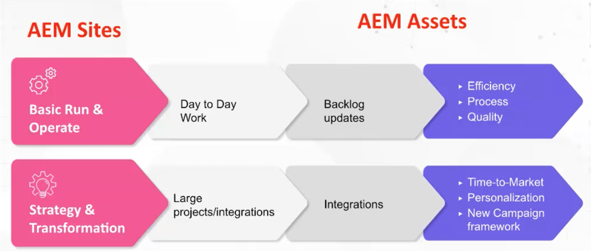

# Adobe Experience Manager (AEM) - Governance and staffing models & archetypes

As a customer experience leader, Adobe understands how challenging it can be for you to ensure you have the right people and governance framework to drive operational efficiencies. With Adobe's industry-proven governance and staffing models, you have the tools and knowledge to create a solid content and asset management foundation. In this article, we'll discuss ways to operationalize your Adobe Experience Manager (AEM) platform and get the most value from your efforts.

## Create a superior operational framework

To be able to run and operate AEM consider the following elements:

* Execute strategic milestones - There are going to be many strategic milestones, (personalization, multi-channel integration, etc.) that cannot be executed unless you have the right staffing model in place.
* Create a foundation for digital transformation - AEM is often used as the first step in an organization's modernization process. Setting a foundation allows you to leverage AEM to its full capacity.
* User engagement - Have a team in place to execute tactical work (update workflows, permissions, CSS, etc.) The more you have gaps between what users want and what they are given, the more frustrated they can become. It is important to keep users invested in the system, invested in the solution, and that you have the right operating model in place.

What then, is the right model? What is the right matrix of roles to create?

There is not a single specific answer because, just as organizations vary greatly, an AEM configuration can vary greatly as well, resulting in the need for different supporting roles. Each vertical, each industry, each team structure will require a different implementation. But you can create a baseline by establishing archetypes.

## Archetypes

Archetypes are specific, high-level, role ideas that map to specific attributes. This in turn can be used to create a foundational premise that helps to inform what model you really need. It is important to note that archetypes are not limited to one person per archetype. For example, a DAM librarian could have some technical experience.

### Streams of operationalization

There are two streams of operationalization for [!DNL AEM Sites] and [!DNL AEM Assets]:

1. Basic run and operate day-to-day work (metadata update)

1. Strategy and transformation work, such as large cross-organization projects

### High-level AEM Asset roles

**General gap:** This baseline supports centralized and decentralized models. If you have a decentralized model, AEM can be used abstractly. Note that the Product Owner role must be used creatively, but you also need to have a Product Owner who owns the different styles for one type of asset, and another who oversees the entirety of the organization.

1. Basic Run and Operate Roles

   * Technical resource - Someone who has AEM experience understands permissioning and can update metadata schema
   * Release manager
   * Product owner - This is a role that is aligned to the solution. Some product owners can be involved in analytics.
   * DAM librarian - This is someone who can help shepherd the integrative framework processes. This creative role may overlap with other roles. (Note: this is a role that has exploded in popularity in the last five years.)
   * Creative

1. Strategy and transformation

   * Development Team - this team is required when engaging with a major strategic milestone.
   * Business Architect - develops requirements to aid in technical milestones and strategic initiatives;can be compensated for with an additional Product Owner
   * Technical Architect - someone who has enterprise level understanding and is a constant presence across the organization. This role serves as the DAM center point of truth.

**Sample scenarios**

1. **Run and operate:**

The following are role examples for a light (sports apparel company) and heavy (cosmetic company) scenario:

1. Light - Sports apparel company roles:

   * 2 part time developers - Part time, offshore
   * 1 Product Owner - Full time, onshore
   * 1 DAM Librarian - Full time, onshore
   * 1 Technical Architect - Part time, onshore
   * 1 Release Manager - Part time, onshore

1. Heavy - Cosmetics company (Multi-Brand)

   * 3 fulltime developers - Full time, offshore
   * 4 Product Owners - 3 brand specific, 1 primary
   * 1 DAM Librarian - Full time, onshore
   * 4 main Admins SME per brand
   * 1 Technical Architect

### High-level [!DNL AEM Sites] roles

1. Basic run and operate

    **General gap:** CSS developers create new skins for components. Adobe Sr Business Consultant, Joseph Van Buskirk, recommends to &quot;Get uncorked components and style systems. This is the role that drives cost savings. 80% of the experiences that are created should be done using previously created or core components.&quot; The goal is to repurpose core or custom components with new styles using a CSS developer (or front end development team) .

    Role examples:

    * CSS development - creates experience artifacts though repurposing components with new styles.
    * Back-end development - creates new components or can extend a core component. If done correctly, this role should not have more than one person, unless there is a need for large animation tasks.
    * Release management - oversees code deployment and serves as the current Customer Success Engineer.
    * Product Owner - collaborates with BU on marrying Technical and Strategic visions; creates maintenance tasks and enhancements and serves as the business owner of the solution.
    * Admin Authors - updates the CSS skin and provides guidance to the authors who are updating and applying content. This role works on workflow configurations and creates guidance documentation for the content authors to apply. NOTE: In release 6.5 Adobe recommends using editable templates.
    * Content Authors - applies content, tiered ownership and delivers communication issues and concerns as they arise with CSM.

1. Strategy and transformation

   Role examples:

   * Development team - provides AEM knowledge and executes new transformative milestones with the Technical Architect.
   * Technical architect - provides integration knowledge, works with the product owner to map technical milestones and provides deep technical knowledge of AEM.
   * Business architect - creates tasks for user stories and helps the product owner manage technical and business milestones.

### Sample scenarios

The following are role examples for a light and heavy client scenario:

1. Light

   * 2 CSS developers - onshore
   * 1 Product owner - full time, onshore
   * 1 Backend developer - offshore
   * 1 Technical architect - onshore
   * 1 Release manager - part time, onshore

1. Heavy (Campaign-centric)

   * 4 CSS developers - full time, onshore
   * 2 Backend developers - full time, onshore
   * 1 Technical architect - onshore
   * 1 Product owner
   * 2 Business architects - offshore

### Key Takeaways

**Understand the archetypes** -- Start slow, understand and analyze the archetypes. Be creative and flexible, keeping in mind that there is not one correct model to follow.

**Understand your roadmap** - Some organizations have a lot of milestones that they want to execute. Be prepared to allocate more technical resources than you may estimate.

**Leverage internal resources** - Gaps may come unexpectedly. You may be able to fill them more quickly by sourcing internal team members, as opposed to searching outside your organization.

For a more in-depth discussion of Governance and Staffing Models &amp; Archetypes, listen to this one-hour panel discussion: [Role Archetypes and Creating an Operational Framework for [!DNL AEM Assets] and [!DNL Sites]](https://adobecustomersuccess.adobeconnect.com/p8ml5nmy0758mp4/)

Learn more about strategy and thought leadership at the [Customer Success](https://experienceleague.corp.adobe.com/docs/customer-success/customer-success/overview.html) hub.
