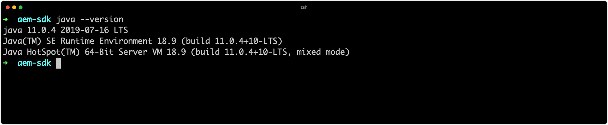
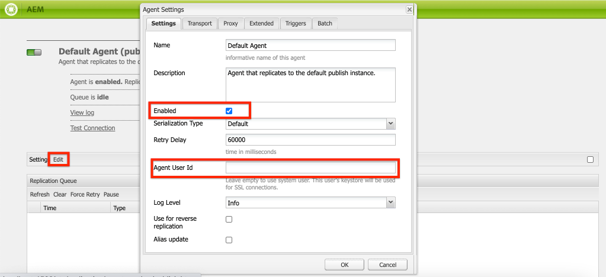
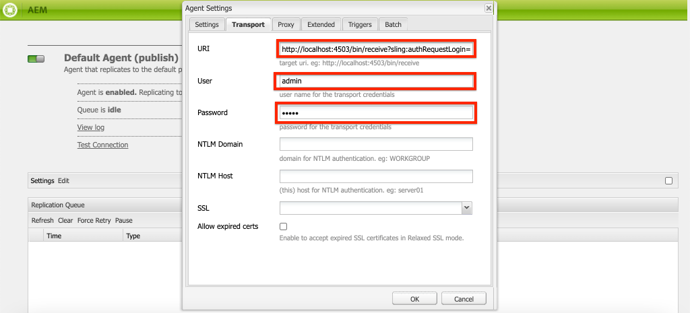
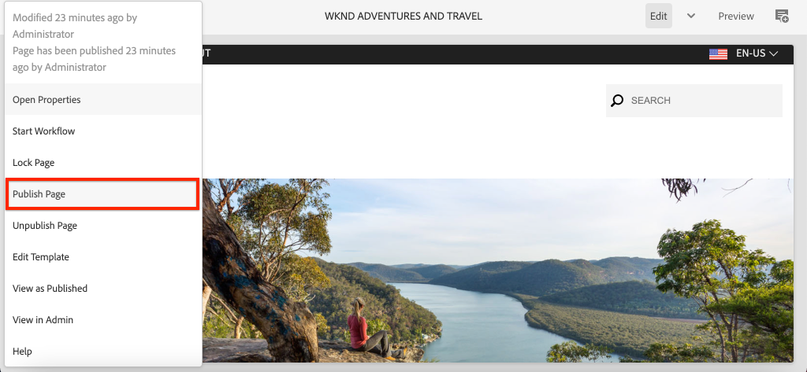
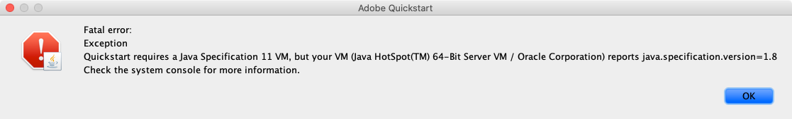

# Set up local AEM SDK {#set-up-local-aem-sdk}

>[!CONTEXTUALHELP]
>id="aemcloud_localdev_aemruntime"
>title="Local AEM Runtime"
>abstract="Adobe Experience Manager (AEM) can be run locally using the AEM as a Cloud Service SDK's Quickstart Jar. This allows developers to deploy to, and test custom code, configuration, and content before committing it to source control, and deploying it to a AEM as a Cloud Service environment."
>additional-url="https://experienceleague.adobe.com/docs/experience-manager-cloud-service/content/implementing/developing/aem-as-a-cloud-service-sdk.html" text="AEM as a Cloud Service SDK"
>additional-url="https://experience.adobe.com/#/downloads/content/software-distribution/en/aemcloud.html" text="Download AEM as a Cloud Service SDK"

Adobe Experience Manager (AEM) can be run locally using the AEM as a Cloud Service SDK's Quickstart Jar. This allows developers to deploy to, and test custom code, configuration, and content before committing it to source control, and deploying it to a AEM as a Cloud Service environment.

 Note that `~` is used as shorthand for the User's Directory. In Windows, this is the equivalent of `%HOMEPATH%`.

## Install Java&trade;

Experience Manager is a Java&trade; application, and thus requires the Oracle Java&trade; SDK to support the development tooling.

1. [Download and install the latest Java&trade; SDK 11](https://experience.adobe.com/#/downloads/content/software-distribution/en/general.html?1_group.propertyvalues.property=.%2Fjcr%3Acontent%2Fmetadata%2Fdc%3AsoftwareType&1_group.propertyvalues.operation=equals&1_group.propertyvalues.0_values=software-type%3Atooling&fulltext=Oracle%7E+JDK%7E+11%7E&orderby=%40jcr%3Acontent%2Fjcr%3AlastModified&orderby.sort=desc&layout=list&p.offset=0&p.limit=14)
1. Verify that Oracle Java&trade; 11 SDK is installed by running the command:
    
>[!BEGINTABS]

>[!TAB macOS]

```shell
$ java --version
```

>[!TAB Windows]

```shell
$ java -version
```

>[!TAB Linux&reg;]

```shell
$ java --version
```

>[!ENDTABS]



## Download the AEM as a Cloud Service SDK

The AEM as a Cloud Service SDK, or AEM SDK, contains the Quickstart Jar used to run AEM Author and Publish locally for development, as well as the compatible version of the Dispatcher Tools.

1. Log in to [https://experience.adobe.com/#/downloads](https://experience.adobe.com/#/downloads) with your Adobe ID
      + Note that your Adobe Organization __must__ be provisioned for AEM as a Cloud Service to download the AEM as a Cloud Service SDK.
1. Navigate to the __AEM as a Cloud Service__ tab
1. Sort by __Published Date__ in __Descending__ order
1. Click on the latest __AEM SDK__ result row
1. Review and accept the EULA, and tap the __Download__ button

## Extract the Quickstart Jar from the AEM SDK zip

1. Unzip the downloaded `aem-sdk-XXX.zip` file

## Set up local AEM Author service{#set-up-local-aem-author-service}

The local AEM Author Service provides developers with a local experience digital marketers/content authors will share to create and manage content.  AEM Author Service is designed both as an authoring and preview environment, allowing most validations of feature development can be performed against it, making it a vital element of the local development process.

1. Create the folder `~/aem-sdk/author`
1. Copy the __Quickstart JAR__ file to  `~/aem-sdk/author` and rename it to `aem-author-p4502.jar`
1. Start the local AEM Author Service by executing the following from the command line:
   + `java -jar aem-author-p4502.jar`
     + Provide the admin password as `admin`. Any admin password is acceptable, however it is recommend to use the default for local development to reduce the need to reconfigure.

    You *cannot* start the AEM as Cloud Service Quickstart Jar [by double-clicking](#troubleshooting-double-click).
1. Access the local AEM Author Service at [http://localhost:4502](http://localhost:4502) in a Web browser

>[!BEGINTABS]

>[!TAB macOS]

  ```shell
  $ mkdir -p ~/aem-sdk/author
  $ cp aem-sdk-Quickstart-XXX.jar ~/aem-sdk/author/aem-author-p4502.jar
  $ cd ~/aem-sdk/author
  $ java -jar aem-author-p4502.jar
  ```

>[!TAB Windows]

  ```shell
  $ mkdir -p c:\Users\<My User>\aem-sdk\author
  $ copy aem-sdk-Quickstart-XXX.jar c:\Users\<My User>\aem-sdk\author\aem-author-p4502.jar
  $ cd c:\Users\<My User>\aem-sdk\author
  $ java -jar aem-author-p4502.jar
  ```

>[!TAB Linux&reg;]

  ```shell
  $ mkdir -p ~/aem-sdk/author
  $ cp aem-sdk-Quickstart-XXX.jar ~/aem-sdk/author/aem-author-p4502.jar
  $ cd ~/aem-sdk/author
  $ java -jar aem-author-p4502.jar
  ```

>[!ENDTABS]


## Set up local AEM Publish service

The local AEM Publish Service provides developers with the local experience end-users of the AEM will have, such as browsing the Web site hosed on AEM. A local AEM Publish Service is important as it integrates with AEM SDK's [Dispatcher tools](./dispatcher-tools.md) and allows developers to smoke-test and fine-tune the final end-user facing experience.

1. Create the folder `~/aem-sdk/publish`
1. Copy the __Quickstart JAR__ file to  `~/aem-sdk/publish` and rename it to `aem-publish-p4503.jar`
1. Start the local AEM Publish Service by executing the following from the command line:
   + `java -jar aem-publish-p4503.jar`
      + Provide the admin password as `admin`. Any admin password is acceptable, however it is recommend to use the default for local development to reduce the need to reconfigure.

    You *cannot* start the AEM as Cloud Service Quickstart Jar [by double-clicking](#troubleshooting-double-click).
1. Access the local AEM Publish Service at [http://localhost:4503](http://localhost:4503) in a Web browser

>[!BEGINTABS]

>[!TAB macOS]

```shell
$ mkdir -p ~/aem-sdk/publish
$ cp aem-sdk-Quickstart-XXX.jar ~/aem-sdk/publish/aem-publish-p4503.jar
$ cd ~/aem-sdk/publish
$ java -jar aem-publish-p4503.jar
```

>[!TAB Windows]

```shell
$ mkdir -p c:\Users\<My User>\aem-sdk\publish
$ copy aem-sdk-Quickstart-XXX.jar c:\Users\<My User>\aem-sdk\publish\aem-publish-p4503.jar
$ cd c:\Users\<My User>\aem-sdk\publish
$ java -jar aem-publish-p4503.jar
```

>[!TAB Linux&reg;]

```shell
$ mkdir -p ~/aem-sdk/publish
$ cp aem-sdk-Quickstart-XXX.jar ~/aem-sdk/publish/aem-publish-p4503.jar
$ cd ~/aem-sdk/publish
$ java -jar aem-publish-p4503.jar
```

>[!ENDTABS]


## Set up local AEM services in prerelease mode

The local AEM runtime can be started in [prerelease mode](https://experienceleague.adobe.com/docs/experience-manager-cloud-service/content/release-notes/prerelease.html) allowing a developer to build against the AEM as a Cloud Service's next release's features. Prerelease is enabled by passing the `-r prerelease` argument on the local AEM runtime's first start. This can be used with both local AEM Author and AEM Publish services.


>[!BEGINTABS]

>[!TAB macOS]

```shell
# For AEM Author service in prerelease mode
$ java -jar aem-author-p4502.jar -r prerelease

# For AEM Publish service in prerelease mode
$ java -jar aem-publish-p4503.jar -r prerelease
```

>[!TAB Windows]

```shell
# For AEM Author service in prerelease mode
$ java -jar aem-author-p4502.jar -r prerelease

# For AEM Publish service in prerelease mode
$ java -jar aem-publish-p4503.jar -r prerelease
```

>[!TAB Linux&reg;]

```shell
# For AEM Author service in prerelease mode
$ java -jar aem-author-p4502.jar -r prerelease

# For AEM Publish service in prerelease mode
$ java -jar aem-publish-p4503.jar -r prerelease
```

>[!ENDTABS]

## Simulate Content Distribution {#content-distribution}

In a true Cloud Service environment content is distributed from the Author Service to the Publish Service using [Sling Content Distribution](https://sling.apache.org/documentation/bundles/content-distribution.html) and the Adobe Pipeline. The [Adobe Pipeline](https://experienceleague.adobe.com/docs/experience-manager-cloud-service/core-concepts/architecture.html?lang=en#content-distribution) is an isolated microservice available only in the cloud environment.

During development, it may be desirable to simulate the distribution of content using the local Author and Publish service. This can be achieved by enabling the legacy Replication agents.

>[!NOTE]
>
> Replication agents are only available to use in the local Quickstart JAR and provide only a simulation of content distribution.

1. Login to the **Author** service and navigate to [http://localhost:4502/etc/replication/agents.author.html](http://localhost:4502/etc/replication/agents.author.html).
1. Click **Default Agent (publish)** to open the default Replication agent.
1. Click **Edit** to open the agent's configuration.
1. Under the **Settings** tab, update the following fields:

    + **Enabled** - check true
    + **Agent User Id** - Leave this field empty

    

1. Under the **Transport** tab, update the following fields:

    + **URI** - `http://localhost:4503/bin/receive?sling:authRequestLogin=1`
    + **User** - `admin`
    + **Password** - `admin`

    

1. Click **Ok** to save the configuration and enable the **Default** Replication Agent.
1. You can now make changes to content on the Author service and publish them to the Publish service.

  

## Quickstart Jar start-up modes

The naming of the Quickstart Jar, `aem-<tier>_<environment>-p<port number>.jar` specifies how it will start up. Once AEM as started in a specific tier, author or publish, it cannot be changed to the alternate tier. To do this, the `crx-Quickstart` folder generated during the first run must be deleted, and Quickstart Jar must be run again. Environment and Ports can be changed, however they require stop/start of the local AEM instance.

Changing environments, `dev`, `stage` and `prod`, can be useful for developers to ensure environment-specific configurations are correctly defined and resolved by AEM. It is recommended that local development primarily be done against the default `dev` environment run mode.

The available permutations are as follows:

| Quickstart Jar filename      | Mode description                                                            |
|------------------------------|-----------------------------------------------------------------------------|
| `aem-author-p4502.jar`       | As Author in Dev run mode on port 4502                                      |
| `aem-author_dev-p4502.jar`   | As Author in Dev run mode on port 4502 (same as `aem-author-p4502.jar`)     |
| `aem-author_stage-p4502.jar` | As Author in Staging run mode on port 4502                                  |
| `aem-author_prod-p4502.jar`  | As Author in Production run mode on port 4502                               |
| `aem-publish-p4503.jar`      | As Publish in Dev run mode on port 4503                                     |
| `aem-publish_dev-p4503.jar`  | As Publish in Dev run mode on port 4503 (same as `aem-publish-p4503.jar`)   |
| `aem-publish_stage-p4503.jar`| As Publish in Staging run mode on port 4503                                 |
| `aem-publish_prod-p4503.jar` | As Publish in Production run mode on port 4503                              |

Note that the port number can be any available port on the local development machine, however by convention:

+ Port __4502__ is used for the __local AEM Author service__
+ Port __4503__ is used for the __local AEM Publish service__

Changing these may require adjustments to AEM SDK configurations

## Stopping an local AEM runtime

In order to stop a local AEM runtime, either AEM Author or Publish service, open the command line window that was used to start the the AEM Runtime, and tap `Ctrl-C`. Wait for AEM to shutdown. When the shutdown process is complete, the command line prompt is available.

## Optional local AEM runtime set up tasks

+ __OSGi configuration environment variables and secret variables__ are [specially set for the AEM local runtime](https://experienceleague.adobe.com/docs/experience-manager-cloud-service/implementing/deploying/configuring-osgi.html#local-development), rather than managing them using the aio CLI.

## When to update the Quickstart Jar

Update the AEM SDK at least monthly on, or shortly after, the last Thursday of each month, which is the release cadence for AEM as a Cloud Service "feature releases".

>[!WARNING]
>
> Updating the Quickstart Jar to a new version requires replacing the entire local development environment, resulting in a loss of all code, configuration and content in the local AEM repositories. Ensure that any code, config or content that should not be destroyed is safely committed to Git, or exported from the local AEM instance as AEM Packages.

### How to avoid content loss when upgrading the AEM SDK

Upgrading the AEM SDK is effectively creating a brand new AEM runtime, including a new repository, meaning any changes made to a prior AEM SDK's repository are lost. The following are viable strategies for aiding in persisting content between AEM SDK upgrades, and can be used discretely or in concert:

1. Create a content package dedicated to containing "sample" content to aid in development, and maintain it in Git. Any content that should be persisted through AEM SDK upgrades would be persisted into this package, and re-deployed after upgrading the AEM SDK.
1. Use [oak-upgrade](https://jackrabbit.apache.org/oak/docs/migration.html) with the `includepaths` directive, to copy content from the prior AEM SDK repository to the new AEM SDK repository.
1. Backup any content using AEM Package Manager and content packages on the prior AEM SDK, and re-install them on the new AEM SDK.

Remember, using the above approaches to maintain code between AEM SDK upgrades, indicates a development anti-pattern. Non-disposable code should originate in your Development IDE and flow into AEM SDK via deployments.

## Troubleshooting

### Double-clicking the Quickstart Jar file results in an error{#troubleshooting-double-click}

When double-clicking the Quickstart Jar to start, an error modal is displayed preventing AEM from starting locally.



This is because AEM as a Cloud Service Quickstart Jar does not support double-clicking of the Quickstart Jar to start AEM locally. Instead, you must run the Jar file from that command line.

To start AEM Author service, `cd` into the directory containing the Quickstart Jar and execute the command:

>[!BEGINTABS]

>[!TAB macOS]

```shell
$ java -jar aem-author-p4502.jar
```

>[!TAB Windows]

```shell
$ java -jar aem-author-p4502.jar
```

>[!TAB Linux&reg;]

```shell
$ java -jar aem-author-p4502.jar
```

>[!ENDTABS]

or, to start AEM Publish service, `cd` into the directory containing the Quickstart Jar and execute the command:

>[!BEGINTABS]

>[!TAB macOS]

```shell
$ java -jar aem-publish-p4503.jar
```

>[!TAB Windows]

```shell
$ java -jar aem-publish-p4503.jar
```

>[!TAB Linux&reg;]

```shell
$ java -jar aem-publish-p4503.jar
```

>[!ENDTABS]

### Starting the Quickstart Jar from the command line immediately aborts{#troubleshooting-java-8}

When starting the Quickstart Jar from the command line, the process immediately aborts and the AEM service does not start, with the following error:

```shell
➜  ~/aem-sdk/author: java -jar aem-author-p4502.jar
Loading quickstart properties: default
Loading quickstart properties: instance
java.lang.Exception: Quickstart requires a Java Specification 11 VM, but your VM (Java HotSpot(TM) 64-Bit Server VM / Oracle Corporation) reports java.specification.version=1.8
  at com.adobe.granite.quickstart.base.impl.Main.checkEnvironment(Main.java:1046)
  at com.adobe.granite.quickstart.base.impl.Main.<init>(Main.java:646)
  at com.adobe.granite.quickstart.base.impl.Main.main(Main.java:981)
Quickstart: aborting
```

This is because AEM as a Cloud Service requires Java&trade; SDK 11 and you are running a different version, most likely Java&trade; 8. To resolve this issue, download and install [Oracle Java&trade; SDK 11](https://experience.adobe.com/#/downloads/content/software-distribution/en/general.html?1_group.propertyvalues.property=.%2Fjcr%3Acontent%2Fmetadata%2Fdc%3AsoftwareType&1_group.propertyvalues.operation=equals&1_group.propertyvalues.0_values=software-type%3Atooling&fulltext=Oracle%7E+JDK%7E+11%7E&orderby=%40jcr%3Acontent%2Fjcr%3AlastModified&orderby.sort=desc&layout=list&p.offset=0&p.limit=14).

Once Oracle Java&trade; 11 SDK is installed, verify it is the active version by running the command from the command line:

>[!BEGINTABS]

>[!TAB macOS]

```shell
$ java --version
```

>[!TAB Windows]

```shell
$ java -version
```

>[!TAB Linux&reg;]

```shell
$ java --version
```

>[!ENDTABS]

## Additional Resources

+ [Download AEM SDK](https://experience.adobe.com/#/downloads)
+ [Adobe Cloud Manager](https://my.cloudmanager.adobe.com/)
+ [Download Docker](https://www.docker.com/)
+ [Experience Manager Dispatcher Documentation](https://experienceleague.adobe.com/docs/experience-manager-dispatcher/using/dispatcher.html)
