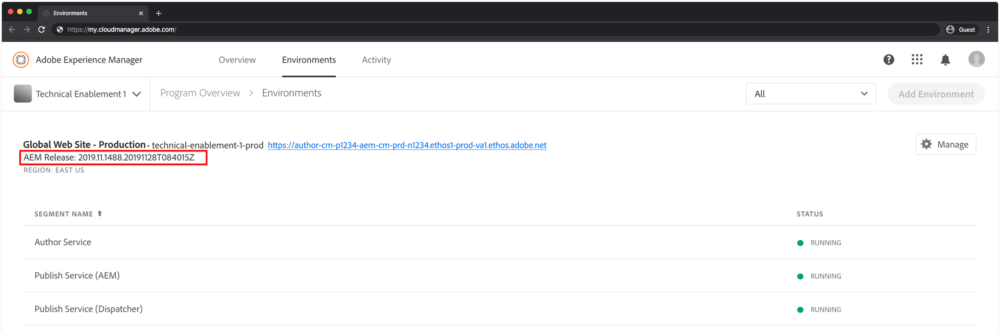

# Set up Local AEM Runtime

Adobe Experience Manager (AEM) can be run locally using the AEM as a Cloud Service SDK's QuickStart Jar. This allows developers to deploy to, and test custom code, configuration and content prior to committing it to source control, and deploying it to a AEM as a Cloud Service environment.

## Install Java

Experience Manager is a Java application, and thus requires the Java SDK to support the development tooling.

1. [Download and install the latest release Java 11 SDK](https://downloads.experiencecloud.adobe.com/content/software-distribution/en/general.html)
1. Verify Java 11 SDK is installed by running the command: `java --version`


## Download the AEM as a Cloud Service SDK

The AEM as a Cloud Service SDK, or AEM SDK, contains the Quickstart Jar used to run AEM Author and Publish locally for development, as well as the compatible version of the Dispatcher Tools.

1. Log in to [downloads.experiencecloud.adobe.com](http://downloads.experiencecloud.adobe.com/) with your Adobe ID
      + Note that your Adobe Organization __must__ be provisioned for AEM as a Cloud Service to download the AEM as a Cloud Service SDK.
1. Search for `aem-sdk`
1. Sort by __Published Date__ in __Descending__ order
1. Click on the latest __AEM SDK__ result row
1. Review and accept the EULA, and tap the __Download__ button

## Extract the QuickStart Jar from the AEM SDK zip

1. Unzip the downloaded `aem-sdk-XXX.zip` file
1. Ensure your Experience Manager developer __license.properties__ file is available

Note the same QuickStart Jar and license.properties files are used to start _both_ AEM Author and Publish Services.

## Set up local AEM Author Service

The local AEM Author Service provides developers with a local experience digital marketers/content authors will share to create and manage content.  AEM Author Service is designed both as an authoring and preview environment, allowing most validations of feature development can be performed against it, making it a vital element of the local development process.

1. Create the folder `~/aem-sdk/author`
1. Copy the __QuickStart JAR__ file to  `~/aem-sdk/author` and rename it to `aem-author-p4502.jar`
1. Copy the __license.properties__ file to  `~/aem-sdk/author`
1. Start the local AEM Author Service by either
   + Double-clicking the __aem-author-p4502.jar__ file
   + Or executing the `java -jar aem-author-p4502.jar` command (requires entering admin credentials, which by default are: admin/admin)
     + Provide the admin password as `admin`. Any admin password is acceptable, however its recommend to use the default for local development to reduce the need to re-configure.
1. Access the local AEM Author Service at [http://localhost:4502](http://localhost:4502) in a Web browser

```
$ mkdir -p ~/aem-sdk/author
$ cp aem-sdk-quickstart-XXX.jar ~/aem-sdk/author/aem-author-p4502.jar
$ cp ../license.properties ~/aem-sdk/author
$ cd ~/aem-sdk/author
$ java -jar aem-author-p4502.jar
```

## Set up local AEM Publish Service

The local AEM Publish Service provides developers with the local experience end-users of the AEM will have, such as browsing the Web site hosed on AEM. A local AEM Publish Service is important as it integrates with AEM SDK's [Dispatcher tools](./dispatcher-tools.md) and allows developers to smoke-test and fine-tune the final end-user facing experience.

1. Create the folder `~/aem-sdk/publish`
1. Copy the __QuickStart JAR__ file to  `~/aem-sdk/publish` and rename it to `aem-publish-p4503.jar`
1. Copy the __license.properties__ file to  `~/aem-sdk/publish`
1. Start the local AEM Publish Service by either
   + Double-clicking the __aem-publish-p4503.jar__ file
   + Or executing the `java -jar aem-publish-p4503.jar` command
      + Provide the admin password as `admin`. Any admin password is acceptable, however its recommend to use the default for local development to reduce the need to re-configure.
1. Access the local AEM Publish Service at [http://localhost:4503](http://localhost:4503) in a Web browser

```
$ mkdir -p ~/aem-sdk/publish
$ cp aem-sdk-quickstart-XXX.jar ~/aem-sdk/author/aem-publish-p4503.jar
$ cp ../license.properties ~/aem-sdk/publish
$ cd ~/aem-sdk/publish
$ java -jar aem-publish-p4503.jar
```

## QuickStart Jar start-up modes

The naming of the QuickStart Jar, `aem-<tier>_<environment>-p<port number>.jar` specifies how it will start up. Once AEM as started in a specific tier, author or publish, it cannot be changed to the alternate tier. To do this, the `crx-quickstart` folder generated during the first run must be deleted, and Quickstart Jar must be run again. Environment and Ports can be changed, however they require stop/start of the local AEM instance.

Changing environments, `dev`, `stage` and `prod`, can be useful for developers to ensure environment-specific configurations are correctly defined and resolved by AEM. It is recommended that local development primarily be done against the default `dev` environment run mode.

The available permutations are as follows:

+ `aem-author-p4502.jar`
  + As Author in Dev run mode on port 4502
+ `aem-author_dev-p4502.jar`
  + As Author in Dev run mode on port 4502 (same as `aem-author-p4502.jar`)
+ `aem-author_stage-p4502.jar`
  + As Author in Staging run mode on port 4502
+ `aem-author_prod-p4502.jar`
  + As Author in Production run mode on port 4502
+ `aem-publish-p4503.jar`
  + As Author in Dev run mode on port 4503
+ `aem-publish_dev-p4503.jar`
  + As Author in Dev run mode on port 4503 (same as `aem-publish-p450.jar`)
+ `aem-publish_stage-p4503.jar`
  + As Author in Staging run mode on port 4503
+ `aem-publish_prod-p4503.jar`
  + As Author in Production run mode on port 4503

Note that the port number can be any available port on the local development machine, however by convention:

+ Port __4502__ is used for the __local AEM Author service__
+ Port __4503__ is used for the __local AEM Publish service__

Changing these may require adjustments to AEM SDK configurations

## When to update the QuickStart Jar

AEM as a Cloud Service releases daily updates, and thus, it is important for local development to be developing against QuickStart Jar version that is "near" to what is deployed to the AEM as Cloud Service environments. It is recommended the local QuickStart Jar used for local development be refreshed at least bi-weekly to match the version of Experience Manager on the Production environment.

>[!WARNING]
>
> Updating the QuickStart Jar to a new version requires replacing the entire local development environment, resulting in a loss of all code, configuration and content in the local AEM repositories. Ensure that any code, config or content that should not be destroyed is safely committed to Git, or exported from the local AEM instance as AEM Packages.

The version of AEM as a Cloud Service can be found via [Cloud Manager](https://my.cloudmanager.adobe.com/).

+ __Cloud Manager > Environments__, per environment specified by the __AEM Release__ label



## Additional Resources

+ [Download AEM SDK](http://downloads.experiencecloud.adobe.com/)
+ [Adobe Cloud Manager](https://my.cloudmanager.adobe.com/)
+ [Download Docker](https://www.docker.com/)
+ [Experience Manager Dispatcher Documentation](https://docs.adobe.com/content/help/en/experience-manager-dispatcher/using/dispatcher.html)
