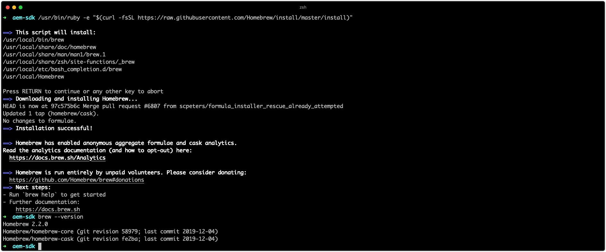
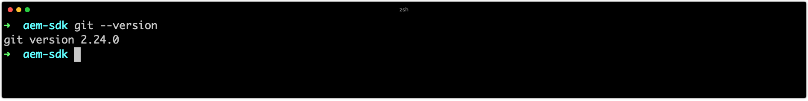
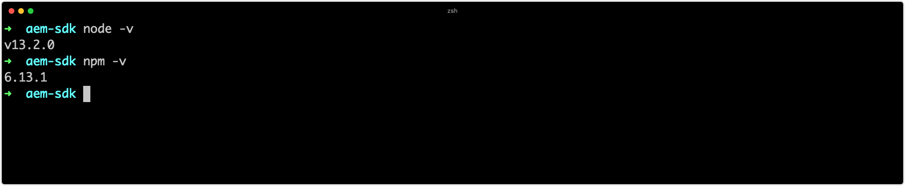
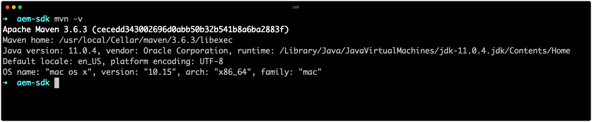

 
# Set up development tools

Adobe Experience Manager (AEM) development requires a minimal set of development tooling to be installed and set up on the developer machine. These tools support the development and building of AEM Projects.

Note that `~` is used as shorthand for the User's Directory. In Windows, this is the equivalent of `%HOMEPATH%`.

## Install Java

Experience Manager is a Java application, and thus requires the Java SDK to support the development and the AEM as a Cloud Service SDK.

1. [Download and install the latest release Java 11 SDK](https://experience.adobe.com/#/downloads/content/software-distribution/en/general.html?1_group.propertyvalues.property=.%2Fjcr%3Acontent%2Fmetadata%2Fdc%3AsoftwareType&1_group.propertyvalues.operation=equals&1_group.propertyvalues.0_values=software-type%3Atooling&fulltext=Oracle%7E+JDK%7E+11%7E&orderby=%40jcr%3Acontent%2Fjcr%3AlastModified&orderby.sort=desc&layout=list&p.offset=0&p.limit=14)
1. Verify Java 11 SDK is installed by running the command:
    + Windows: `java -version`
    + macOS / Linux: `java --version`


## Install Homebrew

_The use of Homebrew is optional, but recommended._

Homebrew is a open-source package manager for macOS, Windows and Linux. All the supporting tools can be installed separately, Homebrew provides a convenient way to install and update a variety of development tools required for Experience Manager development.

1. Open your Terminal
1. Check if Homebrew is already installed by running the command: `brew --version`.
1. If Homebrew is not installed, install Homebrew
    + [Install Homebrew on macOS](https://brew.sh/)
        + Homebrew on macOS [Xcode](https://apps.apple.com/us/app/xcode/id497799835) or [Command Line Tools](https://developer.apple.com/download/more/), install-able via the command:
            + `xcode-select --install`
    + [Install Homebrew on Linux](https://docs.brew.sh/Installation#linux-or-windows-10-subsystem-for-linux)
    + [Install Homebrew on Windows 10](https://docs.brew.sh/Installation#linux-or-windows-10-subsystem-for-linux)
1. Verify Homebrew is installed by running the command: `brew --version`



If you are using Homebrew, follow the __Install using Homebrew__ instructions in the sections below. If you are __not__ using Homebrew, install the tools using the OS-specific links.

## Install Git

[Git](https://git-scm.com/) is the source control management system used by [Adobe Cloud Manager](https://docs.adobe.com/content/help/en/experience-manager-cloud-manager/using/requirements/source-code-repository.html), and thus is required for development.

+ Install Git using Homebrew
    1. Open your Terminal/Command Prompt
    1. Execute the command: `brew install git`
    1. Verify Git is installed, using the command: `git --version`
+ Or, download and install Git (macOS, Linux or Windows)
    1. [Download and install Git](https://git-scm.com/downloads)
    1. Open your Terminal/Command Prompt
    1. Verify Git is installed, using the command: `git --version`



## Install Node.js (and npm){#node-js}

[Node.js](https://nodejs.org) is a JavaScript runtime environment used to work with the front-end assets of an AEM project's __ui.frontend__ sub-project. Node.js is distributed with [npm](https://www.npmjs.com/), is the defacto Node.js package manager, used to manage JavaScript dependencies.

+ Install Node.js using Homebrew
    1. Open your Terminal/Command Prompt
    1. Execute the command: `brew install node`
    1. Verify Node.js is installed, using the command: `node -v`
    1. Verify npm is installed, using the command: `npm -v`
+ Or, download and install Node.js (macOS, Linux or Windows)
    1. [Download and install Node.js](https://nodejs.org/en/download/)
    1. Open your Terminal/Command Prompt
    1. Verify Node.js is installed, using the command: `node -v`
    1. Verify npm is installed, using the command: `npm -v`



>[!TIP]
> [AEM Project Archetype](https://github.com/adobe/aem-project-archetype)-based AEM Projects install an isolated version of Node.js at build time. It is good to keep the local development system's version in sync (or close to) the Node.js and npm versions specified in your AEM Maven project's Reactor pom.xml.
See this example [AEM Project Reactor pom.xml](https://github.com/adobe/aem-guides-wknd/blob/9ac94f3f40c978a53ec88fae79fbc17dd2db72f2/pom.xml#L117-L118) for where to locate the Node.js and npm build versions.

## Install Maven

Apache Maven is the open-source Java command-line tool used to build AEM Projects generated from the AEM Project Maven Archetype. All major IDE's ([IntelliJ IDEA](https://www.jetbrains.com/idea/), [Visual Studio Code](https://code.visualstudio.com/), [Eclipse](https://www.eclipse.org/), etc.) have integrated Maven support.

+ Install Maven using Homebrew
    1. Open your Terminal/Command Prompt
    1. Execute the command: `brew install maven`
    1. Verify Maven is installed, using the command: `mvn -v`
+ Or, download and install Maven (macOS, Linux or Windows)
    1. [Download Maven](https://maven.apache.org/download.cgi)
    1. [Install Maven](https://maven.apache.org/install.html)
    1. Open your Terminal/Command Prompt
    1. Verify Maven is installed, using the command: `mvn -v`



## Register the Adobe Public Repository with Maven

Adobe manages a Java artifact repository that Adobe Cloud Manager, by default, has access to this repository during the build of any AEM project, thus it's important to ensure all Java dependencies used by an AEM project are provided by this repository†.

While the AEM Project generated by the [AEM Project Maven Archetype](https://github.com/adobe/aem-project-archetype) embeds a repository registration for Adobe's artifact repository (repo.adobe.com) into the project's pom.xml, it must be registered in your local __settings.xml__ to generate a new project using the AEM Project Maven Archetype. To do this, update the `~/.m2/settings.xml` and add to `<profiles>` the [Adobe Public Profile XML Snippet](https://repo.adobe.com/).

+ Windows:
  + The Maven settings.xml file is located at `C:\Users\<My User>\.m2\settings.xml`
+ macOS / Linux:
  + The maven settings.xml file is located at `~/.m2/settings.xml`

If the __settings.xml__ is missing, download the provided [settings.xml](./assets/development-tools/settings.xml.zip) and place it in your user's `.m2` folder (unzip the zip to obtain the .xml).

It is recommended that the profile be active by default, otherwise, this profile must be explicitly activated using the `-P` flag, `mvn -Padobe-public ...`.

```{xml}
<activation>
    <activeByDefault>true</activeByDefault>
</activation>
```

_† Adobe Cloud Manager can access other public or locally embedded artifact repositories by including those repository registration in the AEM Project's pom.xml. Using external repositories is discouraged as it introduces a point of failure in the build process that Adobe cannot guarantee._

## Set up Adobe I/O CLI with Cloud Manager plugin{#aio-cli}

The [Adobe I/O CLI](https://github.com/adobe/aio-cli), or `aio`, provides command line access to a variety of Adobe services, [including Cloud Manager](https://github.com/adobe/aio-cli-plugin-cloudmanager). The Adobe I/O CLI plays an integral role in development on AEM as a Cloud Service as it provides developers the ability to:
    
+ Tail logs from AEM as a Cloud Services services
+ Manage Cloud Manager pipelines form the CLI

### Install the Adobe I/O CLI with Cloud Manager plugin

1. Ensure [Node.js is installed](#node-js) as the Adobe I/O CLI is an npm module
    + Run `node --version` to confirm
1. Execute `npm install -g @adobe/aio-cli` to install the `aio` npm module globally
1. Execute `aio plugins:install @adobe/aio-cli-plugin-cloudmanager` to install the aio Cloud Manager plug-in

### Set up the Adobe I/O CLI authentication

In order for the Adobe I/O CLI to communicate with Cloud Manager, a Cloud Manager integration must be created in Adobe I/O Console, and credentials must be obtained to successfully authenticate.

>[!VIDEO](https://video.tv.adobe.com/v/35094?quality=12&learn=on)

1. Log in to [console.adobe.io](https://console.adobe.io)
1. Create a new or open an existing Program
    + _Adobe I/O Console programs are different concepts to Cloud Manager programs_
1. Create a new Cloud Manager API integration with the "Developer - Cloud Service" profile
1. Obtain the Service Account (JWT) credentials needs to populate Adobe I/O CLI's [config.json](https://github.com/adobe/aio-cli-plugin-cloudmanager#authentication)
1. Load the `config.json` file into the Adobe I/O CLI
    + `$ aio config:set jwt-auth PATH_TO_CONFIG_JSON_FILE --file --json`
1. Load the `private.key` file into the Adobe I/O CLI
    + `$ aio config:set jwt-auth.jwt_private_key PATH_TO_PRIVATE_KEY_FILE --file`

Begin [executing commands](https://github.com/adobe/aio-cli-plugin-cloudmanager#commands) for Cloud Manager via the Adobe I/O CLI.

## Set up the development IDE

AEM development primarily consists of Java and Front-end (JavaScript, CSS, etc) development and XML management. The following are the most popular IDEs for AEM development.

### IntelliJ IDEA

__[IntelliJ IDEA](https://www.jetbrains.com/idea/)__ is a powerful IDE for Java development. IntelliJ IDEA comes in two flavors, a free Community edition and a commercial (paid) Ultimate version. The free Community version is sufficient for AEM development, however the Ultimate [expands its capability set](https://www.jetbrains.com/idea/download).

>[!VIDEO](https://video.tv.adobe.com/v/26089/?quality=12&learn=on)

+ [Download IntelliJ IDEA](https://www.jetbrains.com/idea/download)
+ [Download the Repo tool](https://github.com/Adobe-Marketing-Cloud/tools/tree/master/repo#installation)

### Microsoft Visual Studio Code

__[Visual Studio Code](https://code.visualstudio.com/)__ (VS Code) is a free, open-source tool for front-end developers. Visual Studio Code can be set up to integrate content sync with AEM with the help of an Adobe tool, __[repo](https://github.com/Adobe-Marketing-Cloud/tools/tree/master/repo#integration-into-visual-studio-code)__.

Visual Studio Code is the ideal choice for front-end developers primarily creating front-end code; JavaScript, CSS and HTML. While VS Code has Java support via [extensions](https://code.visualstudio.com/docs/java/java-tutorial), it may lack some of the advanced features provided by more Java-specific.

>[!VIDEO](https://video.tv.adobe.com/v/25907?quality=12&learn=on)

+ [Download Visual Studio Code](https://code.visualstudio.com/Download)
+ [Download the Repo tool](https://github.com/Adobe-Marketing-Cloud/tools/tree/master/repo#integration-into-visual-studio-code)
+ [Download aemfed VS Code extension](https://aemfed.io/)
+ [Download AEM Sync VS Code extension](https://marketplace.visualstudio.com/items?itemName=Yinkai15.aemsync)

### Eclipse

__[Eclipse IDE](https://www.eclipse.org/ide/)__ is a popular IDEs for Java development, and supports the  __[AEM Developer Tools](https://eclipse.adobe.com/aem/dev-tools/)__ plug-in provided by Adobe, providing an in-IDE GUI for authoring and to synchronize JCR content with a local AEM instance.

>[!VIDEO](https://video.tv.adobe.com/v/25906?quality=12&learn=on)

+ [Download Eclipse](https://www.eclipse.org/ide/)
+ [Download Eclipse Dev Tools](https://eclipse.adobe.com/aem/dev-tools/)
