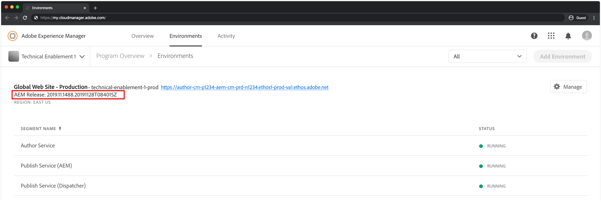

# Set up Local Dispatcher Tools

Adobe Experience Manager (AEM)'s Dispatcher is a Apache HTTP Web server module that provides a security and performance layer between the CDN and AEM Publish tier. Dispatcher is an integral part of the overall Experience Manager architecture and should be part of local development set up.

The AEM as a Cloud Service SDK includes the recommended Dispatcher Tools version, that facilitates configuring, validating and simulating Dispatcher locally. Dispatcher Tools is comprised of:

+ a baseline set of Apache HTTP Web server and Dispatcher configuration files, located in `.../dispatcher-sdk-x.x.x/src`
+ a configuration validator CLI tool, located at `.../dispatcher-sdk-x.x.x/bin/validator`
+ a configuration deployment CLI tool, located at `.../dispatcher-sdk-x.x.x/bin/docker_run`
+ a Docker image that runs Apache HTTP Web server with the Dispatcher module

Note that `~` is used as shorthand for the User's Directory. In Windows, this is the equivalent of `%HOMEPATH%`.

>[!NOTE]
>
> The videos in this page were recorded on macOS. Windows users can follow along, but use the equivalent Dispatcher Tools Windows commands, provided with each video.

## Prerequisites

1. Windows users must use Windows 10 Professional
1. Install [Experience Manager Publish QuickStart](./aem-runtime.md) on the local develop machine.
   + Optionally, install the  latest [AEM reference web site](https://github.com/adobe/aem-guides-wknd/releases) on the local AEM Publish service. This web site is used in this tutorial to visualize a working Dispatcher.
1. Install and start the latest version of [Docker](https://www.docker.com/) (Docker Desktop 2.2.0.5+ / Docker Engine v19.03.9+) on the local development machine.

## Download the Dispatcher Tools (as part of the AEM SDK)

The AEM as a Cloud Service SDK, or AEM SDK, contains the Dispatcher Tools used to run Apache HTTP Web server with the Dispatcher module locally for development, as well as the compatible QuickStart Jar.

If the AEM as a Cloud Service SDK has already been downloaded to [setup the local AEM runtime](./aem-runtime.md), it does not need to be re-downloaded.

1. Log in to [downloads.experiencecloud.adobe.com](https://downloads.experiencecloud.adobe.com/) with your Adobe ID
      + Note that your Adobe Organization __must__ be provisioned for AEM as a Cloud Service to download the AEM as a Cloud Service SDK.
1. Navigate to the __AEM as a Cloud Service__ tab
1. Sort by __Published Date__ in __Descending__ order
1. Click on the latest __AEM SDK__ result row
1. Review and accept the EULA, and tap the __Download__ button
1. Ensure AEM SDK's Dispatcher Tools v2.0.21+ is used

## Extract the Dispatcher Tools from the AEM SDK zip

>[!TIP]
>
> Windows users cannot have any spaces or special characters in the path to the folder containing the Local Dispatcher Tools. If spaces exist  in  the path, the `docker_run.cmd` will fail.

The version of Dispatcher Tools is different from that of the AEM SDK. Ensure the version of Dispatcher Tools is provided via the AEM SDK version matching the AEM as a Cloud Service version.

1. Unzip the downloaded `aem-sdk-xxx.zip` file
1. Unpack the Dispatcher Tools into `~/aem-sdk/dispatcher`
   + Windows: Unzip `aem-sdk-dispatcher-tools-x.x.x-windows.zip` into `C:\Users\<My User>\aem-sdk\dispatcher` (creating missing folders as needed)
   + macOS / Linux: Execute the accompanying shell script `aem-sdk-dispatcher-tools-x.x.x-unix.sh` to unpack the Dispatcher Tools
     + `chmod a+x aem-sdk-dispatcher-tools-x.x.x-unix.sh && ./aem-sdk-dispatcher-tools-x.x.x-unix.sh`

Note that all commands issued below assume the current working directory contains the expanding Dispatcher Tools contents.

>[!VIDEO](https://video.tv.adobe.com/v/30601/?quality=12)
*This video uses macOS for illustrative purposes. The equivalent Windows/Linux commands can be used to achieve similar results*

## Understand the Dispatcher configuration files

>[!TIP]
> Experience Manager projects created from the [AEM Project Maven Archetype](https://github.com/adobe/aem-project-archetype) are pre-populated this set of Dispatcher configuration files, thus there is no need to copy over from the Dispatcher Tools src folder.

The Dispatcher Tools provides a set of Apache HTTP Web server and Dispatcher configuration files that define behavior for all environments, including local development.

These files are intended to be copied into an Experience Manager Maven project to the `dispatcher/src` folder, if they do not already exist in the Experience Manager Maven project.

>[!VIDEO](https://video.tv.adobe.com/v/30602/?quality=12)
*This video uses macOS for illustrative purposes. The equivalent Windows/Linux commands can be used to achieve similar results*

A complete description of the configuration files is available in the unpacked Dispatcher Tools as `dispatcher-sdk-x.x.x/docs/Config.html`.

## Run Dispatcher locally

To run the Dispatcher locally, the Dispatcher configuration files to be used to configure it, must be validated using the Dispatcher Tools's `validator` CLI tool.

+ Usage:
  + Windows: `bin\validator full -d out src`
  + macOS / Linux: `./bin/validator full -d ./out ./src`

The validation is dual purpose:

+ Validates the Apache HTTP Web server and Dispatcher configuration files for correctness
+ Transpiles the configurations into a file-set compatible with the Docker container's Apache HTTP Web Server.

Once validated, the transpiled configurations are used run Dispatcher locally in the Docker container. It is important to ensure the latest configurations have been validated __and__ output using the validator's `-d` option.

+ Usage:
  + Windows: `bin\docker_run <deployment-folder> <aem-publish-host>:<aem-publish-port> <dispatcher-port>`
  + macOS / Linux: `./bin/docker_run.sh <deployment-folder> <aem-publish-host>:<aem-publish-port> <dispatcher-port>`

The `aem-publish-host` can be set to `host.docker.internal`, a special DNS name Docker provides in the container that resolves to the host machine's IP. If he `host.docker.internal` does not resolve, please see the [troubleshooting](#troubleshooting-host-docker-internal) section below.

For example to start the Dispatcher Docker container using the default configuration files provided by the Dispatcher Tools:

1. Generate the `deployment-folder`, named `out` by convention, from scratch every time a configuration changes:

   + Windows: `del /Q out && bin\validator full -d out src`
   + macOS / Linux: `rm -rf ./out && ./bin/validator full -d ./out ./src`

2. (Re-)start Dispatcher Docker container providing the path to the deployment folder:

   + Windows: `bin\docker_run out host.docker.internal:4503 8080`
   + macOS / Linux: `./bin/docker_run.sh ./out host.docker.internal:4503 8080`

The AEM as a Cloud Service SDK's Publish Service, running locally on port 4503 will be available through Dispatcher at `http://localhost:8080`.

To run Dispatcher Tools against an Experience Manager project's Dispatcher configuration, simply generate the `deployment-folder` using the project's `dispatcher/src` folder.

+ Windows:

    ```{shell}
    $ del -/Q out && bin\validator full -d out <User Directory>/code/my-project/dispatcher/src
    $ bin\docker_run out host.docker.internal:4503 8080
    ```

+ macOS / Linux:

    ```{shell}
    $ rm -rf ./out && ./bin/validator full -d ./out ~/code/my-project/dispatcher/src
    $ ./bin/docker_run.sh ./out host.docker.internal:4503 8080
    ```

>[!VIDEO](https://video.tv.adobe.com/v/30603/?quality=12)
*This video uses macOS for illustrative purposes. The equivalent Windows/Linux commands can be used to achieve similar results*

## Dispatcher Tools logs

Dispatcher logs are helpful during local development to understand if and why HTTP Requests are blocked. Log level can be set by prefixing the execution of `docker_run` with environment parameters.

Dispatcher Tools logs are emitted to the standard out when `docker_run` is run.

Useful parameters for debugging Dispatcher include:

+ `DISP_LOG_LEVEL=Debug` sets Dispatcher module logging to Debug level
  + Default value is: `Warn`
+ `REWRITE_LOG_LEVEL=Debug` sets Apache HTTP Web server rewrite module logging to Debug level
  + Default value is: `Warn`
+ `DISP_RUN_MODE` sets the "run mode" of the Dispatcher environment, loading the corresponding run modes Dispatcher configuration files.
  + Defaults to `dev`
+ Valid values: `dev`, `stage`, or `prod`

One or many parameters, can be passed to `docker_run`

+ Windows:

  ```{shell}
  $ bin\validator full -d out <User Directory>/code/my-project/dispatcher/src
  $ DISP_LOG_LEVEL=Debug REWRITE_LOG_LEVEL=Debug bin\docker_run out host.docker.internal:4503 8080
  ```

+ macOS / Linux:

  ```{shell}
  $ ./bin/validator full -d out ~/code/my-project/dispatcher/src
  $ DISP_LOG_LEVEL=Debug REWRITE_LOG_LEVEL=Debug ./bin/docker_run.sh out host.docker.internal:4503 8080
  ```

>[!VIDEO](https://video.tv.adobe.com/v/30604/?quality=12)
*This video uses macOS for illustrative purposes. The equivalent Windows/Linux commands can be used to achieve similar results*

## When to update Dispatcher Tools{#dispatcher-tools-version}

Dispatcher Tools versions increment less frequently than the Experience Manager, and thus Dispatcher Tools require fewer updates in the local development environment.

The recommended Dispatcher Tools version is that which is bundled with the AEM as a Cloud Service SDK that matches the Experience Manager as a Cloud Service version. The version of AEM as a Cloud Service can be found via [Cloud Manager](https://my.cloudmanager.adobe.com/).

+ __Cloud Manager > Environments__, per environment specified by the __AEM Release__ label



_Note that Dispatcher Tools version itself will not match the Experience Manager version._

## Troubleshooting

### docker_run results in 'Waiting until host.docker.internal is available' message{#troubleshooting-host-docker-internal}

`host.docker.internal` is an hostname provided to the Docker contain that resolves to the host. Per docs.docker.com ([macOS](https://docs.docker.com/docker-for-mac/networking/#i-want-to-connect-from-a-container-to-a-service-on-the-host), [Windows](https://docs.docker.com/docker-for-windows/networking/)):

> From Docker 18.03 onwards our recommendation is to connect to the special DNS name host.docker.internal, which resolves to the internal IP address used by the host

If, when `bin/docker_run out host.docker.internal:4503 8080` results in the message __Waiting until host.docker.internal is available__, then:

1. Ensure the installed version of Docker is 18.03 or greater
2. You may have an local machine set up that is preventing the registration/resolution of the `host.docker.internal` name. Instead use your local IP.
    + Windows:
      + From the Command Prompt, execute `ipconfig`, and record the host's __IPv4 Address__ of the host machine.
      + Then, execute `docker_run` using this IP address:
    `bin\docker_run out <HOST IP>:4503 8080`
    + macOS / Linux: 
      + From Terminal, execute `ifconfig` and record the Host __inet__ IP address, usually the __en0__ device.
      + Then execute `docker_run` using the host IP address:
    `bin/docker_run.sh out <HOST IP>:4503 8080`

#### Example error

```{shell}
$ docker_run out host.docker.internal:4503 8080

Running script /docker_entrypoint.d/10-check-environment.sh
Running script /docker_entrypoint.d/20-create-docroots.sh
Running script /docker_entrypoint.d/30-wait-for-backend.sh
Waiting until host.docker.internal is available
```

### docker_run results in '** error: Deployment folder not found'

When running `docker_run.cmd`, an error displays that reads __** error: Deployment folder not found:__. This typically occurs because there are spaces in the path. If possible, remove the spaces in the folder, or move the `aem-sdk` folder to a path that does not contain spaces.

For example, Windows user folders often are `<First name> <Last name>`, with a space between. In the example below the folder `...\My User\...`  contains a space which breaks the local Dispatcher Tools' `docker_run` execution. If the spaces are in a Windows user folder, do not attempt to rename this folder as it will break Windows, instead move the `aem-sdk` folder to a new location your user has permissions to fully modify. Note that instructions that assume the `aem-sdk` folder is in the user's home directory will need to be adjusted to the new location.

#### Example error

```{shell}
$ \Users\My User\aem-sdk\dispatcher>bin\docker_run.cmd out host.internal.docker:4503 8080

'User\aem-sdk\dispatcher\out\*' is not recognized as an internal or external command,
operable program or batch file.
** error: Deployment folder not found: c:\Users\My User\aem-sdk\dispatcher\out
```

### docker_run fails to start on Windows{#troubleshooting-windows-compatible}

Running `docker_run` on Windows can result in the following error, preventing Dispatcher from starting. This is a reported issue with Dispatcher on Windows and will be fixed in a future release.

#### Example error

```{shell}
$ \Users\MyUser\aem-sdk\dispatcher>bin\docker_run out host.docker.internal:4503 8080

Running script /docker_entrypoint.d/10-check-environment.sh
Running script /docker_entrypoint.d/20-create-docroots.sh
Running script /docker_entrypoint.d/30-wait-for-backend.sh
Waiting until host.docker.internal is available
host.docker.internal resolves to 192.168.65.2
Running script /docker_entrypoint.d/40-generate-allowed-clients.sh
Running script /docker_entrypoint.d/50-check-expiration.sh
Running script /docker_entrypoint.d/60-check-loglevel.sh
Running script /docker_entrypoint.d/70-check-forwarded-host-secret.sh
Starting httpd server
[Sun Feb 09 17:32:22.256020 2020] [dispatcher:warn] [pid 1:tid 140080096570248] Unable to obtain parent directory of /etc/httpd/conf.dispatcher.d/enabled_farms/farms.any: No such file or directory
[Sun Feb 09 17:32:22.256069 2020] [dispatcher:alert] [pid 1:tid 140080096570248] Unable to import config file: /etc/httpd/conf.dispatcher.d/dispatcher.any
[Sun Feb 09 17:32:22.256074 2020] [dispatcher:alert] [pid 1:tid 140080096570248] Dispatcher initialization failed.
AH00016: Configuration Failed
```

## Additional Resources

+ [Download AEM SDK](https://downloads.experiencecloud.adobe.com/)
+ [Adobe Cloud Manager](https://my.cloudmanager.adobe.com/)
+ [Download Docker](https://www.docker.com/)
+ [Download the AEM Reference Website (WKND)](https://github.com/adobe/aem-guides-wknd/releases)
+ [Experience Manager Dispatcher Documentation](https://docs.adobe.com/content/help/en/experience-manager-dispatcher/using/dispatcher.html)
