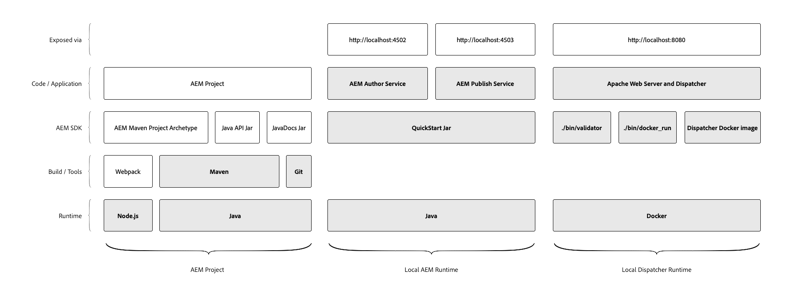

# Local Development Environment Set up {#local-development-environment-set-up}

>[!CONTEXTUALHELP]
>id="aemcloud_localdev_overview"
>title="Overview"
>abstract="Setting up local development environment for AEM as a Cloud Service includes development tooling required to develop, build and compile AEM Projects, as well as local run times allowing developers to quickly validate new features locally before deploying them to AEM as a Cloud Service via Adobe Cloud Manager."
>additional-url="https://experienceleague.adobe.com/docs/experience-manager-cloud-service/implementing/developing/development-guidelines.html" text="Development guidelines"
>additional-url="https://experienceleague.adobe.com/docs/experience-manager-learn/cloud-service/developing/basics/aem-sdk.html" text="Development Basics"

This tutorial walks through setting up a local development environment for Adobe Experience Manager (AEM) using the AEM as a Cloud Service SDK. Included are the development tooling required to develop, build and compile AEM Projects, as well as local run times allowing developers to quickly validate new features locally before deploying them to AEM as a Cloud Service via Adobe Cloud Manager.

>[!VIDEO](https://video.tv.adobe.com/v/32565?quality=12&learn=on)

The local development environment for AEM can be broken up into three logical groups:

+ The __AEM Project__ contains the custom code, configuration and content that is the custom AEM application.
+ The __Local AEM Runtime__ which runs a local version of AEM Author and Publish services locally.
+ The __Local Dispatcher Runtime__ which runs a local version of Apache HTTP Web Server and Dispatcher.

This tutorial walks through how to install and set up the highlighted items in the above diagram, providing a stable local development environment for AEM development.

## File System Organization

This tutorial established the location of the AEM as a Cloud Service SDK artifacts and AEM Project code as follows:

+ `~/aem-sdk` is a organizational folder containing the various tools provided by the AEM as a Cloud Service SDK
+ `~/aem-sdk/author` contains the AEM Author Service
+ `~/aem-sdk/publish` contains the AEM Publish Service
+ `~/aem-sdk/dispatcher` contains the Dispatcher Tools
+ `~/code/<project name>` contains the custom AEM Project source code

Note that `~` is shorthand for the User's Directory. In Windows, this is the equivalent of `%HOMEPATH%`;

## Development Tools for AEM Projects

The AEM project is the custom code base containing the code, configuration and content that is deployed via Cloud Manager to AEM as a Cloud Service. The baseline project structure is generated via the [AEM Project Maven Archetype](https://github.com/adobe/aem-project-archetype).

This section of the tutorial shows how to:

+ Install [!DNL Java]
+ Install [!DNL Node.js] (and npm)
+ Install [!DNL Maven]
+ Install [!DNL Git]

[Set up Development Tools for AEM Projects](./development-tools.md)

## Local AEM Runtime

The AEM as a Cloud Service SDK provides a [!DNL QuickStart Jar] that runs a local version of AEM. The [!DNL QuickStart Jar] can be used to run either the AEM Author Service or AEM Publish Service locally. Note that while the [!DNL QuickStart Jar] provides a local development experience, not all features available in AEM as a Cloud Service are included in the [!DNL QuickStart Jar].

This section of the tutorial shows how to:

+ Install [!DNL Java]
+ Download the AEM SDK
+ Run the [!DNL AEM Author Service]
+ Run the [!DNL AEM Publish Service]

[Set up the Local AEM runtime](./aem-runtime.md)

## Local [!DNL Dispatcher] Runtime

AEM as a Cloud Service SDK's Dispatcher Tools provides everything required to set up the local [!DNL Dispatcher] runtime. [!DNL Dispatcher] Tools are [!DNL Docker]-based and provides command line tools to transpile [!DNL Apache HTTP] Web Server and [!DNL Dispatcher] configuration files into a compatible formats and deploy them to [!DNL Dispatcher] running in the [!DNL Docker] container.

This section of the tutorial shows how to:

+ Download the AEM SDK
+ Install [!DNL Dispatcher] Tools
+ Run the local [!DNL Dispatcher] runtime

[Set up the Local [!DNL Dispatcher] Runtime](./dispatcher-tools.md)
