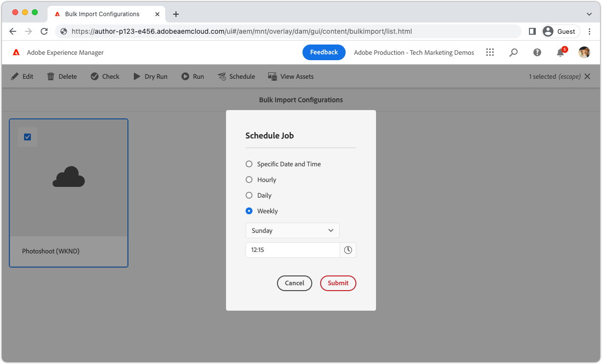

# Using Bulk Import

The Bulk Import tool in AEM as a Cloud Service allows administrators to import assets in bulk from cloud storage in a safe and efficient manner.

>[!BEGINTABS]

>[!TAB Assets view]

Learn how to import numerous files into AEM Assets using the [Asset view](https://experienceleague.adobe.com/docs/experience-manager-cloud-service/content/assets/assets-view/assets-view-introduction.html) [Bulk Import](https://experienceleague.adobe.com/docs/experience-manager-cloud-service/content/assets/assets-view/bulk-import-assets-view.html), with Dropbox serving as the example cloud storage provider for a clear and easy-to-follow integration process.

>[!VIDEO](https://video.tv.adobe.com/v/3426857/?learn=on)

>[!TAB Admin view]

>[!VIDEO](https://video.tv.adobe.com/v/329680?quality=12&learn=on)

>[!TIP]
>
> The input sources in this video only show Azure Blob Storage and Amazon S3; however the available sources continue to grow over time. For a complete list of supported input sources, please refer to the available options in product, or [documentation](https://experienceleague.adobe.com/docs/experience-manager-cloud-service/content/assets/manage/add-assets.html#bulk-upload).

## Schedule bulk import

Bulk Import supports scheduled execution of configurations, including:

+ Single execution at a defined date and time
+ Period executions every hour, day or week

>[!ENDTABS]
