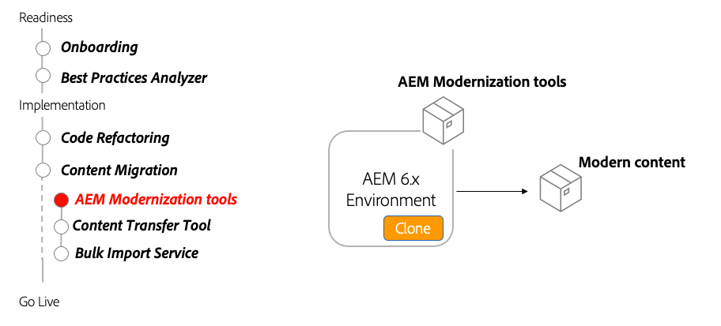

# AEM Modernization Tools

Learn how AEM Modernization Tools are used to upgrade an existing AEM Sites content to be AEM as a Cloud Service compatible and align with best practices.

>[!VIDEO](https://video.tv.adobe.com/v/336965/?quality=12&learn=on)

## Using AEM Modernization Tools

AEM Modernization tools automatically convert existing AEM Pages composed of legacy static templates, foundation components, and the parsys - to use modern approaches such as editable templates, AEM Core WCM Components, and Layout Containers.

### Key Activities

+ Clone AEM 6.x production to run AEM Modernization tools against
+ Download and install the [latest AEM Modernizations tools](https://github.com/adobe/aem-modernize-tools/releases/latest) on the AEM 6.x production clone via Package Manager

+ [Page Structure Converter](https://opensource.adobe.com/aem-modernize-tools/pages/tools/page-structure.html) updates existing page content from static template to a mapped editable template using layout containers
  + Define conversion rules using OSGi configuration
  + Run Page Structure Converter against existing pages

+ [Component Converter](https://opensource.adobe.com/aem-modernize-tools/pages/tools/component.html) updates existing page content from static template to a mapped editable template using layout containers
  + Define conversion rules via JCR node definitions/XML
  + Run the Component Converter tool against existing pages
  
+ [Policy Importer](https://opensource.adobe.com/aem-modernize-tools/pages/tools/policy-importer.html) creates policies from Design configuration
  + Define conversion rules using JCR node definitions/XML
  + Run Policy Importer against existing Design definitions
  + Apply imported policies to AEM components and containers

+ [Dialog Converter](https://opensource.adobe.com/aem-modernize-tools/pages/tools/dialog.html) converts Classic(ExtJS) and CoralUI 2-based component dialogs to CoralUI 3 TouchUI-based dialogs.
  + Run the Dialog Converter tool against existing ExtJS or Coral2 UI-based dialogs
  + Sync converted dialogs back into Git repository

### Other Resources

+ [Download AEM Modernizations tools](https://github.com/adobe/aem-modernize-tools/releases/latest)
+ [AEM Modernization Tools documentation](https://opensource.adobe.com/aem-modernize-tools/)
+ [AEM Gems - Introducing the AEM Modernization Suite](https://helpx.adobe.com/experience-manager/kt/eseminars/gems/Introducing-the-AEM-Modernization-Suite.html)
