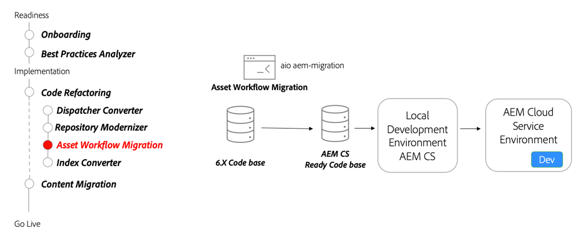

# AEM Assets Microservices - Moving to AEM as a Cloud Service

Learn how AEM Assets as a Cloud Service's asset compute microservices allow you to automatically and efficiently generate any rendition for your assets, replacing this role of traditional AEM Workflow.

>[!VIDEO](https://video.tv.adobe.com/v/336990?quality=12&learn=on)

## Workflow Migration Tool

As part of refactoring your code base, use the [Asset Workflow Migration tool](https://experienceleague.adobe.com/docs/experience-manager-cloud-service/moving/refactoring-tools/asset-workflow-migration-tool.html) to migrate existing workflows to use the Asset Compute microservices in AEM as a Cloud Service.

## Key activities

+ Use the [Adobe I/O Workflow Migrator](https://github.com/adobe/aio-cli-plugin-aem-cloud-service-migration#command-aio-aem-migrationworkflow-migrator) tool to migrate asset processing workflows to use the Asset Compute microservices.
+ Set up a [local development environment](https://experienceleague.adobe.com/docs/experience-manager-learn/cloud-service/local-development-environment-set-up/overview.html) and deploy the updated workflows. Manual adjustment may be needed for complex workflows. 
+ Continue to iterate in a local development environment using the AEM SDK until the updated workflow matches feature parity.
+ Deploy the updated code base to an AEM as a Cloud Service development environment and continue to validate.

## Hands-on exercise

Apply your knowledge by trying out what you learned with this hands-on exercise.

Prior to trying the hands-on exercise, make sure you've watched and understand the video above, and following materials:

+ [Thinking differently about AEM as a Cloud Service](./introduction.md)
+ [Onboarding](./onboarding.md)

Also, make sure you have completed the previous hands-on exercise:

+ [Search and indexing hands-on exercise](./search-and-indexing.md#hands-on-exercise)

<table style="border-width:0">
    <tr>
        <td style="width:150px">
                    
        </td>
        <td style="width:100%;margin-bottom:1rem;">
            
Hands-on with uploading assets

            

                Explore how to defined and assign AEM Assets Processing Profiles to folders and upload assets to AEM using the `aem-upload` npm CLI module.
            

            <a  rel="noreferrer"
                target="_blank"
                href="https://github.com/adobe/aem-cloud-engineering-video-series-exercises/tree/session8-assets#cloud-acceleration-bootcamp---session-8-assets-and-microservices" class="spectrum-Button spectrum-Button--primary spectrum-Button--sizeM">
                Try out assets management
            </a>
        </td>
    </tr>
</table>
