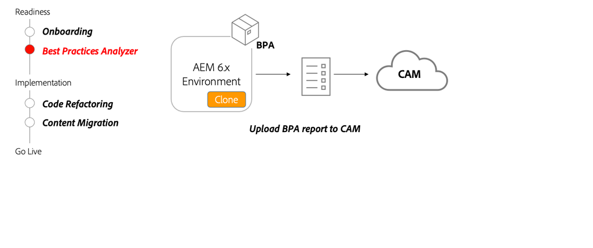

# Best Practices Analyzer and Cloud Acceleration Manager

Learn how Best Practices Analyzer (BPA) and Cloud Acceleration Manager (CAM) provides a customized guide for migrating to AEM as a Cloud Service. 

>[!VIDEO](https://video.tv.adobe.com/v/336957?quality=12&learn=on)

## Using BPA and CAM 

The BPA package should be installed on a clone of the production AEM 6.x environment. The BPA will generate a report that can then be uploaded into CAM, which will provide guidance into the key activities that need to take place in order to move to AEM as a Cloud Service.

## Key activities

+ Make a clone of your production 6.x environment. As you migrate content and refactor code, having a clone of a production environment is valuable to test various tools and changes.
+ Download the latest BPA tool from the [Software Distribution Portal](https://experience.adobe.com/#/downloads/content/software-distribution/en/aemcloud.html) and install on your AEM 6.x cloned environment.
+ Use the BPA tool to generate a report that can be uploaded to Cloud Acceleration Manager (CAM). CAM is accessed through [https://experience.adobe.com/](https://experience.adobe.com/) > **Experience Manager** > **Cloud Acceleration Manager**. 
+ Use CAM to provide guidance on what updates need to be made to the current code base and environment in order to move to AEM as a Cloud Service.

## Hands-on exercise

Apply your knowledge by trying out what you learned with this hands-on exercise.

Prior to trying the hands-on exercise, make sure you've watched and understand the video above, and following materials:

+ [Thinking differently about AEM as a Cloud Service](./introduction.md)
+ [What is AEM as a Cloud Service?](https://experienceleague.adobe.com/docs/experience-manager-learn/cloud-service/introduction/what-is-aem-as-a-cloud-service.html?lang=en)
+ [Architecture of AEM as a Cloud Service](https://experienceleague.adobe.com/docs/experience-manager-learn/cloud-service/introduction/architecture.html?lang=en)
+ [Mutable and immutable content](https://experienceleague.adobe.com/docs/experience-manager-learn/cloud-service/developing/basics/mutable-immutable.html?lang=en)
+ [Differences in developing for AEM as a Cloud Service and AEM 6.x](https://experienceleague.adobe.com/docs/experience-manager-cloud-service/implementing/developing/development-guidelines.html#developing)

<table style="border-width:0">
    <tr>
        <td style="width:150px">
                    
        </td>
        <td style="width:100%;margin-bottom:1rem;">
            
Hands-on with Best Practices Analyzer

            

                Explore the Best Practices Analyzer (BPA) and reviewing the results by running it against a legacy WKND code base that contains example violations.
            

            <a  rel="noreferrer"
                target="_blank"
                href="https://github.com/adobe/aem-cloud-engineering-video-series-exercises/tree/session1-differently#bootcamp---session-1-introduction-and-thinking-differently" class="spectrum-Button spectrum-Button--primary spectrum-Button--sizeM">
                Try out the Best Practices Analyzer
            </a>
        </td>
    </tr>
</table>

## Other resources

+ [Download the Best Practices Analyzer](https://experience.adobe.com/#/downloads/content/software-distribution/en/aemcloud.html?fulltext=Best*+Practices*+Analyzer*&orderby=%40jcr%3Acontent%2Fjcr%3AlastModified&orderby.sort=desc&layout=list&p.offset=0&p.limit=1)