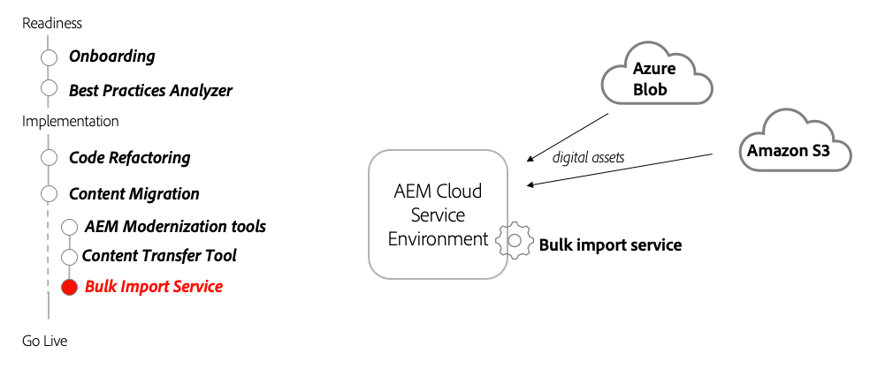

# Bulk Import Service

Learn how AEM as a Cloud Services' Bulk Import Service can be used to import assets from non-AEM sources.

>[!VIDEO](https://video.tv.adobe.com/v/336969?quality=12&learn=on)

## Using the Bulk Import Service

The Bulk Import Service is used to transfer files stored in Azure Blob Storage or Amazon S3 storage into AEM as a Cloud Service as assets.

## Key Activities

+ Upload the files-to-import to your cloud storage provider (Azure Blob Storage or Amazon S3).
+ Configure and run the Bulk Import Service from AEM as a Cloud Service Author service.
+ Run the Bulk Service Importer as a one-time import or schedule a periodic import.

## Other Resources

+ [Bulk import service configuration options](https://experienceleague.adobe.com/docs/experience-manager-cloud-service/content/assets/manage/add-assets.html#configure-bulk-ingestor-tool)
+ [Adobe Developers Live session on Asset Ingestion](https://experienceleague.adobe.com/docs/adobe-developers-live-events/events/2021/feb2021/asset-bulk-ingestion.html)
    