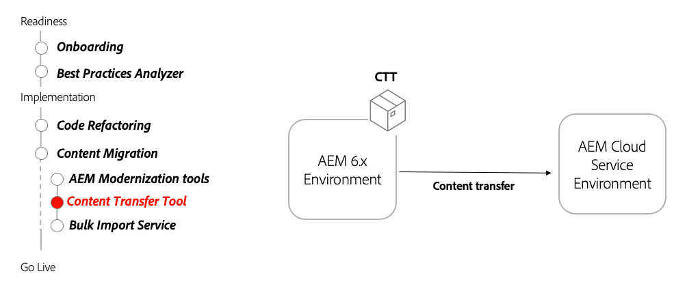

# Content Transfer Tool

Learn how Content Transfer Tool helps you migrate content to AEM as a Cloud Service from AEM 6.3+.

>[!VIDEO](https://video.tv.adobe.com/v/336970/?quality=12&learn=on)

## Using the Content Transfer Tool

The Content Transfer Tool is installed on AEM 6.3+ and transfers content to AEM as a Cloud Service.

### Key Activities

+ Download the [latest Content Transfer Tool](https://experience.adobe.com/#/downloads/content/software-distribution/en/aemcloud.html?fulltext=Content*+Transfer*+Tool*&1_group.propertyvalues.property=.%2Fjcr%3Acontent%2Fmetadata%2Fdc%3AsoftwareType&1_group.propertyvalues.operation=equals&1_group.propertyvalues.0_values=software-type%3Atooling&orderby=%40jcr%3Acontent%2Fjcr%3AlastModified&orderby.sort=desc&layout=list&p.offset=0&p.limit=2).
+ Transfer AEM Author 6.3+ final content to AEM as a Cloud Service Author service.
  + Install the Content Transfer Tool on AEM 6.3+ Author containing the final content to transfer.
  + Run the Content Transfer Tool in batches, transferring sets of content.
+ Transfer AEM Publish 6.3+ final content to AEM as a Cloud Service Publish service.
  + Install the Content Transfer Tool on AEM 6.3+ Publish containing the final content to transfer.
  + Run the Content Transfer Tool in batches, transferring sets of content.
+ Optionally, "top-up" content on AEM as a Cloud Service, by transferring new content since the last content transfer

### Other Resources

+ [Download Content Transfer Tool](https://experience.adobe.com/#/downloads/content/software-distribution/en/aemcloud.html?fulltext=Content*+Transfer*+Tool*&1_group.propertyvalues.property=.%2Fjcr%3Acontent%2Fmetadata%2Fdc%3AsoftwareType&1_group.propertyvalues.operation=equals&1_group.propertyvalues.0_values=software-type%3Atooling&orderby=%40jcr%3Acontent%2Fjcr%3AlastModified&orderby.sort=desc&layout=list&p.offset=0&p.limit=2)
+ [Bulk Import Service how-to video](https://experienceleague.adobe.com/docs/experience-manager-learn/cloud-service/migration/bulk-import.html?lang=en)
