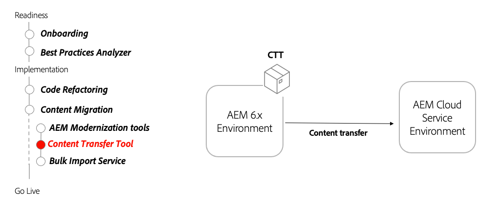

# Content Transfer Tool

Learn how Content Transfer Tool helps you migrate content to AEM as a Cloud Service from AEM 6.3+.

>[!VIDEO](https://video.tv.adobe.com/v/336970?quality=12&learn=on)

## Using the Content Transfer Tool

The Content Transfer Tool is installed on AEM 6.3+ and transfers content to AEM as a Cloud Service.

## Key activities

+ Download the [latest Content Transfer Tool](https://experience.adobe.com/#/downloads/content/software-distribution/en/aemcloud.html?fulltext=Content*+Transfer*+Tool*&1_group.propertyvalues.property=.%2Fjcr%3Acontent%2Fmetadata%2Fdc%3AsoftwareType&1_group.propertyvalues.operation=equals&1_group.propertyvalues.0_values=software-type%3Atooling&orderby=%40jcr%3Acontent%2Fjcr%3AlastModified&orderby.sort=desc&layout=list&p.offset=0&p.limit=2).
+ Transfer AEM Author 6.3+ final content to AEM as a Cloud Service Author service.
  + Install the Content Transfer Tool on AEM 6.3+ Author containing the final content to transfer.
  + Run the Content Transfer Tool in batches, transferring sets of content.
+ Transfer AEM Publish 6.3+ final content to AEM as a Cloud Service Publish service.
  + Install the Content Transfer Tool on AEM 6.3+ Publish containing the final content to transfer.
  + Run the Content Transfer Tool in batches, transferring sets of content.
+ Optionally, "top-up" content on AEM as a Cloud Service, by transferring new content since the last content transfer

## Hands-on exercise

Apply your knowledge by trying out what you learned with this hands-on exercise.

Prior to trying the hands-on exercise, make sure you've watched and understand the video above, and following materials:

+ [AEM Modernization Tools](../aem-modernization-tools.md)
+ [Onboarding](../onboarding.md)
+ [Cloud Manager](../cloud-manager.md)

Also, make sure you have completed the previous hands-on exercise:

+ [Dispatcher hands-on exercise](../dispatcher.md#hands-on-exercise)

<table style="border-width:0">
    <tr>
        <td style="width:150px">
                    
        </td>
        <td style="width:100%;margin-bottom:1rem;">
            
Hands-on with Content Transfer Tool

            

                Explore how the Content Transfer Tool can automatically move content from AEM 6 to AEM as a Cloud Service.
            

            <a  rel="noreferrer"
                target="_blank"
                href="https://github.com/adobe/aem-cloud-engineering-video-series-exercises/tree/session6-transfercontent#cloud-acceleration-bootcamp---session-6-content" class="spectrum-Button spectrum-Button--primary spectrum-Button--sizeM">
                Try out Content Transfer Tool
            </a>
        </td>
    </tr>
</table>

## Other resources

+ [Download Content Transfer Tool](https://experience.adobe.com/#/downloads/content/software-distribution/en/aemcloud.html?fulltext=Content*+Transfer*+Tool*&1_group.propertyvalues.property=.%2Fjcr%3Acontent%2Fmetadata%2Fdc%3AsoftwareType&1_group.propertyvalues.operation=equals&1_group.propertyvalues.0_values=software-type%3Atooling&orderby=%40jcr%3Acontent%2Fjcr%3AlastModified&orderby.sort=desc&layout=list&p.offset=0&p.limit=2)
+ [Bulk Import Service how-to video](https://experienceleague.adobe.com/docs/experience-manager-learn/cloud-service/migration/bulk-import.html)

