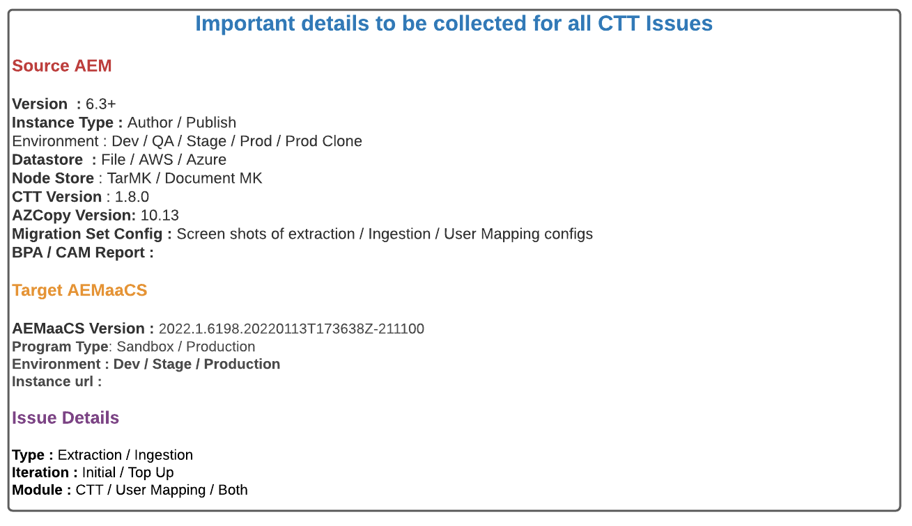
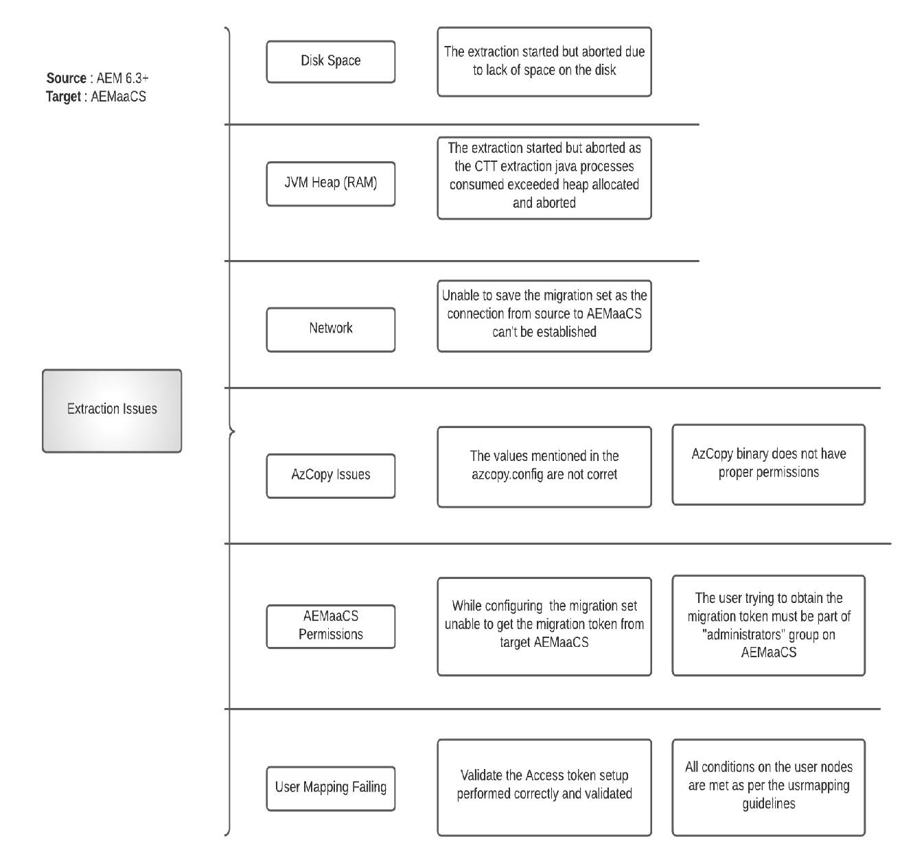
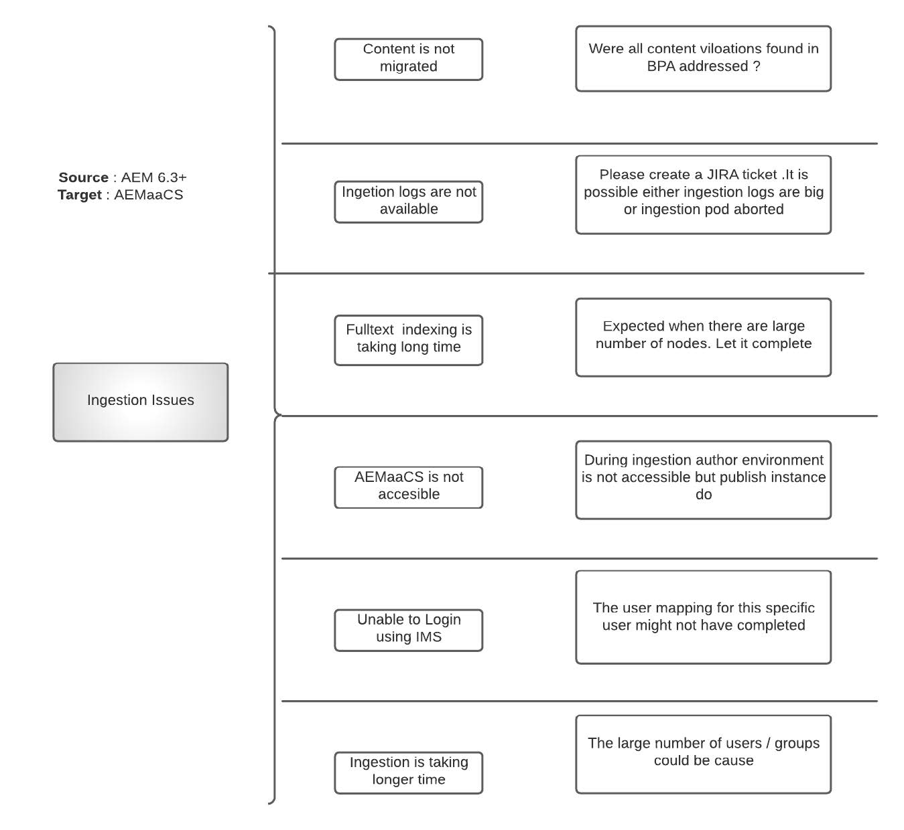

# AEM as a Cloud Service content migration FAQ

Get answers to frequently asked questions about content migration to AEM as a Cloud Service.

## Terminology

+ **AEMaaCS**: [AEM as a Cloud Service](https://experienceleague.adobe.com/docs/experience-manager-cloud-service/content/overview/introduction.html)
+ **BPA**: [Best Practices Analyzer](https://experienceleague.adobe.com/docs/experience-manager-cloud-service/content/migration-journey/cloud-migration/best-practices-analyzer/overview-best-practices-analyzer.html)
+ **CTT**: [Content Transfer Tool](https://experienceleague.adobe.com/docs/experience-manager-cloud-service/content/migration-journey/cloud-migration/content-transfer-tool/overview-content-transfer-tool.html)
+ **CAM**: [Cloud Acceleration Manager](https://experienceleague.adobe.com/docs/experience-manager-cloud-service/content/migration-journey/cloud-acceleration-manager/using-cam/getting-started-cam.html)
+ **IMS**: [Identity Management System](https://experienceleague.adobe.com/docs/experience-manager-cloud-service/content/security/ims-support.html)
+ **DM**: [Dynamic Media](https://experienceleague.adobe.com/docs/experience-manager-cloud-service/content/assets/dynamicmedia/dm-journey/dm-journey-part1.html)

Please use the below template for providing more details while creating CTT related Adobe support tickets.

 { align="center" }

## General content migration questions

### Q: What are the different methods to migrate content into AEM as Cloud Services?

There are three different methods available

+ Using Content Transfer Tool (AEM 6.3+ → AEMaaCS)
+ Through Package Manager (AEM → AEMaaCS)
+ Out of the box Bulk Import Service for Assets (S3/Azure → AEMaaCS)

### Q: Is there a limit on the amount of content that can be transferred using CTT?

No. CTT as a tool could extract from AEM source and ingest into AEMaaCS. However there are specific limits on AEMaaCS platform that should be considered before migration.

For more info, refer to [cloud migration prerequisites](https://experienceleague.adobe.com/docs/experience-manager-cloud-service/content/migration-journey/cloud-migration/content-transfer-tool/prerequisites-content-transfer-tool.html).

### Q: I have the latest BPA report from my source system, what should I do with it?

Export the report as CSV and then upload it to Cloud Acceleration Manager, [associated with your IMS Org](https://experienceleague.adobe.com/docs/experience-manager-cloud-service/content/migration-journey/cloud-acceleration-manager/using-cam/getting-started-cam.html). Then go through the review process as [outlined in the Readiness Phase](https://experienceleague.adobe.com/docs/experience-manager-cloud-service/content/migration-journey/cloud-acceleration-manager/using-cam/cam-readiness-phase.html).

Please review the code and content complexity assessment provided by the tool and make a note of associated action items that lead to code refactoring backlog or Cloud Migration Assessment.

### Q: Is it recommended to extract on source author and ingest into AEMaaCS author and publish?

It is always recommended to perform 1:1 extraction and ingestion between author and publish tiers. That being said, it is acceptable to extract source production author and ingest that into Dev, Stage, and Production CS.

### Q: Is there a way to estimate the time, it takes to migrate the content from source AEM into AEMaaCS using CTT?

Since the migration process depends on internet band width, heap allocated for CTT process, free memory available, and disk IO which are subjective to each source system, it is recommended to execute Proof Of migrations early on and extrapolate that data points to come up with estimates.

### Q: How does my source AEM performance be impacted if I start CTT extraction process?

CTT tool runs in its own Java&trade; process which takes up to 4gb heap, which is configurable through OSGi configuration. This number may change but you can grep for the Java&trade; process and find that out.

If AZCopy is installed and/or Pre copy option / validation feature enabled, then AZCopy process consumes CPU cycles.

Apart from jvm , the tool also uses disk IO to store the data on a transitional temp space and that will be cleaned up after extraction cycle. Apart from the RAM, CPU and Disk IO, CTT tool also uses the network band width of the source system to upload data into Azure blob store.

The amount of resources the CTT extraction process takes depends on the number of nodes, number of blobs and their aggregated size. It is hard to provide a formula and hence it is recommended to execute a small Proof of migration to determine the source server upsize requirements.

If clone environments are used for migration, then it will not impact the live production server resource utilization but has its own downsides regarding synching content between Live production and clone

### Q: In my source author system, we have SSO configured for the users to authenticate into Author instance. Do I have to use User Mapping feature of CTT in this case?

The short answer is "**Yes**".

The CTT extraction and ingestion **without** user mapping only migrates the content, the associated principles (users, groups) from source AEM to AEMaaCS. But there is a requirement for these users (identities) present in Adobe IMS and have (provisioned with) access to AEMaaCS instance to successfully authenticate. The job of [user-mapping tool](https://experienceleague.adobe.com/docs/experience-manager-cloud-service/content/migration-journey/cloud-migration/content-transfer-tool/legacy-user-mapping-tool/overview-user-mapping-tool-legacy.html) is to map the local AEM user to IMS User so that authentication and authorizations work together.

In this case, the SAML identity provider is configured against Adobe IMS to use either Federated / Enterprise ID, rather than directly to AEM using Authentication handler.

### Q: In my source author system, we have basic authentication configured for the users to authenticate into Author instance with local AEM users. Do I have to use User Mapping feature of CTT in this case?

The short answer is "**Yes**".

The CTT extraction and ingestion without user mapping does migrate the content, the associated principles (users, groups) from source AEM to AEMaaCS. But there is a requirement for these users (identities) present in Adobe IMS and have (provisioned with) access to AEMaaCS instance to successfully authenticate. The job of [user-mapping tool](https://experienceleague.adobe.com/docs/experience-manager-cloud-service/content/migration-journey/cloud-migration/content-transfer-tool/legacy-user-mapping-tool/overview-user-mapping-tool-legacy.html) is to map the local AEM user to IMS User so that authentication and authorizations work together.

In this case, the users use personal Adobe ID and the Adobe ID is used by IMS admin for providing access to AEMaaCS.

### Q: What do the terms "wipe" and "overwrite" mean in the context of CTT?

In the context of [extraction phase](https://experienceleague.adobe.com/docs/experience-manager-cloud-service/content/migration-journey/cloud-migration/content-transfer-tool/getting-started-content-transfer-tool.html?lang=en#extraction-setup-phase), The options are either to overwrite the data in the staging container from previous extraction cycles or add the differential (added/updated/deleted) into it. Staging Container is nothing, but the blob storage container associated with migration set. Each migration set gets their own staging container.

In the context of [ingestion phase](https://experienceleague.adobe.com/docs/experience-manager-cloud-service/content/migration-journey/cloud-migration/content-transfer-tool/ingesting-content.html), The options are + to replace the entire content repository of AEMaaCS or sync the differential (added/updated/deleted) content from staging migration container.

### Q: There are multiple websites, associated assets, users, groups in the source system. Is it possible to migrate them in phases to AEMaaCS?

Yes, it is possible but requires careful planning regarding:

+   Creating the migration sets assuming the sites, assets are into their respective hierarchies
    + Verify whether it's acceptable to migrate all the assets as part of one migration set and then bring sites that are using them in phases
+   In the current state, the author ingestion process makes the author instance unavailable for content authoring even though publish tier can still serve the content
    + This means until the ingestion completes into author, content-authoring activities are frozen

Please review the Top up extraction and ingestion process as documented before planning the migrations.

### Q: Are my websites going to be available for end users even though ingestion happening into either AEMaaCS author or publish instances?

Yes. End-user traffic is not interrupted by content migration activity. However, the author ingestion freezes content authoring until it completes.

### Q: The BPA report shows items related to missing original renditions. Should I clean them up on source before extraction?

Yes. The missing original rendition means the asset binary is not properly uploaded in the first place. Considering it as bad data, please review, backup using Package Manager (as required) and remove them from source AEM before running extraction. The bad data will have negative results on the asset processing steps.

### Q: The BPA report has items related to missing `jcr:content` node for folders. What should I do with them?

When `jcr:content` is missing at folder level, any action to propagate settings such as processing profiles, etc. from parents will break at this level. Please review the reason for missing `jcr:content`. Even though these folders could be migrated, please note that such folders degrade user experience and cause unnecessary troubleshooting cycles later.

### Q: I have created a migration set. is it possible to check the size of it?

Yes, there is a [Check Size](https://experienceleague.adobe.com/docs/experience-manager-cloud-service/content/migration-journey/cloud-migration/content-transfer-tool/getting-started-content-transfer-tool.html#migration-set-size) feature which is part of the CTT.

### Q: I am performing the migration (extraction, ingestion). Is it possible to validate that all my content extracted is ingested into target?

Yes, there is a [validation](https://experienceleague.adobe.com/docs/experience-manager-cloud-service/content/migration-journey/cloud-migration/content-transfer-tool/validating-content-transfers.html) feature which is part of CTT.
 
### Q: My customer has a requirement to move content between AEMaaCS environments such as from AEMaaCS Dev to AEMaaCS Stage or to AEMaaCS Prod. Can I use content transfer tool for these use-cases?

Unfortunately, No. CTT's use case is to migrate content from On-premises/AMS-hosted AEM 6.3+ source to AEMaaCS cloud environments. [Please read CTT documentation](https://experienceleague.adobe.com/docs/experience-manager-cloud-service/content/migration-journey/cloud-migration/content-transfer-tool/overview-content-transfer-tool.html).

### Q: What kind of problems are anticipated during extraction?

Extraction Phase is an involved process that requires multiple aspects to work as expected. Being aware of different kind of issues that may occur and how to mitigate them increases the overall success of content migration.

The public documentation is continuously improved based the learnings, but here are some high-level problem categories and possible underlying reasons.

 { align="center" }

### Q: What kind of problems are anticipated during ingestion?

Ingestion phase completely occurs in cloud platform and requires help from the resources that have access to AEMaaCS infrastructure. Please create a support ticket for more help.

Here are possible issue categories (please do not consider this as an exclusive list)

 { align="center" }

### Q: Does my source server need to have outbound internet connection for CTT to work?

The short answer is "**Yes**".

The CTT process requires connectivity to the below resources:

+ The target AEM as a Cloud Service environment: `author-p<program_id>-e<env_id>.adobeaemcloud.com`
+ The Azure blob storage service: `casstorageprod.blob.core.windows.net`
+ The User Mapping IO endpoint: `usermanagement.adobe.io`

Refer to the documentation for more information about [source connectivity](https://experienceleague.adobe.com/docs/experience-manager-cloud-service/content/migration-journey/cloud-migration/content-transfer-tool/getting-started-content-transfer-tool.html#source-environment-connectivity).

## Asset processing Dynamic Media related questions

### Q: Are assets going to be reprocessed automatically after ingestion in AEMaaCS?

No. To process the assets, the request to reprocess must be initiated.

### Q: Are assets going to be reindexed automatically after ingestion in AEMaaCS?

Yes. The assets are reindexed based on the index definitions available on AEMaaCS.

### Q: The source AEM has an integration with Dynamic Media. Are there any specific things that must be considered before Content Migration?

Yes, please consider the following when source AEM has Dynamic Media Integration.

+ AEMaaCS Supports Only Dynamic Media Scene7 Mode. If the source system is on Hybrid Mode, then the DM migration to Scene7 modes is required.
+ If the approach is to migrate from source clone instances, then it is safe to disable DM integration on clone that would be used for CTT. This step is purely to avoid any writes to DM or avoid load on DM traffic.
+ Please note that CTT migrates nodes, metadata of a migration set from source AEM to AEMaaCS. It will not perform any operations on DM directly.

### Q: What are different migration approaches when DM integration present on Source AEM?

Please read the above question and answer before 

(These are two possible options but are not limited to only these two). It depends on how customer wants to approach the UAT, Performance testing, the available environment and whether a clone is being used for migration or not. Please consider these two as starting point for discussion

**Option 1**

If the number of assets / nodes in the source environment are on lower end (~100K), assuming these can be migrated over a period of 24 + 72 hours including extraction and ingestion, the better approach is

+   Perform migration from production directly
+   Run an initial extraction and ingestion into AEMaaCS with `wipe=true`
    + This step migrates all nodes and binaries
+   Continue working on on-premise / AMS Prod author
+   From now on, run all other proof of migration cycles with `wipe=true`
    + Note this operation migrates full node store, but only modified blobs as opposed to entire blobs. The previous set of blobs are there in the Azure blob store of target AEMaaCS instance.
    + Use this proof of migrations for measuring the migration duration, user mapping, Testing, validation of all other functionalities
+   Finally, before the week of go-live, perform a wipe=true migration
    + Connect the Dynamic Media on AEMaaCS
    + Disconnect DM config from AEM on-premises source

With this option you can run migration one to one, meaning On-prem Dev → AEMaaCS Dev, and so forth. and move the DM configurations from respective environments

(In case the migration is being planned to be performed from Clone)

**Option 2**

+   Create clone of Production author, remove DM configuration from Clone
+   Migrate on-premise clone → AEMaaCS Dev / Stage
    + Connect production DM company briefly to AEMaaCS Dev/Stage for validation purposes
    + During the DM connection is active, avoid asset ingestion into AEMaaCS
    + This enables them to validate CTT, DM specific validations
+   Once the testing is complete on AEMaaCS
    + Run a wipe migration from on-premise Stage to AEMaaCS Stage

Run a wipe migration from on-premise Dev to AEMaaCS Dev.

The above approach can be used for just measuring the migration duration but requires cleaning it up later.

## Additional resources

+   [Tips and Tricks for Migrating to Experience Manager in the Cloud ( Summit 2022)](https://business.adobe.com/summit/2022/sessions/tips-and-tricks-for-migrating-to-experience-manage-tw109.html)

+   [CTT Expert Series Video](https://experienceleague.adobe.com/docs/experience-manager-learn/cloud-service/migration/moving-to-aem-as-a-cloud-service/content-migration/content-transfer-tool.html)

+   [Expert Series Videos on other AEMaaCS topics](https://experienceleague.adobe.com/docs/experience-manager-learn/cloud-service/expert-resources/aem-experts-series.html)
