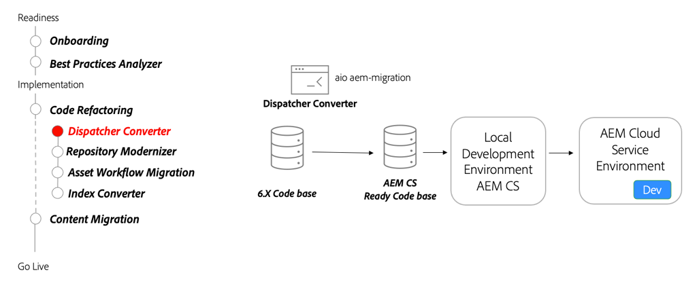

# Dispatcher

Learn about AEM Dispatcher for AEM as a Cloud Service, focusing on notable changes from Dispatcher for AEM 6, the Dispatcher conversion tool and how to use the Dispatcher Tools SDK.

>[!VIDEO](https://video.tv.adobe.com/v/336962?quality=12&learn=on)

## Dispatcher Converter

As part of refactoring your code base, use the [AEM Dispatcher Converter](https://experienceleague.adobe.com/docs/experience-manager-cloud-service/moving/refactoring-tools/dispatcher-transformation-utility-tools.html) to refactor existing on-premise or Adobe Managed Services Dispatcher configurations to AEM as a Cloud Service compatible Dispatcher configuration.

## Key activities

+ Use the [Adobe I/O Dispatcher Converter tool](https://github.com/adobe/aio-cli-plugin-aem-cloud-service-migration#aio-aem-migrationdispatcher-converter) to migrate an existing Dispatcher configuration.
+ Reference the Dispatcher module from the [AEM Project Archetype](https://github.com/adobe/aem-project-archetype/tree/develop/src/main/archetype/dispatcher.cloud) as a best practice.
+ [Set up local Dispatcher Tools](https://experienceleague.adobe.com/docs/experience-manager-learn/cloud-service/local-development-environment-set-up/dispatcher-tools.html) to validate dispatcher, before testing in a Cloud Service environment.

## Hands-on exercise

Apply your knowledge by trying out what you learned with this hands-on exercise.

Prior to trying the hands-on exercise, make sure you've watched and understand the video above, and following materials:

+ [AEM Modernization Tools](./aem-modernization-tools.md)
+ [Onboarding](./onboarding.md)
+ [Cloud Manager](./cloud-manager.md)

Also, make sure you have completed the previous hands-on exercise:

+ [Cloud Manager hands-on exercise](./cloud-manager.md#hands-on-exercise)

<table style="border-width:0">
    <tr>
        <td style="width:150px">
                    
        </td>
        <td style="width:100%;margin-bottom:1rem;">
            
Hands-on with Dispatcher Tools

            

                Explore using the AEM SDK's Dispatcher Tools to validate Dispatcher configurations as well as running AEM Dispatcher locally using Docker.
            

            <a  rel="noreferrer"
                target="_blank"
                href="https://github.com/adobe/aem-cloud-engineering-video-series-exercises/tree/session5-dispatcher#cloud-acceleration-bootcamp---session-5-dispatcher" class="spectrum-Button spectrum-Button--primary spectrum-Button--sizeM">
                Try out Dispatcher Tools
            </a>
        </td>
    </tr>
</table>
