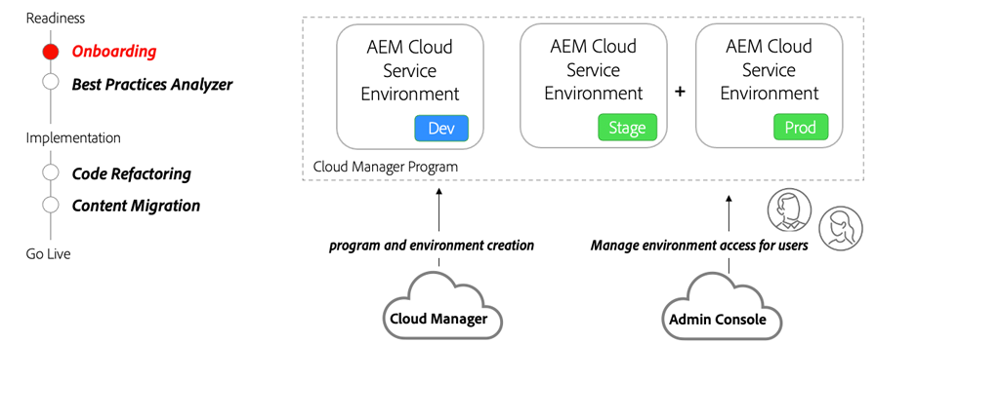

# Onboarding to AEM as a Cloud Service 

Learn about onboarding to AEM as a Cloud Service starting from the contract phase all the way through setting up the environments using Cloud Manager.

>[!VIDEO](https://video.tv.adobe.com/v/336959?quality=12&learn=on)

## Cloud Manager and Admin console

A critical part of onboarding is to create AEM as a Cloud Service programs and provision various environments using Adobe Cloud Manager. The [Admin Console](https://adminconsole.adobe.com/) is used to assign roles and provide access for users in your organization to AEM environments.

## Key Activities

+ A system administrator uses the [Admin Console](https://adminconsole.adobe.com/) to assign one or more users to the [Cloud Manager - Business Owner](https://experienceleague.adobe.com/docs/experience-manager-cloud-manager/using/requirements/setting-up-users-and-roles.html) product profile.
+ User(s) assigned to the Business Owner Product Profile use the self-service features of [Cloud Manager](https://experienceleague.adobe.com/docs/experience-manager-cloud-manager/using/introduction-to-cloud-manager.html) to [create program(s)](https://experienceleague.adobe.com/docs/experience-manager-cloud-service/implementing/using-cloud-manager/production-programs/creating-production-program.html) and [add environments](https://experienceleague.adobe.com/docs/experience-manager-cloud-service/implementing/using-cloud-manager/manage-environments.html)
+ Use the [Admin Console](https://adminconsole.adobe.com/) to assign Developers and users to different [Cloud Manager roles](https://experienceleague.adobe.com/docs/experience-manager-cloud-manager/using/requirements/setting-up-users-and-roles.html) and grant permission to various AEM environments.

## Hands-on exercise

Apply your knowledge by trying out what you learned with this hands-on exercise.

Prior to trying the hands-on exercise, make sure you've watched and understand the video above, and following materials:

+ [Thinking differently about AEM as a Cloud Service](./introduction.md)
+ [Cloud Manager](./cloud-manager.md)

Also, make sure you have completed the previous hands-on exercise:

+ [AEM Modernization Tools hands-on exercise](./aem-modernization-tools.md#hands-on-exercise)

<table style="border-width:0">
    <tr>
        <td style="width:150px">
                    
        </td>
        <td style="width:100%;margin-bottom:1rem;">
            
Hands-on with onboarding

            

                Explore AEM as a Cloud Service onboarding process and how to deploy an AEM application to the AEM SDK.
            

            <a  rel="noreferrer"
                target="_blank"
                href="https://github.com/adobe/aem-cloud-engineering-video-series-exercises/tree/session3-onboarding#bootcamp---session-3-on-boarding" class="spectrum-Button spectrum-Button--primary spectrum-Button--sizeM">
                Try out onboarding
            </a>
        </td>
    </tr>
</table>
