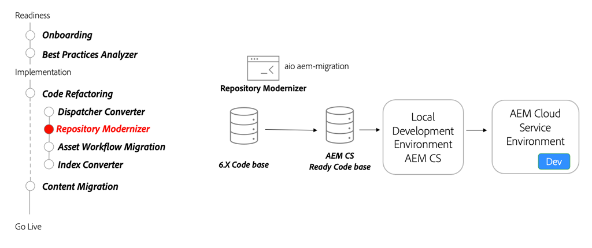

# Repository modernization

Learn about repository modernization, mutable and immutable content, package structure and the repository modernizer CLI tool.

>[!VIDEO](https://video.tv.adobe.com/v/336958?quality=12&learn=on)

## Repository Modernizer Tool

As part of refactoring your code base, use the [Repository Modernizer tool](https://experienceleague.adobe.com/docs/experience-manager-cloud-service/moving/refactoring-tools/repo-modernizer.html) to restructure a 6.x code base to a more modern structure.

## Key activities

* Use the [Adobe I/O Repository Modernizer](https://github.com/adobe/aio-cli-plugin-aem-cloud-service-migration#command-aio-aem-migrationrepository-modernizer) tool to restructure a project to match the expected structure of an AEM as a Cloud Service project.
* Manually adjust and fix any build errors in the updated code base.
* Set up a [local development environment](https://experienceleague.adobe.com/docs/experience-manager-learn/cloud-service/local-development-environment-set-up/overview.html) and deploy the updated code base. Iterate until the project is in a stable state.
* Deploy the updated code base to an AEM as a Cloud Service development environment and continue to validate.
