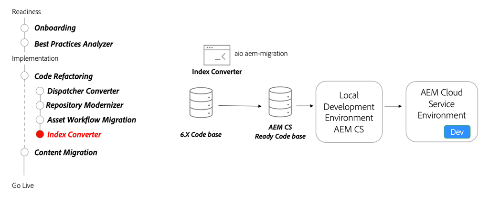

# Search and indexing

Learn about AEM as a Cloud Service's search indexes, how to convert AEM 6 index definitions to be AEM as a Cloud Service compatible, and how to deploy indexes to AEM as a Cloud Service.

>[!VIDEO](https://video.tv.adobe.com/v/336963?quality=12&learn=on)

## Index Converter Tool

As part of refactoring your code base, use the [Index converter tool](https://github.com/adobe/aio-cli-plugin-aem-cloud-service-migration#command-aio-aem-migrationindex-converter) to convert custom Oak index definitions to AEM as a Cloud Service compatible index definitions.

## Key activities

+ Use the [Adobe I/O Workflow Migrator](https://github.com/adobe/aio-cli-plugin-aem-cloud-service-migration#command-aio-aem-migrationindex-converter) tool to migrate asset processing workflows to use the Asset Compute microservices.
+ Set up a [local development environment](https://experienceleague.adobe.com/docs/experience-manager-learn/cloud-service/local-development-environment-set-up/overview.html) and deploy the customized indices. Ensure that the updated indices are up to date.
+ Deploy the updated code base to an AEM as a Cloud Service development environment and continue to validate.
+ If modifying an out of the box index **ALWAYS** copy the latest index definition from an AEM as a Cloud Service environment running on the latest release. Modify the copied index definition to fit your needs.

## Hands-on exercise

Apply your knowledge by trying out what you learned with this hands-on exercise.

Prior to trying the hands-on exercise, make sure you've watched and understand the video above, and following materials:

+ [Thinking differently about AEM as a Cloud Service](./introduction.md)
+ [Repository Modernization](./repository-modernization.md)

Also, make sure you have completed the previous hands-on exercise:

+ [Content Transfer Tool hands-on exercise](./content-migration/content-transfer-tool.md#hands-on-exercise)

<table style="border-width:0">
    <tr>
        <td style="width:150px">
                    
        </td>
        <td style="width:100%;margin-bottom:1rem;">
            
Hands-on with indexes

            

                Explore defining and deploying Oak indexes to AEM as a Cloud Service.
            

            <a  rel="noreferrer"
                target="_blank"
                href="https://github.com/adobe/aem-cloud-engineering-video-series-exercises/tree/session7-indexes#cloud-acceleration-bootcamp---session-7-search-and-indexing" class="spectrum-Button spectrum-Button--primary spectrum-Button--sizeM">
                Try out indexing
            </a>
        </td>
    </tr>
</table>
