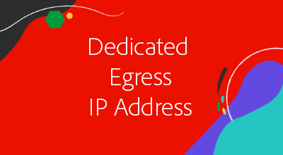
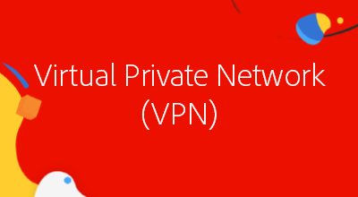

# Advanced networking

AEM as a Cloud Service provides advanced networking features that allows for precise management of connections to and from AEM as a Cloud Service programs. 

|                                                   | [Production Programs](https://experienceleague.adobe.com/docs/experience-manager-cloud-service/content/implementing/using-cloud-manager/programs/introduction-production-programs.html) | [Sandbox Programs](https://experienceleague.adobe.com/docs/experience-manager-cloud-service/content/implementing/using-cloud-manager/programs/introduction-sandbox-programs.html) |
|---------------------------------------------------|:-----------------------:|:---------------------:|
| Supports advanced networking                      | &#10004;                | &#10008;             |

AEM's advanced networking is comprised of three options for managing connectivity with external services. A Cloud Manager program, and its AEM as a Cloud Service environments, can only use a single type of advanced networking configuration at a time, so ensure that the most appropriate type is selected.

|                                   | HTTP/HTTPS on standard ports | HTTP/HTTPS on non-standard ports | Non-HTTP/HTTPS connections | Dedicated egress IP | "No-proxy hosts" list | Connect to VPN-protected services | Limit AEM Publish traffic by IP |
|-----------------------------------|:----------------------------:|:--------------------------------:|:--------------------------:|:-------------------:|:-------------------------------------:|:-------------------------------------:|:----:|
| __No advanced networking__                                            | &#10004; | &#10008; | &#10008; | &#10008; | &#10008; | &#10008; | &#10008; |
| [__Flexible port egress__](./flexible-port-egress.md)                 | &#10004; | &#10004; | &#10004; | &#10008; | &#10008; | &#10008; | &#10008; |
| [__Dedicated egress IP address__](./dedicated-egress-ip-address.md)   | &#10004; | &#10004; | &#10004; | &#10004; | &#10004; | &#10008; | &#10008; |
| [__Virtual Private Network__](./vpn.md)                               | &#10004; | &#10004; | &#10004; | &#10004; | &#10004; | &#10004; | &#10004; |

For more details on the considerations involved when selecting the appropriate advanced networking type, see [advanced networking documentation](https://experienceleague.adobe.com/docs/experience-manager-cloud-service/security/configuring-advanced-networking.html).

## Advanced networking tutorials

Once the most appropriate advanced networking option based on your organization's need has been identified, click into the corresponding tutorial below to for step-by-step instructions and code samples.

<table>
  <tr>
   <td>
      
      
<strong><a href="./flexible-port-egress.md">Flexible port egress</a></strong>

      

          Allow outbound AEM as a Cloud Service traffic on non-standard ports.
      

    </td>   
   <td>
      
      
<strong><a href="./dedicated-egress-ip-address.md">Dedicated egress IP address</a></strong>

      

        Originate outbound AEM as a Cloud Service traffic from a dedicated IP.
      

    </td>   
   <td>
      
      
<strong><a href="./vpn.md">Virtual Private Network (VPN)</a></strong>

      

        Secure traffic between a customer or vendor infrastructure and AEM as a Cloud Service.
      

    </td>   
  </tr>
</table>

## Code examples

This collection provides examples of the configuration and code required to leverage advanced networking features for specific use cases.

Ensure the the appropriate [advanced networking configuration](#advanced-networking) has been set up prior to following these tutorials.

<table><tr>
   <td>
      
      
<strong><a href="./examples/email-service.md">E-mail service</a></strong>

      

        OSGi configuration example using AEM's to connect to external e-mail services.
      

    </td>  
    <td>
        
        
<strong><a href="./examples/http-dedicated-egress-ip-vpn.md">HTTP/HTTPS</a></strong>

        

            Java™ code example making HTTP/HTTPS connection from AEM as a Cloud Service to an external service using HTTP/HTTPS protocol.
        

    </td>
    <td>
      
      
<strong><a href="./examples/sql-datasourcepool.md">SQL connection using JDBC DataSourcePool</a></strong>

      

            Java™ code example connecting to external SQL databases by configuring AEM's JDBC datasource pool.
      

    </td>   
    </tr><tr>
    <td>
      
      
<strong><a href="./examples/sql-java-apis.md">SQL connection using Java™ APIs</a></strong>

      

            Java™ code example connecting to external SQL databases using Java™'s SQL APIs.
      

    </td>   
    <td>
      
      
<strong><a href="https://experienceleague.adobe.com/docs/experience-manager-cloud-service/implementing/using-cloud-manager/ip-allow-lists/apply-allow-list.html">Applying an IP allowlist</a></strong>

      

            Configure an IP allowlist such that only VPN traffic can access AEM.
      

    </td>
   <td>
      
      
<strong><a href="https://experienceleague.adobe.com/docs/experience-manager-cloud-service/security/configuring-advanced-networking.html#restrict-vpn-to-ingress-connections">Path-based VPN access restrictions to AEM Publish</a></strong>

      

            Require VPN access for specific paths on AEM Publish.
      

    </td>
</tr>
</table>
