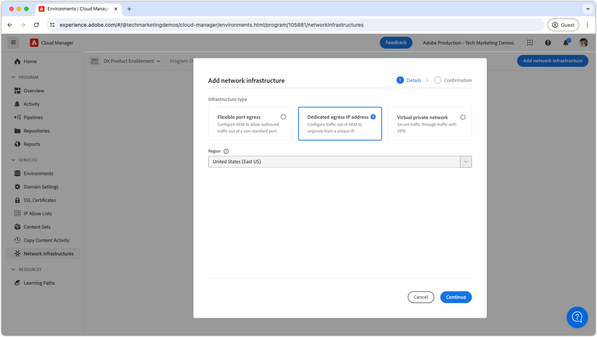
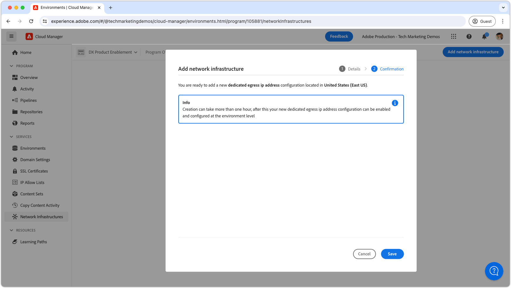
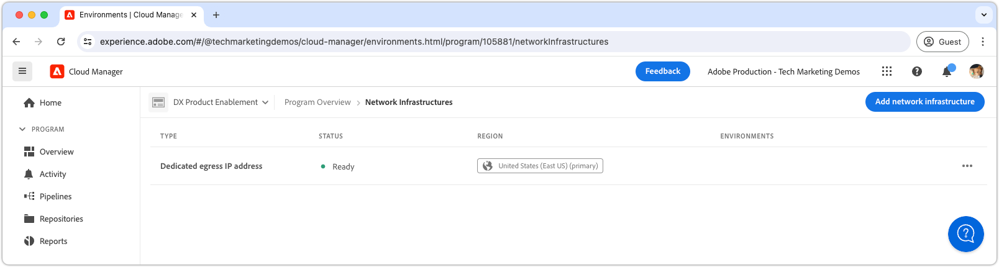

# Dedicated egress IP address

 Learn how to set up and use dedicated egress IP address, which allows outbound connections from AEM to originate from a dedicated IP.

## What is dedicated egress IP address?

Dedicated egress IP address allows requests from AEM as a Cloud Service to use a dedicated IP address, allowing the external services to filter incoming requests by this IP address. Like [flexible egress ports](./flexible-port-egress.md), dedicated egress IP lets you egress on non-standard ports.

A Cloud Manager Program can only have a __single__ network infrastructure type. Ensure dedicated egress IP address is the most [appropriate type of network infrastructure](./advanced-networking.md) for your AEM as a Cloud Service before executing the following commands.

>[!MORELIKETHIS]
>
> Read the AEM as a Cloud Service [advanced network configuration documentation](https://experienceleague.adobe.com/en/docs/experience-manager-cloud-service/content/security/configuring-advanced-networking) for more details on dedicated egress IP address.

## Prerequisites

The following are required when setting up dedicated egress IP address using Cloud Manager APIs:

+ Cloud Manager API with [Cloud Manager Business Owner permissions](https://developer.adobe.com/experience-cloud/cloud-manager/guides/getting-started/permissions/)
+ Access to [Cloud Manager API authentication credentials](https://developer.adobe.com/experience-cloud/cloud-manager/guides/getting-started/create-api-integration/)
  + Organization ID (aka IMS Org ID)
  + Client ID (aka API Key)
  + Access Token (aka Bearer Token)
+ The Cloud Manager Program ID   
+ The Cloud Manager Environment IDs

For more details [review how to setup, configure, and obtain Cloud Manger API credentials](https://experienceleague.adobe.com/en/docs/experience-manager-learn/cloud-service/developing/extensibility/app-builder/server-to-server-auth),to use them to make a Cloud Manager API call.

This tutorial uses `curl` to make the Cloud Manager API configurations. The provided `curl` commands assume a Linux/macOS syntax. If using the Windows command prompt, replace the `\` line-break character with `^`.

## Enable dedicated egress IP address on the program

Start by enabling and configuring the dedicated egress IP address on AEM as a Cloud Service.

>[!BEGINTABS]

>[!TAB Cloud Manager]

Dedicated egress IP address can be enabled using Cloud Manager. The following steps outline how to enable dedicated egress IP address on AEM as a Cloud Service using the Cloud Manager.

1. Log in to the [Adobe Experience Manager Cloud Manager](https://experience.adobe.com/cloud-manager/) as a Cloud Manager Business Owner.
1. Navigate to the desired Program.
1. In the left menu, navigate to __Services > Network Infrastructures__.
1. Select the __Add network infrastructure__ button.

    

1. In the __Add network infrastructure__ dialog, select the __Dedicated egress IP address__ option, and select the __Region__ to create the dedicated egress IP address.

    

1. Select __Save__ to confirm the addition of the dedicated egress IP address. 

    

1. Wait for the network infrastructure to be created and marked as __Ready__. This process can take up to 1 hour.

    

With the Dedicated egress IP address created, you can now configure it using the Cloud Manager APIs as described below.

>[!TAB Cloud Manager APIs]

Dedicated egress IP address can be enabled using Cloud Manager APIs. The following steps outline how to enable Dedicated egress IP address on AEM as a Cloud Service using the Cloud Manager API.


1. First, determine the region in which the Advanced Networking is needed, by using the Cloud Manager API [listRegions](https://developer.adobe.com/experience-cloud/cloud-manager/reference/api/) operation. The `region name` is required to make subsequent Cloud Manager API calls. Typically, the region the Production environment resides in is used.

    Find your AEM as a Cloud Service environment's region in [Cloud Manager](https://my.cloudmanager.adobe.com) under the [environment's details](https://experienceleague.adobe.com/en/docs/experience-manager-cloud-service/content/implementing/using-cloud-manager/manage-environments). The region name displayed in Cloud Manager can be [mapped to the region code](https://developer.adobe.com/experience-cloud/cloud-manager/guides/api-usage/creating-programs-and-environments/#creating-aem-cloud-service-environments) used in the Cloud Manager API.
    
    __listRegions HTTP request__

    ```shell
    $ curl -X GET https://cloudmanager.adobe.io/api/program/{programId}/regions \
        -H 'x-gw-ims-org-id: <ORGANIZATION_ID>' \
        -H 'x-api-key: <CLIENT_ID>' \
        -H 'Authorization: Bearer <ACCESS_TOKEN>' \
        -H 'Content-Type: application/json' 
    ```

2. Enable dedicated egress IP address for a Cloud Manager Program using the Cloud Manager API [createNetworkInfrastructure](https://developer.adobe.com/experience-cloud/cloud-manager/reference/api/) operation. Use the appropriate `region` code obtained from the Cloud Manager API `listRegions` operation.

    __createNetworkInfrastructure HTTP request__

    ```shell
    $ curl -X POST https://cloudmanager.adobe.io/api/program/{programId}/networkInfrastructures \
        -H 'x-gw-ims-org-id: <ORGANIZATION_ID>' \
        -H 'x-api-key: <CLIENT_ID>' \
        -H 'Authorization: Bearer <ACCESS_TOKEN>' \
        -H 'Content-Type: application/json' \
        -d '{ "kind": "dedicatedEgressIp", "region": "va7" }'
    ```

    Wait 15 minutes for the Cloud Manager Program to provision the network infrastructure.

3. Check that the program has finished __dedicated egress IP address__ configuration using the Cloud Manager API [getNetworkInfrastructure](https://developer.adobe.com/experience-cloud/cloud-manager/reference/api/#operation/getNetworkInfrastructure) operation, using the `id` returned from the `createNetworkInfrastructure` HTTP request in the previous step.

     __getNetworkInfrastructure HTTP request__

    ```shell
    $ curl -X GET https://cloudmanager.adobe.io/api/program/{programId}/networkInfrastructure/{networkInfrastructureId} \
        -H 'x-gw-ims-org-id: <ORGANIZATION_ID>' \
        -H 'x-api-key: <CLIENT_ID>' \
        -H 'Authorization: Bearer <ACCESS_TOKEN>' \
        -H 'Content-Type: application/json'
    ```

    Verify that the HTTP response contains a __status__ of __ready__. If not yet ready, recheck the status every few minutes.

With the Dedicated egress IP address created, you can now configure it using the Cloud Manager APIs as described below.

>[!ENDTABS]


## Configure dedicated egress IP address proxies per environment

1. Configure the __dedicated egress IP address__ configuration on each AEM as a Cloud Service environment using the Cloud Manager API [enableEnvironmentAdvancedNetworkingConfiguration](https://developer.adobe.com/experience-cloud/cloud-manager/reference/api/) operation. 

    __enableEnvironmentAdvancedNetworkingConfiguration HTTP request__

    ```shell
    $ curl -X PUT https://cloudmanager.adobe.io/api/program/{programId}/environment/{environmentId}/advancedNetworking \
        -H 'x-gw-ims-org-id: <ORGANIZATION_ID>' \
        -H 'x-api-key: <CLIENT_ID>' \
        -H 'Authorization: Bearer <ACCESS_TOKEN>' \
        -H 'Content-Type: application/json' \
        -d @./dedicated-egress-ip-address.json
    ```

    Define the JSON parameters in a `dedicated-egress-ip-address.json` and provided to curl via `... -d @./dedicated-egress-ip-address.json`.

    [Download the example dedicated-egress-ip-address.json](./assets/dedicated-egress-ip-address.json). This file is only an example. Configure your file as required based on the optional/required fields documented at [enableEnvironmentAdvancedNetworkingConfiguration](https://developer.adobe.com/experience-cloud/cloud-manager/reference/api/). 

    ```json
    {
        "nonProxyHosts": [
            "example.net",
            "*.example.org",
        ],
        "portForwards": [
            {
                "name": "mysql.example.com",
                "portDest": 3306,
                "portOrig": 30001
            },
            {
                "name": "smtp.sendgrid.net",
                "portDest": 465,
                "portOrig": 30002
            }
        ]
    }
    ```

    Dedicated egress IP address configuration's HTTP signature only differs from [flexible egress port](./flexible-port-egress.md#enable-dedicated-egress-ip-address-per-environment) in that it also supports the optional `nonProxyHosts` configuration.

    `nonProxyHosts` declares a set of hosts for which port 80 or 443 should be routed through the default shared IP address ranges rather than the dedicated egress IP. `nonProxyHosts` may be useful as traffic egressing through shared IPs is optimized automatically by Adobe.

    For each `portForwards` mapping, the advanced networking defines the following forwarding rule:

    | Proxy host  | Proxy port |  | External host | External port |
    |---------------------------------|----------|----------------|------------------|----------|
    | `AEM_PROXY_HOST` | `portForwards.portOrig` | &rarr; | `portForwards.name` | `portForwards.portDest` |

1. For each environment, validate the egress rules are in effect using the Cloud Manager API [getEnvironmentAdvancedNetworkingConfiguration](https://developer.adobe.com/experience-cloud/cloud-manager/reference/api/) operation.

    __getEnvironmentAdvancedNetworkingConfiguration HTTP request__

    ```shell
    $ curl -X GET https://cloudmanager.adobe.io/api/program/{programId}/environment/{environmentId}/advancedNetworking \
        -H 'x-gw-ims-org-id: <ORGANIZATION_ID>' \
        -H 'x-api-key: <CLIENT_ID>' \
        -H 'Authorization: <YOUR_TOKEN>' \
        -H 'Content-Type: application/json'
    ```

1. Dedicated egress IP address configurations can be updated using the Cloud Manager API [enableEnvironmentAdvancedNetworkingConfiguration](https://developer.adobe.com/experience-cloud/cloud-manager/reference/api/) operation. Remember `enableEnvironmentAdvancedNetworkingConfiguration` is a `PUT` operation, so all rules must be provided with every invocation of this operation.

1. Obtain the __dedicated egress IP address__ by using a DNS Resolver (such as [DNSChecker.org](https://dnschecker.org/)) on the host: `p{programId}.external.adobeaemcloud.com`, or by running `dig` from the command line.

    ```shell
    $ dig +short p{programId}.external.adobeaemcloud.com
    ```

    The hostname cannot be `pinged`, as it is an egress and _not_ and ingress.
    
    Note that the dedicated egress IP address is shared by all AEM as a Cloud Service environments in the program.

1. Now, you can use the dedicated egress IP address in your custom AEM code and configuration. Often when using dedicated egress IP address, the external services AEM as a Cloud Service connects to are configured to only allow traffic from this dedicated IP address.

## Connecting to external services over dedicated egress IP address

With the dedicated egress IP address enabled, AEM code and configuration can use the dedicated egress IP to make calls to external services. There are two flavors of external calls that AEM treats differently:

1. HTTP/HTTPS calls to external services
    + Includes HTTP/HTTPS calls made to services running on ports other than the standard 80 or 443 ports.
1. non-HTTP/HTTPS calls to external services
    + Includes any non-HTTP calls, such as connections with Mail servers, SQL databases, or services that run on other non-HTTP/HTTPS protocols.

HTTP/HTTPS requests from AEM on standard ports (80/443) are allowed by default but they do not use the dedicated egress IP address if not configured appropriately as described below.

>[!TIP]
>
> See AEM as a Cloud Service's dedicated egress IP address documentation for [the full set of routing rules](https://experienceleague.adobe.com/en/docs/experience-manager-cloud-service/content/security/configuring-advanced-networking).


### HTTP/HTTPS

When creating HTTP/HTTPS connections from AEM, when using dedicated egress IP address, HTTP/HTTPS connections are automatically proxied out of AEM using the dedicated egress IP address. No additional code or configuration is required to support HTTP/HTTPS connections, other than setting up dedicated egress IP address advanced networking.

#### Code examples

<table>
<tr>
<td>
    <a  href="./examples/http-dedicated-egress-ip-vpn.md"></a>
    <div><strong><a href="./examples/http-dedicated-egress-ip-vpn.md">HTTP/HTTPS</a></strong></div>
    <p>
        Java&trade; code example making HTTP/HTTPS connection from AEM as a Cloud Service to an external service using HTTP/HTTPS protocol.
    </p>
</td>   
<td></td>   
<td></td>   
</tr>
</table>

### Non-HTTP/HTTPS connections to external services

When creating non-HTTP/HTTPS connections (ex. SQL, SMTP, and so on) from AEM, the connection must be made through a special host name provided by AEM.

| Variable name | Use | Java&trade; code | OSGi configuration |
| - |  - | - | - |
| `AEM_PROXY_HOST` | Proxy host for non-HTTP/HTTPS connections | `System.getenv("AEM_PROXY_HOST")` | `$[env:AEM_PROXY_HOST]` |


Connections to external services are then called through the `AEM_PROXY_HOST` and the mapped port (`portForwards.portOrig`), which AEM then routes to the mapped external hostname (`portForwards.name`) and port (`portForwards.portDest`).

| Proxy host  | Proxy port |  | External host | External port |
|---------------------------------|----------|----------------|------------------|----------|
| `AEM_PROXY_HOST` | `portForwards.portOrig` | &rarr; | `portForwards.name` | `portForwards.portDest` |

#### Code examples

<table><tr>
   <td>
      <a  href="./examples/sql-datasourcepool.md"></a>
      <div><strong><a href="./examples/sql-datasourcepool.md">SQL connection using JDBC DataSourcePool</a></strong></div>
      <p>
            Java&trade; code example connecting to external SQL databases by configuring AEM's JDBC datasource pool.
      </p>
    </td>   
   <td>
      <a  href="./examples/sql-java-apis.md"></a>
      <div><strong><a href="./examples/sql-java-apis.md">SQL connection using Java&trade; APIs</a></strong></div>
      <p>
            Java&trade; code example connecting to external SQL databases using Java&trade;'s SQL APIs.
      </p>
    </td>   
   <td>
      <a  href="./examples/email-service.md"></a>
      <div><strong><a href="./examples/email-service.md">E-mail service</a></strong></div>
      <p>
        OSGi configuration example using AEM to connect to external e-mail services.
      </p>
    </td>   
</tr></table>
