# Virtual Private Network (VPN)

Learn how to connect AEM as a Cloud Service with your VPN to create secure communication channels between AEM and internal services.

>[!IMPORTANT]
>
>You can configure VPNs and port forwarding either through the Cloud Manager UI or using API calls. This tutorial focuses on the API method. 
>
>If you prefer using the UI, see [Configure Advanced Networking for AEM as a Cloud Service](https://experienceleague.adobe.com/en/docs/experience-manager-cloud-service/content/security/configuring-advanced-networking).

## What is a Virtual Private Network?

Virtual Private Network (VPN) allows an AEM as a Cloud Service customer to connect **the AEM environments** within a Cloud Manager Program to an existing, [supported](https://experienceleague.adobe.com/en/docs/experience-manager-cloud-service/content/security/configuring-advanced-networking) VPN. VPN allows secure and controlled connections between AEM as a Cloud Service and services within the customer's network.

A Cloud Manager Program can only have a __single__ network infrastructure type. Ensure that Virtual Private Network is the most [appropriate type of network infrastructure](https://experienceleague.adobe.com/en/docs/experience-manager-cloud-service/content/security/configuring-advanced-networking) for your AEM as a Cloud Service before executing the following commands.

>[!NOTE]
>
>Please note, connecting the build environment from Cloud Manager to a VPN is not supported. If you must access binary artifacts from a private repository, you must set up a secure and password-protected repository with a URL that is available on the public internet [as described here](https://experienceleague.adobe.com/en/docs/experience-manager-cloud-service/content/implementing/using-cloud-manager/create-application-project/setting-up-project).

>[!MORELIKETHIS]
>
> Read the AEM as a Cloud Service [advanced network configuration documentation](https://experienceleague.adobe.com/en/docs/experience-manager-cloud-service/content/security/configuring-advanced-networking) for more details on Virtual Private Network.

## Prerequisites

The following are required when setting up a Virtual Private Network using Cloud Manager APIs:

+ Adobe account with [Cloud Manager Business Owner permissions](https://developer.adobe.com/experience-cloud/cloud-manager/guides/getting-started/permissions/)
+ Access to [Cloud Manager API's authentication credentials](https://developer.adobe.com/experience-cloud/cloud-manager/guides/getting-started/create-api-integration/)
  + Organization ID (aka IMS Org ID)
  + Client ID (aka API Key)
  + Access Token (aka Bearer Token)
+ The Cloud Manager Program ID
+ The Cloud Manager Environment IDs
+ A **Route-Based** Virtual Private Network, with access to all necessary connection parameters.

For more details [review how to setup, configure, and obtain Cloud Manger API credentials](https://experienceleague.adobe.com/en/docs/experience-manager-learn/cloud-service/developing/extensibility/app-builder/server-to-server-auth), to use them to make a Cloud Manager API call.

>[!IMPORTANT]
>
>This tutorial uses `curl` to make the Cloud Manager API configurations&mdash;*if you prefer a programmatic approach*. The provided `curl` commands assume a Linux&reg; or macOS syntax. If using the Windows command prompt, replace the `\` line-break character with `^`. 
>
>Alternatively, you can complete the same task through the Cloud Manager UI. *If you prefer the UI approach*, see [Configure Advanced Networking for AEM as a Cloud Service](https://experienceleague.adobe.com/en/docs/experience-manager-cloud-service/content/security/configuring-advanced-networking).

## Enable Virtual Private Network per program

Start by enabling the Virtual Private Network on AEM as a Cloud Service.


>[!BEGINTABS]

>[!TAB Cloud Manager]

Flexible port egress can be enabled using Cloud Manager. The following steps outline how to enable flexible port egress on AEM as a Cloud Service using the Cloud Manager.

1. Log in to the [Adobe Experience Manager Cloud Manager](https://experience.adobe.com/cloud-manager/) as a Cloud Manager Business Owner.
1. Navigate to the desired Program.
1. In the left menu, navigate to __Services > Network Infrastructures__.
1. Select the __Add network infrastructure__ button.

    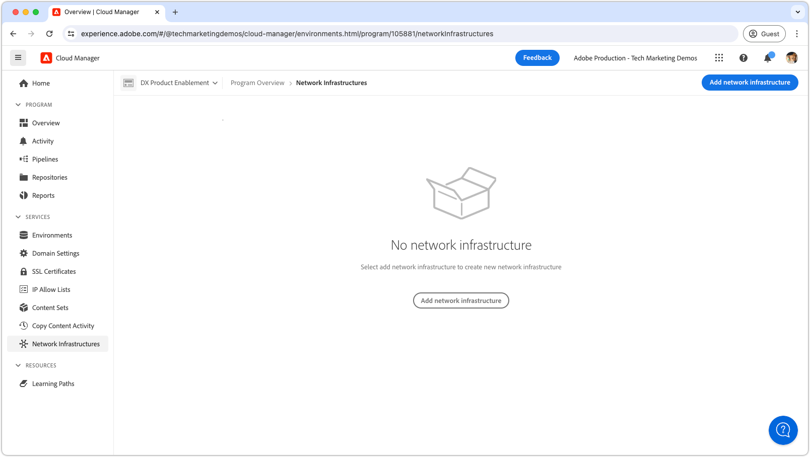

1. In the __Add network infrastructure__ dialog box, select the __Virtual private network__ option. Fill out the fields and select __Continue__. Work with your organization's network administrator to obtain the correct values.

    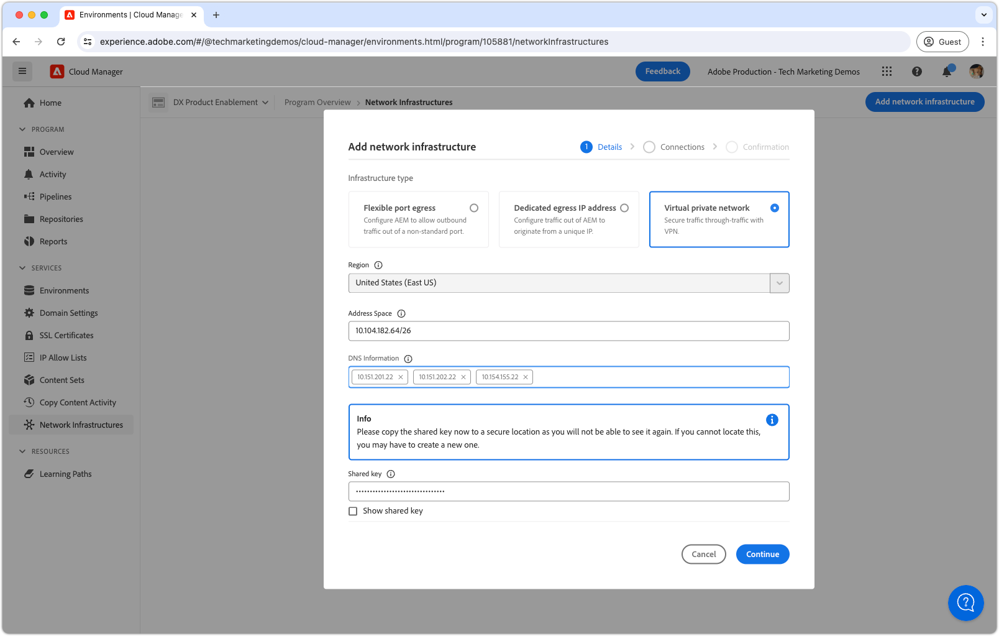

1. Create at least one VPN connection. Give the connection a meaningful name and select the __Add connection__ button. 

    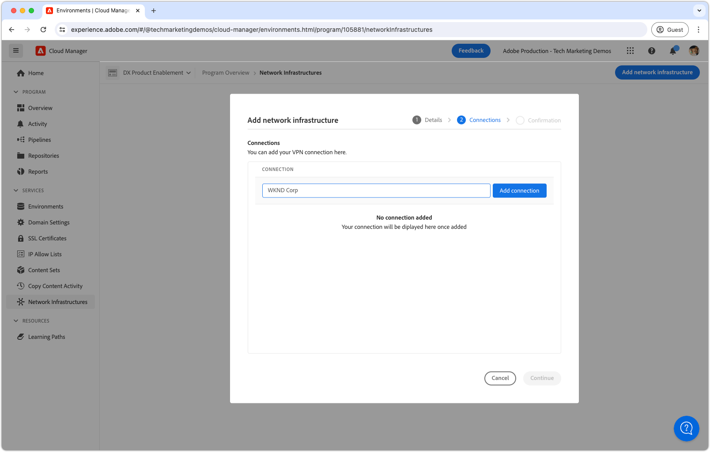

1. Configure the VPN connection. Work with your organization's network administrator to obtain the correct values. Select __Save__ to confirm the addition of the connection. 

    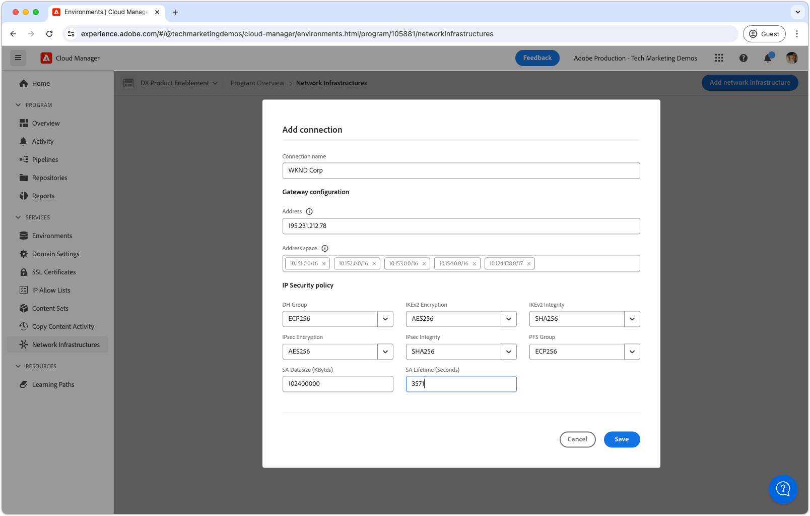

1. If multiple VPN connections are required, as more connections as needed. When all VPN connections are added, select __Continue__.

    

1. Select __Save__ to confirm the addition of the VPN and all configured connections.

    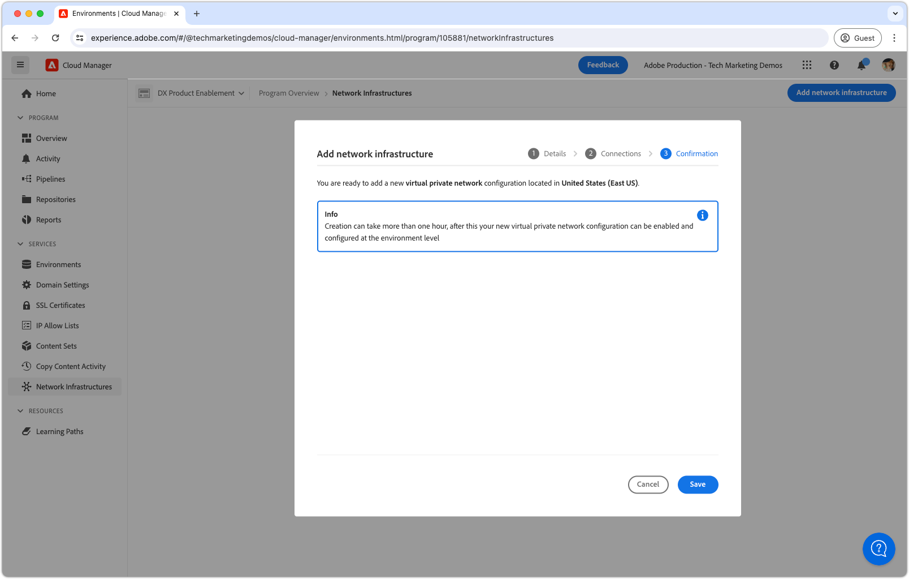

1. Wait for the network infrastructure to be created and marked as __Ready__. This process can take up to 1 hour.

    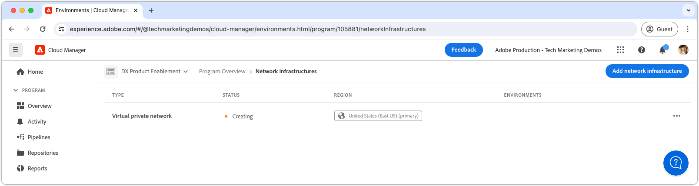

With the VPN created, you can now configure it using the Cloud Manager APIs as described below.

>[!TAB Cloud Manager APIs]

Virtual Private Network can be enabled using Cloud Manager APIs. The following steps outline how to enable VPN on AEM as a Cloud Service using the Cloud Manager API.

1. First, determine the region in which the Advanced Networking is needed by using the Cloud Manager API [listRegions](https://developer.adobe.com/experience-cloud/cloud-manager/reference/api/) operation. The `region name` is required to make subsequent Cloud Manager API calls. Typically, the region the Production environment resides in is used.

    Find your AEM as a Cloud Service environment's region in [Cloud Manager](https://my.cloudmanager.adobe.com) under the [environment's details](https://experienceleague.adobe.com/en/docs/experience-manager-cloud-service/content/implementing/using-cloud-manager/manage-environments). The region name displayed in Cloud Manager can be [mapped to the region code](https://developer.adobe.com/experience-cloud/cloud-manager/guides/api-usage/creating-programs-and-environments/#creating-aem-cloud-service-environments) used in the Cloud Manager API.    

    __listRegions HTTP request__

    ```shell
    $ curl -X GET https://cloudmanager.adobe.io/api/program/{programId}/regions \
        -H 'x-gw-ims-org-id: <ORGANIZATION_ID>' \
        -H 'x-api-key: <CLIENT_ID>' \
        -H 'Authorization: Bearer <ACCESS_TOKEN>' \
        -H 'Content-Type: application/json'
    ```

1. Enable Virtual Private Network for a Cloud Manager Program using Cloud Manager APIs [createNetworkInfrastructure](https://developer.adobe.com/experience-cloud/cloud-manager/reference/api/) operation. Use the appropriate `region` code obtained from the Cloud Manager API `listRegions` operation.

    __createNetworkInfrastructure HTTP request__

    ```shell
    $ curl -X POST https://cloudmanager.adobe.io/api/program/{programId}/networkInfrastructures \
        -H 'x-gw-ims-org-id: <ORGANIZATION_ID>' \
        -H 'x-api-key: <CLIENT_ID>' \
        -H 'Authorization: Bearer <ACCESS_TOKEN>' \
        -H 'Content-Type: application/json'
        -d @./vpn-create.json
    ```

    Define the JSON parameters in a `vpn-create.json` and provided to curl by way of `... -d @./vpn-create.json`.

    [Download the example vpn-create.json](./assets/vpn-create.json).  This file is only an example. Configure your file as required based on the optional/required fields documented at [enableEnvironmentAdvancedNetworkingConfiguration](https://developer.adobe.com/experience-cloud/cloud-manager/reference/api/). 

    ```json
    {
        "kind": "vpn",
        "region": "va7",
        "addressSpace": [
            "10.104.182.64/26"
        ],
        "dns": {
            "resolvers": [
                "10.151.201.22",
                "10.151.202.22",
                "10.154.155.22"
            ],
            "domains": [
                "wknd.site",
                "wknd.com"
            ]
        },
        "connections": [{
            "name": "connection-1",
            "gateway": {
                "address": "195.231.212.78",
                "addressSpace": [
                    "10.151.0.0/16",
                    "10.152.0.0/16",
                    "10.153.0.0/16",
                    "10.154.0.0/16",
                    "10.142.0.0/16",
                    "10.143.0.0/16",
                    "10.124.128.0/17"
                ]
            },
            "sharedKey": "<secret_shared_key>",
            "ipsecPolicy": {
                "dhGroup": "ECP256",
                "ikeEncryption": "AES256",
                "ikeIntegrity": "SHA256",
                "ipsecEncryption": "AES256",
                "ipsecIntegrity": "SHA256",
                "pfsGroup": "ECP256",
                "saDatasize": 102400000,
                "saLifetime": 3600
            }
        }]
    }
    ```

    Wait 45-60 minutes for the Cloud Manager Program to provision the network infrastructure.

1. Check that the environment has finished __Virtual Private Network__ configuration using the Cloud Manager API [getNetworkInfrastructure](https://developer.adobe.com/experience-cloud/cloud-manager/reference/api/#operation/getNetworkInfrastructure) operation, using the `id` returned from the `createNetworkInfrastructure` HTTP request in the previous step.

     __getNetworkInfrastructure HTTP request__

    ```shell
    $ curl -X GET https://cloudmanager.adobe.io/api/program/{programId}/networkInfrastructure/{networkInfrastructureId} \
        -H 'x-gw-ims-org-id: <ORGANIZATION_ID>' \
        -H 'x-api-key: <CLIENT_ID>' \
        -H 'Authorization: <YOUR_BEARER_TOKEN>' \
        -H 'Content-Type: application/json'
    ```

    Verify that the HTTP response contains a __status__ of __ready__. If not yet ready, recheck the status every few minutes.


With the VPN created, you can now configure it using the Cloud Manager APIs as described below.

>[!ENDTABS]

## Configure Virtual Private Network proxies per environment

1. Enable and configure the __Virtual Private Network__ configuration on each AEM as a Cloud Service environment using the Cloud Manager API [enableEnvironmentAdvancedNetworkingConfiguration](https://developer.adobe.com/experience-cloud/cloud-manager/reference/api/) operation.

    __enableEnvironmentAdvancedNetworkingConfiguration HTTP request__

    ```shell
    $ curl -X PUT https://cloudmanager.adobe.io/api/program/{programId}/environment/{environmentId}/advancedNetworking \
        -H 'x-gw-ims-org-id: <ORGANIZATION_ID>' \
        -H 'x-api-key: <CLIENT_ID>' \
        -H 'Authorization: Bearer <ACCESS_TOKEN>' \
        -H 'Content-Type: application/json' \
        -d @./vpn-configure.json
    ```

    Define the JSON parameters in a `vpn-configure.json` and provided to curl by way of `... -d @./vpn-configure.json`.

    [Download the example vpn-configure.json](./assets/vpn-configure.json)

    ```json
    {
        "nonProxyHosts": [
            "example.net",
            "*.example.org"
        ],
        "portForwards": [
            {
                "name": "mysql.example.com",
                "portDest": 3306,
                "portOrig": 30001
            },
            {
                "name": "smtp.sendgrid.com",
                "portDest": 465,
                "portOrig": 30002
            }
        ]
    }
    ```

    `nonProxyHosts` declares a set of hosts for which port 80 or 443 should be routed through the default shared IP address ranges rather than the dedicated egress IP. `nonProxyHosts` may be useful as traffic egressing through shared IPs that Adobe optimizes automatically.

    For each `portForwards` mapping, the advanced networking defines the following forwarding rule:

    | Proxy host  | Proxy port |  | External host | External port |
    |---------------------------------|----------|----------------|------------------|----------|
    | `AEM_PROXY_HOST` | `portForwards.portOrig` | &rarr; | `portForwards.name` | `portForwards.portDest` |

    If your AEM deployment __only__ requires HTTP/HTTPS connections to external service, leave the `portForwards` array empty, as these rules are only required for non-HTTP/HTTPS requests.


2. For each environment, validate the VPN routing rules are in effect using the Cloud Manager API's [getEnvironmentAdvancedNetworkingConfiguration](https://developer.adobe.com/experience-cloud/cloud-manager/reference/api/) operation.

    __getEnvironmentAdvancedNetworkingConfiguration HTTP request__

    ```shell
    $ curl -X GET https://cloudmanager.adobe.io/api/program/{programId}/environment/{environmentId}/advancedNetworking \
        -H 'x-gw-ims-org-id: <ORGANIZATION_ID>' \
        -H 'x-api-key: <CLIENT_ID>' \
        -H 'Authorization: Bearer <ACCESS_TOKEN>' \
        -H 'Content-Type: application/json'
    ```

3. Virtual Private Network proxy configurations can be updated using the Cloud Manager API's [enableEnvironmentAdvancedNetworkingConfiguration](https://developer.adobe.com/experience-cloud/cloud-manager/reference/api/) operation. Remember `enableEnvironmentAdvancedNetworkingConfiguration` is a `PUT` operation, so all rules must be provided with every invocation of this operation.

4. Now, you can use the Virtual Private Network egress configuration in your custom AEM code and configuration.

## Connecting to external services over the Virtual Private Network

With the Virtual Private Network enabled, AEM code and configuration can use them to make calls to external services through the VPN. There are two flavors of external calls that AEM treats differently:

1. HTTP/HTTPS calls to external services
    + These external services include HTTP/HTTPS calls made to services running on ports other than the standard ports 80 or 443.
1. Non-HTTP/HTTPS calls to external services
    + These external services include any non-HTTP calls, such as connections to mail servers, SQL databases, or services that use protocols other than HTTP/HTTPS.

HTTP/HTTPS requests from AEM on standard ports (80/443) are allowed by default but do not use the VPN connection if not configured appropriately as described below.

### HTTP/HTTPS

When creating HTTP/HTTPS connections from AEM, when using VPN, HTTP/HTTPS connections are automatically proxied out of AEM. No additional code or configuration is required to support HTTP/HTTPS connections.

>[!TIP]
>
> See AEM as a Cloud Service's Virtual Private Network documentation for [the full set of routing rules](https://experienceleague.adobe.com/en/docs/experience-manager-cloud-service/content/security/configuring-advanced-networking).

#### Code examples

<table>
<tr>
<td>
    <a  href="./examples/http-dedicated-egress-ip-vpn.md">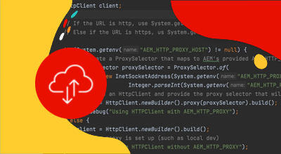</a>
    <div><strong><a href="./examples/http-dedicated-egress-ip-vpn.md">HTTP/HTTPS</a></strong></div>
    <p>
        Java&trade; code example making HTTP/HTTPS connection from AEM as a Cloud Service to an external service using the HTTP/HTTPS protocol.
    </p>
</td>
<td></td>
<td></td>
</tr>
</table>

### Non-HTTP/HTTPS connections code examples

When creating non-HTTP/HTTPS connections (ex. SQL, SMTP, and so on) from AEM, the connection must be made through a special host name provided by AEM.

| Variable name | Use | Java&trade; code | OSGi configuration |
| - |  - | - | - |
| `AEM_PROXY_HOST` | Proxy host for non-HTTP/HTTPS connections | `System.getenv("AEM_PROXY_HOST")` | `$[env:AEM_PROXY_HOST]` |


Connections to external services are then called through the `AEM_PROXY_HOST` and the mapped port (`portForwards.portOrig`), which AEM then routes to the mapped external hostname (`portForwards.name`) and port (`portForwards.portDest`).

| Proxy host  | Proxy port |  | External host | External port |
|---------------------------------|----------|----------------|------------------|----------|
| `AEM_PROXY_HOST` | `portForwards.portOrig` | &rarr; | `portForwards.name` | `portForwards.portDest` |


#### Code examples

<table><tr>
   <td>
      <a  href="./examples/sql-datasourcepool.md">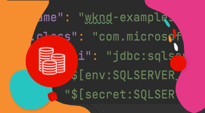</a>
      <div><strong><a href="./examples/sql-datasourcepool.md">SQL connection using JDBC DataSourcePool</a></strong></div>
      <p>
            Java&trade; code example connecting to external SQL databases by configuring AEM's JDBC datasource pool.
      </p>
    </td>
   <td>
      <a  href="./examples/sql-java-apis.md">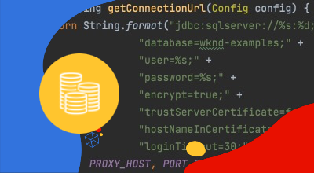</a>
      <div><strong><a href="./examples/sql-java-apis.md">SQL connection using Java&trade; APIs</a></strong></div>
      <p>
            Java&trade; code example connecting to external SQL databases using Java&trade;'s SQL APIs.
      </p>
    </td>
   <td>
      <a  href="./examples/email-service.md">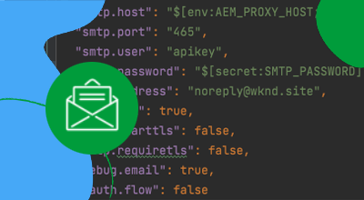</a>
      <div><strong><a href="./examples/email-service.md">E-mail service</a></strong></div>
      <p>
        OSGi configuration example using AEM to connect to external e-mail services.
      </p>
    </td>
</tr></table>

### Limit access to AEM as a Cloud Service through the VPN

The Virtual Private Network configuration limits access to AEM as a Cloud Service environments to a VPN.

#### Configuration examples

<table><tr>
   <td>
      <a href="https://experienceleague.adobe.com/en/docs/experience-manager-cloud-service/content/implementing/using-cloud-manager/ip-allow-lists/apply-allow-list">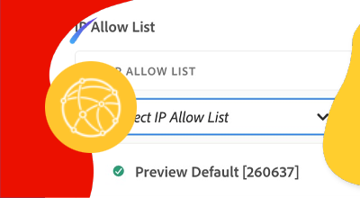</a>
      <div><strong><a href="https://experienceleague.adobe.com/en/docs/experience-manager-cloud-service/content/implementing/using-cloud-manager/ip-allow-lists/apply-allow-list">Applying an IP allowlist</a></strong></div>
      <p>
            Configure an IP allowlist such that only VPN traffic can access AEM.
      </p>
    </td>
    </td>
   <td></td>
</tr></table>
