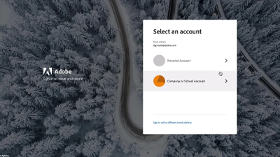
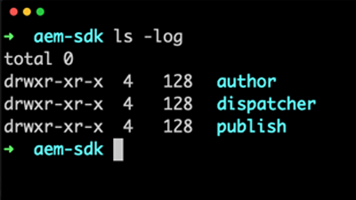
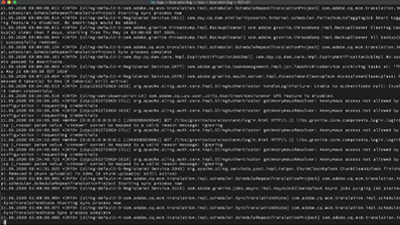

# AEM as Cloud Service videos and tutorials {#overview}

Adobe Experience Manager (AEM) is now available as a Cloud Service. AEM as a Cloud Service introduces the next generation of the Experience Manager product line, building on past investments and innovations, preserving and extending all use cases and functionalities.

>[!VIDEO](https://video.tv.adobe.com/v/31085/?quality=12&learn=on)

## What's new

* **[Token-based authentication (Tutorial)](https://experienceleague.adobe.com/docs/experience-manager-learn/getting-started-with-aem-headless/authentication/overview.html)**
    *Learn how to use token-based authentication to interact with AEM as a Cloud Service over HTTP*

* **[Headless GraphQL (Tutorial)](https://experienceleague.adobe.com/docs/experience-manager-learn/getting-started-with-aem-headless/graphql/overview.html)**
    *Learn how to use AEM's GraphQL APIs to power experiences in an external application.*

* **[Bulk Import (Video)](./migration/bulk-import.md)**
    *Learn how to bulk import assets into AEM from Azure Blob Storage or Amazon S3*

* **[Asset Compute metadata worker (Tutorial)](./asset-compute/advanced/metadata.md)**
    *Learn how to write asset metadata back to AEM from an Asset Compute worker*

* **[Asset Compute microservices extensibility (Tutorial)](./asset-compute/overview.md)**
    *Learn how to develop  Asset Compute workers to generate custom asset renditions*

## Staff picks

<table>
   <td>
      
      

         <a href="./accessing/overview.md">
         <strong>Configuring access to AEM Tutorial</strong>
         </a>
      

      

         <em>Configure IMS users in Adobe Admin Console to access AEM.</em>
      

   </td>   
   <td>
      
      

         <a href="./local-development-environment/overview.md">
         <strong>Local Development Environment Setup Tutorial</strong>
         </a>
      

      

         <em>Get your local dev machine ready for AEM as a Cloud Service development!</em>
      

   </td>   
   <td>
      
      

         <a href="./debugging/aem-sdk-local-quickstart/overview.md">
         <strong>Debugging AEM SDK</strong>
         </a>
      

      

         <em>Explore tools used to debug your application on the AEM as a Cloud Service SDK's local quickstart.</em>
      

   </td>
</table>

## Additional resources

* [Experience League - Explore Adobe Experience Manager](https://experienceleague.adobe.com/#recommended/solutions/experience-manager)
* [Adobe Experience Manager as a Cloud Service documentation](https://experienceleague.adobe.com/docs/experience-manager-cloud-service/landing/home.html)
