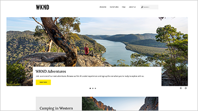
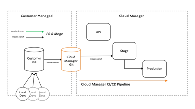

# Overview {#overview}

Adobe Experience Manager (AEM) is now available as a Cloud Service. AEM as a Cloud Service introduces the next generation of the Experience Manager product line, building on past investments and innovations, preserving and extending all use cases and functionalities.

>[!VIDEO](https://video.tv.adobe.com/v/31085/?quality=12&learn=on)

## What's New

* **[Local Development Environment Set Up (Tutorial)](./local-development-environment/overview.md)**
     
    *Learn how to set up your local development machine for AEM as a Cloud Service development*

* **[Get started developing for AEM Sites (Tutorial)](https://docs.adobe.com/content/help/en/experience-manager-learn/getting-started-wknd-tutorial-develop/overview.html)**
     
    *An end-to-end tutorial on how to develop a Web site in AEM as a Cloud Service*

* **[Deploying WKND to AEM as a Cloud Service (Video)](./develop-wknd-tutorial.md#deploying-wknd-to-aem-as-a-cloud-service)**
     
    *A quick overview of deploying an AEM Project to AEM as a Cloud Service*

* **[Integrating Git with Adobe Cloud Manager (Video)](https://docs.adobe.com/content/help/en/experience-manager-cloud-manager/using/managing-code/setup-cloud-manager-git-integration.html)**
     
    *Learn how to work with Git to easily deploy your project to AEM as a Cloud Service using Adobe Cloud Manager*

* **[Understand Processing Profiles and Assets microservices (Video)](https://docs.adobe.com/content/help/en/experience-manager-cloud-service/assets/manage/asset-microservices-configure-and-use.html#get-started)**
    
   *Learn about how Adobe Experience Manager as a Cloud Service uses Assets microservices and Processing Profiles to create asset renditions*

* **[Understand the Structure of a Project Content Package (Article)](https://docs.adobe.com/content/help/en/experience-manager-cloud-service/implementing/developing/aem-project-content-package-structure.html)**
     
    *Adobe Experience Manager as a Cloud Service adjusts the Maven Project structure, clearly separating Code from Content*

* **[Develop a Repository Structure Package (Article)](https://docs.adobe.com/content/help/en/experience-manager-cloud-service/implementing/developing/repository-structure-package.html)**
    
   *Learn about Repository Structure Packages and why they are needed for Adobe Experience Manager as a Cloud Service projects*

## Staff Picks

<table>
   <td>
      
      

         <a href="./local-development-environment/overview.md">
         <strong>Local Development Environment Set up Tutorial</strong>
         </a>
      

      

         <em>Get your local machine ready for AEM as a Cloud Service development!</em>
      

   </td>
   <td>
      
      

         <a href="https://docs.adobe.com/content/help/en/experience-manager-learn/getting-started-wknd-tutorial-develop/overview.html">
         <strong>Get started developing for AEM Sites</strong>
         </a>
      

      

         <em>An end-to-end tutorial on how to develop a Web site in AEM.</em>
      

   </td>
   <td>
      
      

         <a href="https://docs.adobe.com/content/help/en/experience-manager-cloud-manager/using/managing-code/setup-cloud-manager-git-integration.html">
         <strong>Integrating with Git</strong>
         </a>
      

      

         <em>Deploy your project to AEM as a Cloud Service using Adobe Cloud Manager.</em>
      

   </td>
</table>

## Additional Resources

* [Experience League - Explore Adobe Experience Manager](https://experienceleague.adobe.com/#recommended/solutions/experience-manager)
* [Adobe Experience Manager as a Cloud Service Documentation](https://docs.adobe.com/content/help/en/experience-manager-cloud-service/landing/home.html)
