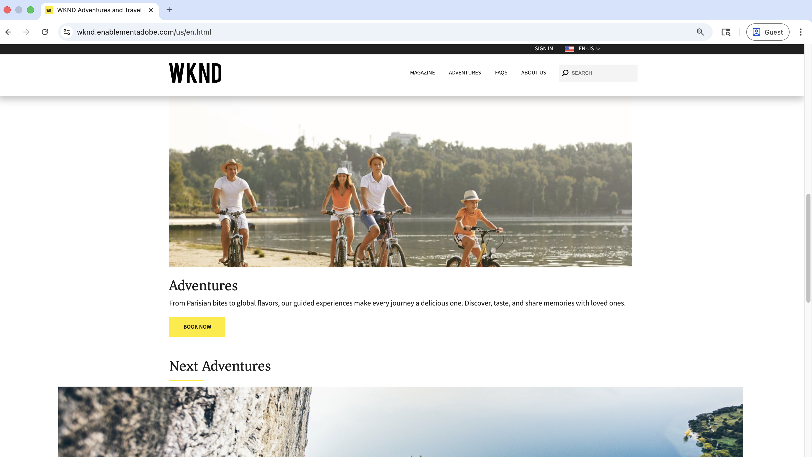
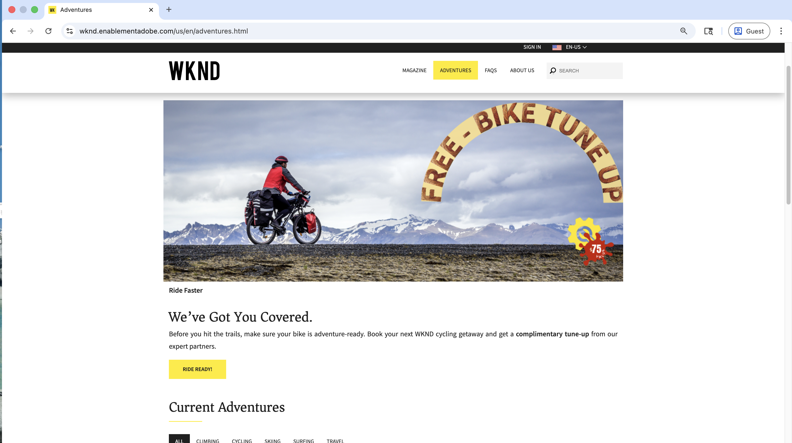
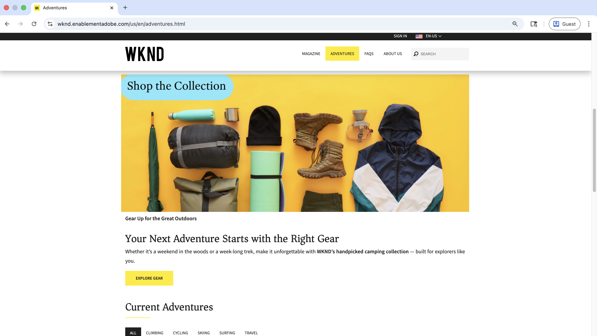
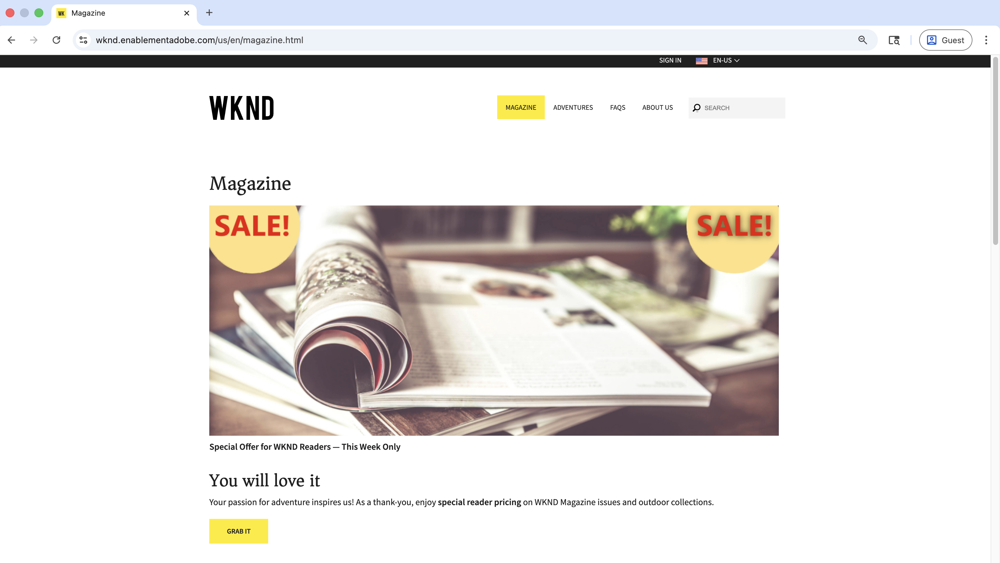
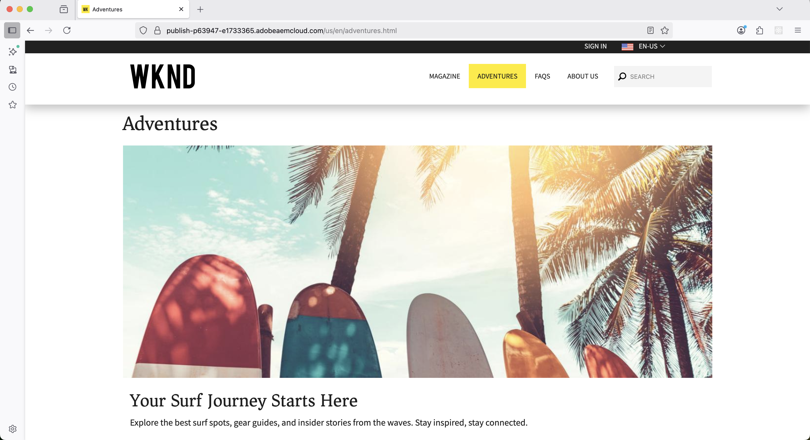
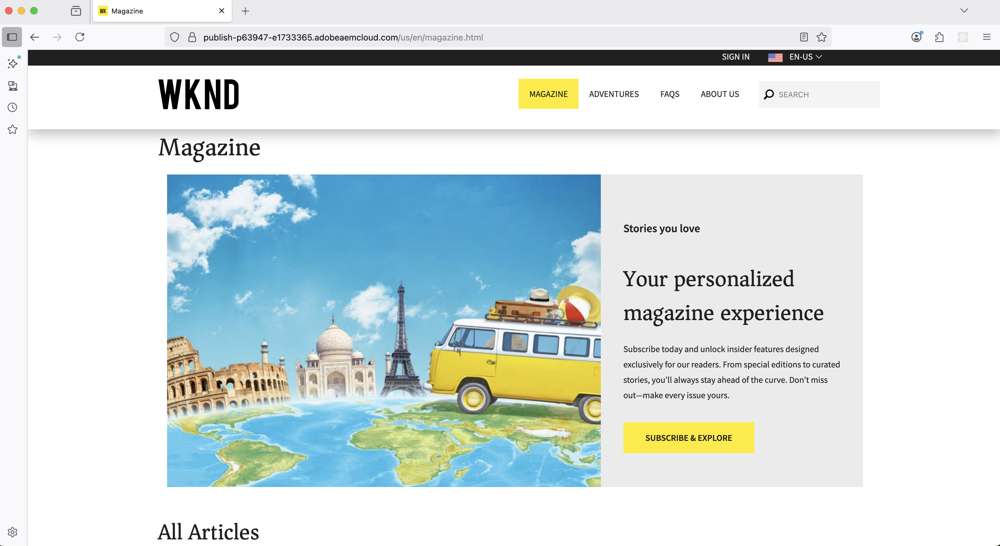
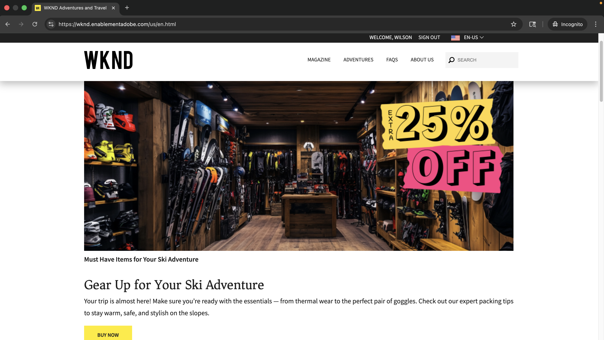

# Live Demo of Personalization Use Cases

Visit the [WKND Enablement website](https://wknd.enablementadobe.com/us/en.html){target="wknd"} to see real-world examples of A/B testing, behavioral targeting, and known-user personalization.

>[!VIDEO](https://video.tv.adobe.com/v/3476461/?learn=on&enablevpops)

This page guides you through hands-on demonstrations of each personalization scenario. Use it to explore what's possible before building these capabilities on your own AEM site.

>[!IMPORTANT]
>
> Open the demo site in multiple browser windows or incognito/private browsing mode to experience different personalized variations simultaneously. 
> When using private browsing mode, Firefox and Safari might block the ECID cookie, alternatively use regular browsing mode or clear cookies before trying a new personalization scenario.

## Demo Use Cases

The [WKND Enablement website](https://wknd.enablementadobe.com/us/en.html){target="wknd"} demonstrates three types of personalization:

| Personalization Type | What You'll See | Timing |
|---------------------|-----------------|---------|
| **Behavioral Targeting** | Content adapts based on your browsing behavior and interests. Commonly referred to as _next-page or same-page personalization_ | Real-time & Batch |
| **Known-user Personalization** | Tailored experiences based on complete customer profiles built from data across multiple systems. Commonly referred to as _personalization at scale_| Real-time |
| **A/B Testing** | Different content variations tested to find the best performer. Commonly referred to as _experimentation_ | Real-time |

## Behavioral Targeting

Content automatically adapts based on visitor actions and interests during their browsing session. This is commonly referred to as _next-page or same-page personalization_.

### Home, Adventures, and Magazine Pages

These experiences appear immediately based on your current browsing behavior (real-time personalization). The Adobe Experience Platform Edge Network is used to make real-time personalization decisions.

| Page | What You'll See | How to Test | Experience |
|------|-----------------|-------------|------------|
| [Home](https://wknd.enablementadobe.com/us/en.html){target="wknd"} | A personalized **family-friendly Adventures hero banner** featuring a family biking together by a lakeside, promoting guided experiences that create shared memories | Visit [Bali Surf Camp](https://wknd.enablementadobe.com/us/en/adventures/bali-surf-camp.html){target="wknd"} or [Gastronomic Marais Tour](https://wknd.enablementadobe.com/us/en/adventures/gastronomic-marais-tour.html){target="wknd"}, then return to homepage | {width="200" zoomable="yes"} |
| [Adventures](https://wknd.enablementadobe.com/us/en/adventures.html){target="wknd"} | A cycling-focused **"Free Bike Tune Up" promotional hero** with "We've Got You Covered" messaging and complimentary bike maintenance offer from WKND's expert partners | Visit any biking-related adventure (for example, [Cycling Tuscany](https://wknd.enablementadobe.com/us/en/adventures/cycling-tuscany.html){target="wknd"}), then navigate to the Adventures page | {width="200" zoomable="yes"} |
| [Adventures](https://wknd.enablementadobe.com/us/en/adventures.html){target="wknd"} | A camping-themed **gear collection hero** showcasing essential camping equipment (sleeping bags, jackets, boots) with "Your Next Adventure Starts with the Right Gear" messaging | Visit any camping-related adventure (for example, [Yosemite Backpacking](https://wknd.enablementadobe.com/us/en/adventures/yosemite-backpacking.html){target="wknd"}), then navigate to the Adventures page | {width="200" zoomable="yes"} |
| [Magazine](https://wknd.enablementadobe.com/us/en/magazine.html){target="wknd"} | A time-sensitive **magazine sale promotion** featuring rolled WKND magazines with prominent "SALE!" badges and special reader pricing on issues and outdoor collections | Read one or more magazine articles (for example, [Ski Touring](https://wknd.enablementadobe.com/us/en/magazine/ski-touring.html){target="wknd"}), then navigate to the Magazine landing page | {width="200" zoomable="yes"} |

### Adventures and Magazine Pages (Batch)

These experiences are based on historical behavior and appear on your next visit or later the same day (batch personalization). The data is aggregated and processed into profile attributes, and activated to Adobe Experience Platform Edge Network.

| Page | What You'll See | How to Test | Experience |
|------|-----------------|-------------|------------|
| [Adventures](https://wknd.enablementadobe.com/us/en/adventures.html){target="wknd"} | A surf-themed hero featuring **colorful surfboards under palm trees** with "Your Surf Journey Starts Here" messaging and curated surf destination content based on your interests | Visit multiple [surf-related adventures](https://wknd.enablementadobe.com/us/en/adventures.html#tabs-b4210c6ff3-item-b411b19941-tab){target="wknd"}, then return to the Adventures page the next day | {width="200" zoomable="yes"} |
| [Magazine](https://wknd.enablementadobe.com/us/en/magazine.html){target="wknd"} | A **personalized magazine subscription offer** featuring world travel destinations with a classic VW van, emphasizing "Your personalized magazine experience" with exclusive subscriber benefits | Read 3 or more [magazine articles](https://wknd.enablementadobe.com/us/en/magazine.html){target="wknd"}, then return to the Magazine landing page the next day | {width="200" zoomable="yes"} |

**Learn More:** Ready to implement behavioral targeting on your own AEM site? Start with the [Behavioral Targeting Tutorial](./use-cases/behavioral-targeting.md) to learn the complete setup process.

## Known-user Personalization

Personalized experiences based on complete customer profiles built from data across multiple systems, including purchase history and customer lifecycle stage. The Adobe Experience Platform Edge Network is used to make real-time personalization decisions.

### Home Page Hero

The WKND homepage hero banner is personalized based on authenticated user profiles. Test with these demo accounts to see a personalized experience:

| Page | What You'll See | How to Test | Profile Context | Experience |
|------|-----------------|-------------|-----------------|------------|
| [Home](https://wknd.enablementadobe.com/us/en.html){target="wknd"} | A ski shop interior showcasing **premium ski equipment with "EXTRA 25% OFF"** promotion, featuring expert packing tips to prepare for their upcoming ski adventure | Sign in with `rwilson/rwilson` and refresh the page | Recently purchased ski adventures, thus upselling ski gear | {width="200" zoomable="yes"} |

**Learn More:** Ready to implement known-user personalization on your own AEM site? Start with the [Known-user Personalization Tutorial](./use-cases/known-user-personalization.md) to learn the complete setup process.

## A/B Testing (Experimentation)

Test different content variations to determine which performs best for your business goals. Adobe Target randomly serves different variations to visitors and tracks which perform better. This is commonly referred to as _experimentation_.

### Home Page Featured Article

The WKND homepage runs an active A/B test with three variations of the _Camping in Western Australia_ featured article. Each visitor is randomly assigned to see one of these variations:

| Page | What You'll See | How to Test | Experience |
|------|-----------------|-------------|------------|
| [Home](https://wknd.enablementadobe.com/us/en.html){target="wknd"} | One of three randomly assigned featured article variations in the "Our Featured" section: **"Off the Grid: Epic Camping Routes Across Western Australia"** or **"Wandering the Wild: Camping Adventures in Western Australia"** (or a third variation), each with unique imagery and messaging to test which resonates best | Visit the homepage in different browsers, use incognito/private mode, or clear cookies to see different variations | {width="200" zoomable="yes"} |

**Learn More:** Ready to implement A/B testing on your own AEM site? Start with the [Experimentation (A/B Testing) Tutorial](./use-cases/experimentation.md) to learn the complete setup process.

## Next Steps

Ready to implement personalization on your own AEM site? Start with the [Personalization Overview](./overview.md) to learn the complete setup process.

